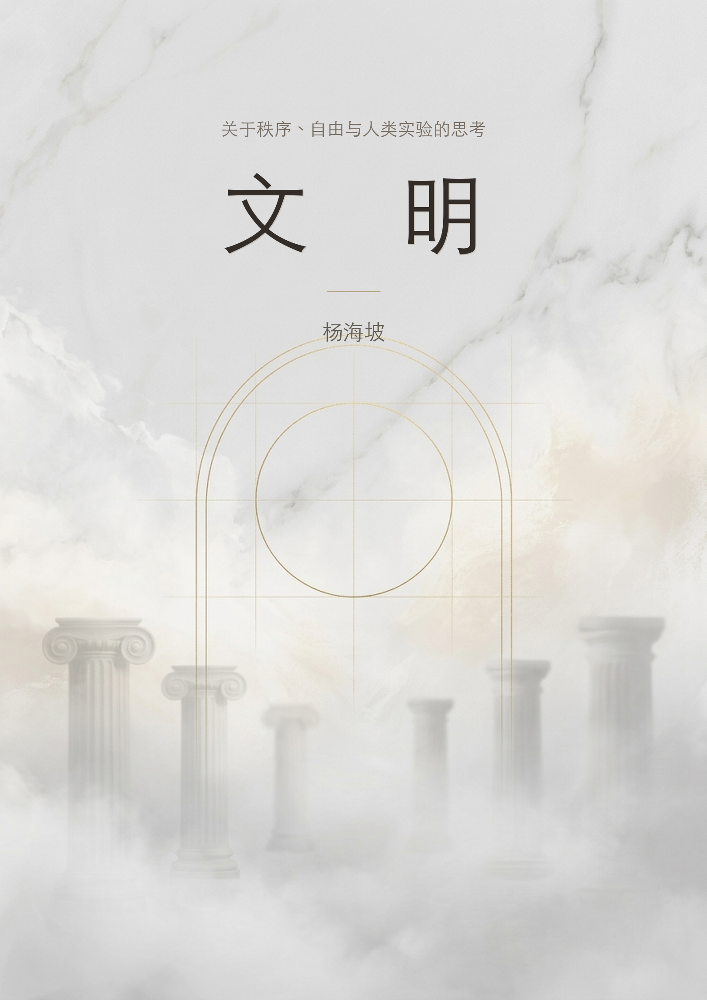

---
pdf_options:
  format: A4
  margin:
    top: "2.5cm"
    bottom: "2cm"
    left: "2cm"
    right: "2cm"
---

  

目 录

第一部分：文明的底层逻辑

<a href="#chapter-1">1. 意识的阶梯：理解社会的底层逻辑</a>2

<a href="#chapter-2">2. 发展可能从来不是文明的目的</a>21

<a href="#chapter-3">3. 儒学：一套文明的操作系统</a>35

第二部分：自由秩序的建立

<a href="#chapter-4">4. 自由的力量</a>51

<a href="#chapter-5">5. 伟大的核武器</a>69

第三部分：自由秩序的衰退

<a href="#chapter-6">6. 拆掉栅栏的人</a>82

<a href="#chapter-7">7. 失去中产阶级的自由社会</a>95

<a href="#chapter-8">8. 灯塔的熄灭</a>115

第四部分：重建与实验

<a href="#chapter-9">9. 稳定的共和</a>141

<a href="#chapter-10">10. 区块链：一场硬核的自由主义实验</a>167

第一部分：文明的底层逻辑

意识的阶梯：理解社会的底层逻辑

### 引言：一把被忽视的万能钥匙

我们生活在一个信息爆炸的时代，解释社会现象的理论框架数不胜数——经济学解释利益分配，政治学解释权力运作，社会学解释群体行为，心理学解释个体动机。每一个框架都照亮了现实的一部分，但没有一个能提供统一的底层解释。

哈佛大学发展心理学家罗伯特·凯根（Robert Kegan）的建构-发展理论（Constructive-Developmental Theory）可能是最接近这个统一解释的框架。它揭示的不是人们"想什么"或"做什么"，而是人们"如何建构意义"——一个比行为和观点都更深层的结构。

理解这个结构之后，你会发现：宗教的传播、市场的趋势、军队的组织、企业的兴衰、国家的治理、教育的困境、人际关系的模式——这些表面上千差万别的现象，在底层共享同一个机制。

那个机制可以用一句话概括：**大约80%的成年人通过外部权威和群体共识来建构意义。** 理解了这一点，就拿到了理解绝大多数社会现象的钥匙。

### 第一章：五个阶段——人类意义建构的光谱

凯根的理论将成人的意识发展划分为五个阶段。这不是智力的高低，不是知识的多少，不是能力的强弱——而是一个人"用什么方式来理解自己和世界"的结构性差异。

**第一阶段：冲动性心智。** 这是幼儿期的意识状态。孩子完全被即时的感知和冲动所控制——饿了就哭，想要就拿，没有"等一等"的能力。他还不能区分"我的感受"和"外部现实"——他的感受就是世界的全部。这个阶段通常在童年早期被超越，但它的残留会在极端压力下重新浮现——成年人在暴怒、恐慌或极度饥饿时表现出的失控，就是第一阶段的短暂回归。理解第一阶段的价值在于：它提醒我们，所有更高阶段的"理性"和"自我控制"都不是天然的，而是发展的成就——这个成就在极端条件下可以被暂时撤销。

**第二阶段：工具性心智。** 世界是一个交换系统。所有关系都是交易——我给你什么，你给我什么。他人是工具，规则是手段。这个阶段的人可以非常聪明，甚至非常成功，但他们的一切行动都指向一个方向：自我利益的最大化。他们可以学会"表演"合作和关心，但那是因为合作在当前情境中对他们有利，不是因为他们真正理解"合作"作为一种价值的含义。

**第三阶段：社会化心智。** 这是成年人口中占比最大的阶段，约35%-40%。在这个阶段，一个人的自我感不再仅由利益驱动，而是由关系、角色和群体归属来定义。"我是谁"取决于"我属于什么群体""别人怎么看我""我在什么关系中"。这个阶段的人能够真正地关心他人、遵守规则、为群体做出牺牲——但前提是这些行为与他们的身份认同一致。他们不是在"选择"遵守规则，他们是"被"规则定义的。

**第四阶段：自主性心智。** 约15%-20%的成年人达到这个阶段。他们发展出了独立于外部评价和群体共识的内在价值体系。他们能够从关系中退后一步审视关系，从体制中退后一步评估体制。他们的判断标准来自内部而非外部。他们能产生真正的异议——不是为了叛逆，而是因为他们的独立分析得出了与共识不同的结论。

**第五阶段：自我转化心智。** 不到5%，可能不到1%。这个阶段的人能够看到自己的框架本身是一种建构——包括他们在第四阶段辛苦建立的那个独立价值体系。他们能够同时持有多个矛盾的框架，在每个框架的适用域内使用它，而不被任何一个框架捕获。他们不是没有立场，而是知道所有立场都是特定视角下的产物。

**理解这个光谱的关键点在于：发展不是知识的积累，而是意义建构方式的结构性转变。** 每一次发展，都是将自己原来"嵌入其中、无法看到"的东西（凯根称之为"主体"），转化为"可以观察、审视"的东西（"客体"）。第三阶段的人嵌入在关系中——关系就是他的自我，他无法站在关系之外审视它。第四阶段的人能看到关系是关系、框架是框架，但他嵌入在自己的独立框架中——他看不到自己的框架本身也是一种建构。第五阶段的人连这一层也看到了。

这个结构有一个残酷的含义：一个人无法真正理解比他当前阶段更高的阶段。第三阶段的人听第四阶段的描述，会用第三阶段的方式去理解它——把"独立思考"理解为"跟随一个鼓励独立思考的权威"。这就像一个只能看到二维平面的人试图理解三维立体——他能记住描述三维的词汇，但他的理解本质上仍然是二维的。

还有一种比第三阶段更难识别的类型：**伪第四阶段**。这些人看起来很有独立判断力——他们有自己的"投资体系"、有自己的"人生哲学"、能写出逻辑严密的分析。但他们的整个框架是从某个权威来源（某本书、某个大师、某个流派）整体下载来的，然后被当作自己的东西来使用。区分的方法只有一个：看他在框架与自身经验发生冲突时怎么做。真正的第四阶段能独立仲裁这个冲突，伪第四阶段会回归他下载框架的那个权威。

与伪第四阶段容易混淆的还有另一种常见误认：**把专业能力等同于意识阶段。** 一个逻辑严密的程序员、一个论证精确的律师、一个发表了大量论文的学者——他们看起来很"独立思考"，但仔细观察会发现，很多人的身份认同完全挂载在自己所属的专业社区上。程序员鄙视"不懂技术的人"，律师鄙视"没有法律思维的人"，学者鄙视"非学术圈的人"——这种鄙视的结构跟任何第三阶段群体维护边界的方式完全一致。他们的"独立思考"只发生在专业领域内部，出了这个领域，他们跟任何依赖群体共识的人没有区别。真正的第四阶段不是在某个领域内思考得很好，而是能对自己所在领域的基本假设本身提出质疑。大多数专业人士做不到这一点——他们的专业框架就是他们的身份，质疑框架等于质疑自己。

如果把第二阶段晚期、第三阶段以及伪第四阶段加在一起，占成年人口的比例大约在80%左右。这80%的人的共同特征是：**他们通过外部权威和群体共识来建构意义。** 这个事实是后续所有分析的基石。

### 第二章：宗教——高阶洞见的降维传播

宗教现象是阶段理论最锐利的应用场景之一。宗教的**产生**几乎都源自第四甚至第五阶段的个体洞见，但宗教的**传播和维持**几乎完全依赖第三阶段的人口基础。

释迦牟尼说"不要因为是传统就接受，不要因为是经典就接受，要通过自己的体验来验证"——这是明确的反第三阶段宣言。耶稣挑战法利赛人的形式主义，说"安息日是为人设的，不是人为安息日设的"——这是第四阶段对第三阶段的典型挑战。

但这些教导传到第三阶段的大众手中后发生了什么？第三阶段的人做了一件非常自然的事：**把创始人本人变成了那个外部权威。** 释迦牟尼说不要盲从权威，结果他自己变成了最大的权威。这不是"歪曲"——这是第三阶段的意义建构系统在处理高阶信息时唯一能做的事。就像把一个三维物体投影到二维平面上，它必然失去一个维度。

每一个成功的宗教都经历了惊人相似的制度化过程：活的教导变成固定文本，文本变成不可质疑的教条，教条催生组织，组织变成社会控制工具。这个过程的本质是从高阶段的原始洞见退化为第三阶段的社会组织系统。尼西亚信经把耶稣的教导固化为一系列必须相信的命题。佛教的部派分裂围绕的是"佛陀到底说了什么"的文本争议。"怎么理解教导"变得比教导本身更重要。异端审判的逻辑是第三阶段的纯粹表达——"你的理解跟我们群体的共识不同，所以你是错的，必须被排除。"

宗教的传播与金融市场的牛市在结构上惊人地相似：叙事形成→共识扩散→自我强化循环→"信仰"作为群体身份认同声明。"我信比特币"和"我信耶稣"在意义建构层面用的是同一套操作系统。差异只在于宗教的"牛市"可以持续几百年——因为它提供的"产品"（对死亡恐惧的安慰、对生命意义的解释、社区归属感）是人类永恒的需求，不会被一次"崩盘"证伪。

每一次重大的宗教改革运动，本质上都是第四阶段对制度化第三阶段的挑战。路德说"因信称义"——你不需要通过教会这个中介来与上帝建立关系。翻译成凯根的语言：你不需要依赖外部权威体系来定义你的信仰，你可以独立地建构你与终极实在的关系。但讽刺的是，新教很快也形成了自己的教条、教派和权威结构。一个反制度化的运动本身被制度化了。禅宗在佛教内部也是如此——"不立文字，教外别传"是第五阶段对佛教制度化的反叛，但禅宗在制度化之后也变成了一套有仪轨、有公案体系、有师徒等级的第三阶段组织。

这揭示了一个关于人类社会的根本性限制：**任何源自高阶段的洞见，一旦需要大规模传播，就必然被降维到第三阶段的形式。** 这不是宗教特有的问题。马克思的批判性分析变成了教条体系，自由主义的独立判断变成了"政治正确"的群体规范——同一个机制在反复上演。原因很简单：第三阶段是人口的绝大多数，任何需要"大规模"的东西，都必须能被第三阶段理解和参与。而第三阶段的人参与任何东西的方式都是同一种：**把它变成一个可以认同的群体、一套可以遵守的规则、一个可以信赖的权威。**

这也意味着，真正好的表达可能是：**在同一个载体中同时服务不同的阶段，让各取所需。** 《大学》《中庸》做到了这一点——两千年来，大多数人从中读到的是道德训诫，少数人从中读到的是意识觉醒的路径。同一个文本，不同阶段的人提取不同层次的意义。

### 第三章：市场——意识阶段的聚合体

传统的市场分析要么从基本面出发（公司值多少钱），要么从技术面出发（价格图形在说什么）。但如果用凯根的框架来看，市场的本质既不是信息处理机器，也不是随机漫步——**市场是不同意识阶段的参与者的行为叠加。** 价格反映的不是"信息"，而是不同意识阶段的参与者对信息的不同意义建构的聚合。

第二阶段的交易者是纯粹的投机者——追涨杀跌，没有信仰，哪里有波动就去哪里。他们是市场噪声的制造者。他们的优势是止损果断（没有情感依附），劣势是没有框架来识别趋势的结构——只能对即时价格变化做反应，不能对价格的"意义"做判断。

第三阶段的交易者是市场中最大的群体，也是**趋势的主体**。他们的交易决策不是独立判断的结果，而是对外部共识的响应——分析师怎么说、新闻怎么报、社区怎么看。当共识看涨时他们集体做多，当共识反转时他们集体恐慌。一个牛市的形成和维持，本质上就是越来越多的第三阶段参与者被吸入同一个共识方向——趋势延续不是因为"基本面在改善"，而是因为越来越多的人看到趋势在延续，然后加入趋势，从而进一步延续趋势。崩盘则是这个同步行为的反向运作——下跌引发恐慌，恐慌引发更多抛售，抛售引发更大恐慌。这不是市场在"发现价值"，这是第三阶段的集体心理在自我放大。

在加密市场中这一点尤其明显。第三阶段的参与者不只是跟随价格，他们跟随**叙事**。"比特币是数字黄金""以太坊是世界计算机""DeFi将颠覆传统金融"——这些叙事的功能不是描述现实，而是**提供一个集体身份认同的锚点**。当一个人说"我相信比特币"的时候，他表达的往往不是一个独立的分析结论，而是一个群体归属声明。这就是为什么加密市场中"信仰"这个词如此频繁——它暴露了参与者的意义建构方式。

伪第四阶段的交易者可能是最危险的群体——他们有"投资体系"，但这个体系变成了身份认同。当体系被市场否定时，他们不是质疑体系而是质疑市场。"市场错了，我是对的，终究会回归"——这种执念导致了大量"有体系"的交易者的爆仓。而且他们往往是最有影响力的意见领袖——他们的分析听起来很专业、很有逻辑，恰好满足了第三阶段跟随者对权威的需求。当他们错的时候，大量跟随者一起错。

真正的第四阶段交易者知道自己的系统有适用边界，能在系统失效时退出。他们是市场中的稳定器——当第三阶段把价格推向极端时，他们能逆向操作。

一个典型牛市周期的完整解读因此变成了参与者的顺序入场：第四阶段少数人基于独立判断安静建仓→叙事形成吸引第三阶段早期采纳者→共识扩散，正反馈循环启动→狂热阶段，"不可能不涨"成为共识，第二阶段纯投机者涌入，第四阶段开始离场→转折，叙事自我验证循环被打破→第三阶段同步抛售，身份认同崩塌→底部，第三阶段离场不再关注，第四阶段重新建仓，新周期开始。

技术分析在这个框架中获得了新的定位——它不是占卜，而是群体心理学在K线图上的映射。每一根K线、每一个成交量柱状图，背后都是真实的买卖行为，是数以万计的投资者在恐惧和贪婪之间做出的选择。这些选择的汇聚形成了趋势、支撑、阻力、形态——它们不是精确的预言，而是概率的偏向。技术分析有效，恰恰是因为第三阶段的行为具有结构性的可重复性。它的适用边界在于：当参与者结构发生根本变化时，基于历史模式的分析可能失效。

价值投资解决"买什么"，技术分析解决"何时买卖"，两者各有适用域。但更重要的是认识到：两者都是框架，都有适用边界。同样的逻辑也适用于经济学中最著名的对立——哈耶克和凯恩斯之争：微观层面哈耶克是对的，分散的信息处理优于中央计划；宏观层面凯恩斯更合适，当第三阶段的合成谬误（每个人理性紧缩但集体效果是灾难性的需求崩塌）出现时，需要一个不被集体情绪驱动的行为者从外部注入反向力量。两者不矛盾，因为它们描述的是不同层级的现象。能给每个框架划定适用域而非选边站队，本身就是第五阶段的认知操作。

### 第四章：军队——阶段匹配的极致样本

军队可能是人类设计过的最精密的阶段匹配系统。

士兵层需要第二阶段的条件反射式战术执行加上第三阶段的集体认同。基础训练的本质是把一个普通人从原有的身份认同中剥离出来，然后植入新的集体身份——剃头、统一着装、消除个人标识、用编号替代名字。同时反复操练战术动作，让它们不再经过意识处理，变成身体自动执行的程序。战场上你没有时间"思考"要不要开枪，你的身体必须在感知到威胁的瞬间自动反应。

士官层需要稳定的第三阶段。他们是军队真正的脊梁——不靠惩罚维持纪律，靠的是"在我的班里我们就是这样做事的"这种群体认同的力量。他们是第三阶段的具象化，新兵通过跟他的关系来内化军队的文化。

初级军官需要第三到四过渡期的有限度独立判断。纯第三阶段的军官会死板执行命令，哪怕战场情况已经变了。太独立的又可能搞乱整体部署。最佳状态是：深度认同军队的使命和上级的意图，同时在执行层面有一定灵活性。

中高级军官需要成熟的第四阶段。到了旅级以上，纯粹的执行不够了，需要理解上级的**意图**，然后自主决定如何实现。德军的"任务式战术"从19世纪就开始培养军官的独立判断力，这可能是德军在两次世界大战中战术水平远超对手的制度性原因——它本质上是在军事组织中系统性地培养第四阶段的能力。

最高层的将领需要至少成熟的第四阶段，极少数触及第五阶段。战略层面需要在多个相互矛盾的目标和框架之间做出权衡——军事目标与政治约束、短期战术与长期战略、本国利益与联盟关系。历史上公认的军事天才的共同特征不是某一个维度的卓越，而是在极端压力下整合多维度信息并做出创造性判断的能力。

这个结构揭示了一个深刻的组织学原理：最高效的大规模协调系统，不是让所有人都达到最高阶段，而是**在不同层级部署匹配的阶段**。底层太独立会破坏协调，高层太服从会丧失灵活性。

军队还揭示了一个独特的心理机制：它是唯一一个制度性地要求成员可能牺牲生命的组织。你不能靠第二阶段的利益交换来驱动这种行为（没有什么利益值得用命来换），只能靠第三阶段的身份认同。"为了战友""为了连队的荣誉"——当"连队的荣誉"就是"我"的一部分时，为连队牺牲在心理上不是"牺牲自我"，而是"保全自我"。这也解释了退伍军人心理问题的普遍性——他们失去的不只是一份工作，是一个定义了他们是谁的整个意义系统。

### 第五章：企业——熵增、基因与抗退化

企业组织遵循与军队同样的阶段匹配逻辑，但面临一个军队不需要面对的问题：人才的筛选和晋升不由战争的淘汰来完成，而是由组织内部的选拔系统来决定。高阶位置上是否坐着高阶的人，决定了组织的命运。

**如果一个第三阶段的人被放到了关键管理位置上，退化就开始了。** 他的招聘和提拔标准必然偏向他能理解和认同的东西：忠诚、配合、"跟我合得来"。真正有独立判断力的候选人会让他感到隐隐不适——那种独立性对他来说不是"有主见"而是"威胁"。他不是有意排斥优秀的人，而是他的意义建构系统**真的无法识别比他更高阶段的人的价值**。

这个过程每重复一层，组织的平均阶段就下降一层。第三阶段的人招进来第三阶段早期的人，第三阶段早期的人再招进来第二阶段晚期的人。三四轮之后，整个部门就变成了一个以那个平庸管理者为核心的、向下兼容的系统。效率在下降，但所有人都觉得"还行"——因为衡量标准本身也在随着人的阶段下降而降低。

比第三阶段管理者更危险的是**高功能的第二阶段伪装者**——他们不是看不到优秀的人，而是非常清楚地看到了，然后有意识地排斥。这种人极善于表演：对上完美汇报，满嘴"长期主义""团队协作""战略对齐"；对下则系统性地吸取资源、转嫁风险、垄断信息。他们跟伪第四阶段的本质区别在于：伪第四阶段真诚地相信自己下载的框架，高功能第二阶段清醒地知道自己在表演——每一个词、每一个姿态都是精确计算过的利益最大化动作。识别他们的方法不是看他们说什么，而是看**利益冲突时他们保护谁**。当项目成功时，观察功劳的归属；当项目失败时，观察责任的流向。如果成功永远归于他、失败永远归于环境或下属，底层代码就暴露了。常规面试几乎无法识别这种人，因为面试本身就是一种表演环境——而表演恰好是他们最强的能力。更有效的方法是把他们放进一个资源不足、责任模糊、需要真实协作的困难局面中，看他们在无法独自获益时如何行动。

这个退化过程有一个特别阴险的特征：**它在早期几乎不可见。** 组织的惯性——已有的流程、客户关系、品牌——可以在相当长时间内掩盖人才质量的下降。等到老本吃完、需要应对新挑战的时候，才会发现整个团队已经没有能力应对了——但这时候往往已经过了好几年，因果关系已经很难追溯。

这就是组织的"熵增"。热力学第二定律说孤立系统的熵只能增加。热力学也给出了答案：**抵抗熵增需要持续从外部输入能量，孤立系统必然走向混乱，只有开放系统才能维持秩序。**

王朝的覆灭是这个机制的极端展开。每一个王朝的开国团队都包含大量第四阶段甚至更高的人——他们在战争的极端压力中被筛选出来。但随着和平时期到来，权力传递开始依赖血统和关系网络，选拔标准逐代偏向第三阶段的指标——家族背景、科举成绩、政治忠诚。几代之后，朝廷里坐满了善于考试和经营关系但缺乏独立判断力的人。然后外部冲击来了，系统需要第四阶段的应对能力，但系统内已经没有这样的人了。企业也是同一个剧本——诺基亚、柯达、雅虎，无一例外。

**抵抗这种熵增的核心原则是让组织在关键环节上无法自我封闭。**

最关键的一条是：创始人或最高决策者保留对关键岗位的否决权，但下放选择权。选择权下放让管理者发展独立判断力，否决权保留防止他们的阶段局限导致系统性选拔错误。仅仅是否决权的存在本身就是校准力——管理者会不自觉地用更高的标准来筛选候选人，因为他知道自己的选择可能被审视。

与此配合的是制度化的跨层级信息通道。不是偶尔的"走动式管理"，而是不可被中间层阻断的反馈渠道——让组织内任何层级的人都有路径将信息传递到最高层。这个通道的价值不在于真的有多少信息被传递，而在于它制造的**透明预期**——所有管理者知道下面的人有渠道越过自己，欺上瞒下的行为成本就急剧上升。

还需要持续引入外部人才来打破内部共识惯性。外部人带来的不只是"能力"，更重要的是不同的标准和做事方式——他们的存在本身就是对"我们一直都是这样做的"这种第三阶段惯性的挑战。同时要对"文化适配"保持警惕——这个听起来很合理的标准在实际操作中往往意味着"跟我们现有的人相似"，它是阶段退化最隐蔽的帮凶。真正有价值的标准应该是：价值观对齐但思维方式多元——认同根本目的，但看问题的方式跟现有人不一样。

体制化本身就是第三阶段的制度表达——用外部规则和流程来替代个体的独立判断，让组织运转不依赖任何个人。这是必要的基础设施，但如果不加制衡，它会成为组织发展的天花板。最好的组织在体制化和独立判断之间维持动态平衡——让体制处理常规事务，同时确保体制不会吞噬掉组织中残存的独立判断力。

**而对于创业来说，最被低估的杠杆点是第一批人的阶段含量。**

第一批人的阶段构成决定了组织的"基因"——后续所有的选拔标准、文化基调、决策方式都是从这个基因中复制出来的。如果起点的第四阶段浓度足够高，正向选择的飞轮会自我强化。硅谷最成功的公司有一个共同特征：创始人在前二十人的招聘上花了不成比例的时间和精力。那二十人的质量在很大程度上决定了后续整个组织能长多大、走多远。

这也回答了一个常见的问题：高阶位置上的高阶人，是因为高阶而被选拔到这些位置的，还是因为位置催化了他们的发展？答案是大部分是选择效应。位置提供的挑战可以催化已准备好的人的发展，但位置本身不制造高阶——大量的人被提拔到超出他们阶段的位置上，学会了表演更高阶段的行为，内在结构没有改变。这就是彼得原理的深层机制——每个人都会被提升到超出他当前意识阶段所能处理的复杂性的位置。

现实中的最优策略是分层配置：核心层（前10-20人）追求最高的第四阶段含量，中间层大量配置第三到四过渡期的人（在高阶段环境中他们的发展会被加速），执行层配置成熟的第三阶段。这个结构跟军队的将领-军官-士兵结构同构——不是巧合，而是大规模人类协作的底层逻辑决定的。

开局的基因对了，后面很多问题根本不会出现。

### 第六章：中国的意识发展——创伤、秦制与转型困境

将凯根框架应用于国家层面虽然是不完美的类比，但能照亮一些传统分析框架看不到的东西。

中国的对外关系展现出强烈的工具性特征——利益交换逻辑、对国际规则的选择性态度。内部治理更接近被管理的第三阶段变体——强调集体认同、社会和谐、对权威的服从，通过宣传、教育和审查来维持。"中国梦""中华民族伟大复兴"是集体身份框架——第三阶段的核心运作方式。但这不是"自然的"第三阶段——它是被制度性力量维持的。当需要外力来维持一种状态时，说明存在被压制的向更高阶段发展的张力。

改革开放引入了经济领域的第四阶段空间（个体创业、市场竞争、独立经济决策），同时在政治和意识形态领域保持第三阶段管理。这种"经济第四阶段、政治第三阶段"的分裂，是当代很多张力的根源。

深层原因有两个。

第一，**反复的集体创伤未被消化**。1840年以来的连续冲击（鸦片战争、甲午、八国联军、日本侵华），每一次都是对既有意义系统的毁灭性打击，而且创伤之间没有喘息空间。个体创伤有两种走向：后创伤成长（需要安全环境和反思消化）或退行（创伤持续、无安全空间、旧系统被摧毁但没有时间重建）。近代中国更接近后者。集体心理的适应性反应是退回到更早的"安全"阶段——"先确保生存和利益"。这形成了一种国家层面的焦虑型内部工作模型："外部世界是掠夺性的，只有自己强大才不被欺负。""百年屈辱"的叙事不只是宣传工具，它反映了真实的集体创伤记忆——被制度化地维持和强化，而非反思性地消化。

第二，**秦制的持续压制**。秦统一建立的中央集权制度，核心逻辑是消除所有独立于皇权之外的权力和意义来源。焚书坑儒不是意外，是这个逻辑的极端表达——独立的思想系统威胁统一秩序。此后两千年，这个逻辑以不同形式反复出现——汉武帝"罢黜百家独尊儒术"、科举制度将知识分子引入体制、文字狱。每一次"大一统"重建都伴随着对独立思想和多元权力的系统性压制。

翻译成凯根的语言：这个制度的功能是**把整个社会锁定在第三阶段**——所有人应该通过与皇权/体制的关系来定义自己的身份和价值。任何试图建构独立于体制之外的意义系统的尝试，都被视为"异端"。这不是某个朝代的偶然选择，而是在政治竞争中反复胜出的制度逻辑——能最高效地动员大量第三阶段人口的系统赢得了竞争。

1949年后继承了秦制的结构特征（中央集权、意识形态统一、系统性消除独立权力中心），但用了新的话语包装。马克思主义提供了一个看似第四阶段的框架（声称基于独立的理性分析），但在实践中被转化为第三阶段的工具——"正确思想"不是独立思考的结果，而是需要学习和内化的外部权威。

原始儒学（尤其是孟子"大丈夫"理想、王阳明"致良知"）包含强烈的第四甚至第五阶段元素——要求个人基于内在道德自觉行动，而非简单服从外部权威。孟子说"说大人，则藐之"——这是清晰的第四阶段精神。但制度化的儒学被改造为维护等级秩序和服从的工具。"三纲五常"将关系伦理固化为不可质疑的等级。独立思考被重新定义为"在正统经典框架内思考"——本质上是第三阶段运作穿着第四阶段的外衣。

第四阶段的社会需要一个基本条件：**允许多元意义系统共存和竞争。** 这意味着权力必须是分散的、可挑战的，思想必须是自由流动的、不受审查的，个体必须有权做出不同于集体的选择而不受惩罚。这些条件在中国历史上只在短暂的窗口期出现过——春秋战国、魏晋、民国初年——每次都很快被新一轮的中央集权统一所终结。

中国最根本的发展挑战因此可以被表述为：从善于学习和执行的文明（第三阶段的"内化外部标准"）转向善于原创和引领的文明（第四阶段的"建构自己的标准"）。社会被锁定在第三阶段时可以极高效地执行已知的最优方案（解释了中国在"追赶"阶段的惊人效率），但在需要创造全新方案——没有现成模板可参考——的时候就会暴露局限。这个转变需要的制度条件，恰恰是当前制度不愿提供的。这个悖论可能是中国未来几十年的核心张力。

**富士康模式是这个张力的微缩样本。** 中国经济奇迹在很大程度上是通过创造大量的第二阶段运作环境来实现的——把几亿人从农村的第三阶段共同体中拔出来，放进只需要第二阶段功能的工厂中。这个过程需要六个条件的罕见叠加：巨大的可动员剩余劳动力、义务教育提供的基础素质、制度性压制劳动者议价能力、户籍制度将再生产成本转嫁回农村、地方政府全力配合、以及全球供应链的特定历史窗口。

户籍制度在其中扮演的角色极其关键。它的本质是把劳动力的再生产成本（养育下一代、赡养老人、医疗养老）转嫁回农村——工厂只需支付维持工人个体基本生存的成本，不需要支付他作为完整社会人的全部成本。而且它阻止了工人在城市扎根——一个无法安家的工人，永远是临时的、流动的、原子化的，没有条件建立深层社会关系网络，因此也没有条件组织起来进行集体行动。他永远是一个可替换的个体，而不是一个扎根的社区成员。

这个条件组合是中国特殊历史路径的产物，其他国家难以复制。但这些条件正在消失——劳动力减少、工资上涨、新一代不接受旧条件、户籍松动。一个国家不可能永远靠第二阶段的交换逻辑驱动增长。当劳动力开始要求意义和尊严（第三阶段的需求），当创新成为增长的主要驱动力（需要第四阶段的独立思考），旧模式就必须转型。

### 第七章：AI——意识阶段的放大器

AI可能是人类历史上第一个对不同意识阶段的人产生完全不同价值的工具。

对第二阶段的人，AI是更高效的利益获取工具——用它来赚更多钱，但不会用它来质疑赚钱策略本身是否正确。他问AI"怎么把这个东西卖出去"，不会问"这个东西值不值得卖"。

对第三阶段的人，AI是**新的权威来源**——这是最值得警惕的层面。语言模型能用流畅、自信、结构化的语言输出大量"看起来很有道理"的内容，天然地满足了第三阶段对外部权威的需求。一个第三阶段的人问AI"我应该怎么教育孩子"，得到一个详细的、有理有据的回答，他的反应是：把这个回答当作"正确答案"来执行。他不会质疑回答的框架假设，不会考虑这个回答是否适用于他的具体情境。他会像从前对待老师、专家、权威书籍一样对待AI的输出——直接内化。

最危险的情况是：**AI让第三阶段的人更舒适地停留在第三阶段。** 过去一个人面对复杂决策不得不自己挣扎、犯错、从后果中学习。现在他可以问AI，得到一个"足够好"的答案，跳过整个挣扎过程。短期效率提高了，长期发展被绕过了。而且第三阶段的人会用AI来确认已有立场——"帮我写一篇论证X观点的文章"——AI会写得比他自己更有说服力，他会觉得"看，AI都同意我"。他不知道的是，让AI写反X观点的文章，AI也会写得同样好。AI是一面镜子，但第三阶段的人把它当作了窗户。

对第三到四过渡期的人，AI可以是有价值的脚手架——一个没有社会后果的对话对象。正在发展独立判断力的人，最大的障碍之一是害怕表达不成熟的想法被人评判。跟AI对话没有这个风险——可以试探性地表达半成型的想法，看看它被展开后是否成立，而不用担心丢脸。如果有意识地用AI来**挑战**自己的立场——"请从反对的角度批评我的想法"——AI可以成为廉价的、随时可用的思想陪练。但这需要使用者已经意识到自己需要被挑战——一个没有这种自觉的人，会自然地把AI用成一个更高效的确认机器。

对第四阶段的人，AI是强大的认知放大器——工具而非权威。他们用AI加速信息处理、外化思考、提升执行效率。他们的特征是频繁否定AI的输出，因为他们有自己的标准。AI帮他们做的是"粗加工"，精加工由自己完成。

对第五阶段的人，AI是一面有一定深度的镜子。他们跟AI对话的过程本身就是思维工具——不是AI的回答有多好，而是**提问这个行为**迫使他们把隐性认知显性化。每一个问题在问出来之前可能只是一种模糊的感觉，问出来之后变成了一个可以被审视的对象。AI的回答给他们的不是新知识，而是一个校准自己认知的参照系。他们能看到AI输出的框架局限性，能在不同框架之间自由切换。而且AI提供了一种在人类关系中几乎不存在的纯粹性——你不需要照顾对方的感受，不需要维护面子，不需要管理印象。

AI对社会最深远的影响可能不是效率的提升，而是对意识发展阶段分布的潜在影响。**它可能加速一种已有的分化：能独立思考的人变得更善于思考，不能独立思考的人变得更不需要思考。** 技术只是放大了已有的倾向，但这个放大效应的规模可能前所未有。

哪一种可能性占主导，取决于一个关键变量：人们是用AI来替代自己的思考，还是用AI来深化自己的思考。而这个选择本身——讽刺地——取决于他们的意识发展阶段。

### 第八章：养育——为发展提供土壤而非蓝图

将前述所有知识整合到养育领域，核心原则出人意料地简单：**不能"引导孩子到第五阶段"。** 如果这被当作目标来追求，它本身就成了障碍——被父母的框架塑造的孩子，无论框架多么先进，仍然停留在第三阶段。第五阶段不是可以被指向的目的地，而是从充分经历每一个先前阶段中自然涌现的状态。

每个发展阶段都必须被充分地"住过"才能被真正超越。试图跳过某个阶段会制造"伪阶段"——表面跳过，内部留下空洞，迟早在压力下暴露。一个在第二阶段没有充分体验过"我有需求，我可以为自己争取"的孩子，被过早地推入道德教育（第三阶段），可能在成年后出现无法为自己争取或突发性的过度自我的问题。一个被过度保护的青少年，没有经历过真正独立的决策和后果承担（第四阶段的前体验），到了成年后面对复杂选择时会本能地寻找一个权威来告诉他该怎么做。

父母的角色需要随孩子的阶段转变。幼儿期做安全基地——稳定地在那里，回应需求，"足够好"即可。学龄期做教练——设定挑战，提供支持，夸过程不夸天赋，让他们自己完成并承受结果。青少年期做顾问——当他们来找你时提供视角，但不主动指导方向，忍受他们犯可预见的错误而不出手干预。成年子女做平等对话者——分享经验，完全尊重独立选择。

对能力强的父母来说最难的恰恰是后面的角色。一个在事业上习惯了高效决策和掌控全局的人，面对孩子的"错误选择"时，要做到真正地不干预，所需的自我克制远超商业中的任何挑战。因为他确实看得更准——这是最大的诱惑。但如果他在每一个决策节点都介入——即使他的判断确实更好——孩子的独立判断力就永远无法完成"独立判断→执行→承受后果→学习"的完整闭环。父母在第一步或第二步就介入，闭环断裂，发展不会发生。允许孩子犯错，不是因为错误有价值，而是因为**从错误中独立恢复**的能力只有通过实际经历才能建立。

**一个更深层的真相是：父母自身的意识发展水平是孩子发展结果最强的预测因子。** 不是因为高阶段的父母"教得更好"，而是因为他们的互动模式自然地更复杂、更灵活、更能响应孩子的真实需要而非自己的投射。第三阶段的父母会不自觉地用群体标准来评估孩子——"别人家的孩子都在学钢琴""你们班其他同学怎么都考得比你好"——因为群体比较就是他们建构意义的方式。第四阶段的父母能看到孩子作为一个独立个体的独特性，但可能过度坚持自己的教育理念而忽视了孩子的实际感受。只有至少触及第五阶段的父母，才能在不同的教育理念之间灵活切换，根据这个具体的孩子在这个具体的时刻需要什么来回应。

所以一个看似悖论的结论是：对孩子发展最有益的事情，可能不是任何具体的教育策略，而是**父母自身的持续成长**。阅读、反思、经历、写作——这些看似与育儿无关的活动，实际上在持续更新父母作为孩子最重要发展环境的质量。

至于孩子是否携带了到达第五阶段的"种子"——某些气质特征确实可以在早年观察到。高开放性（对新事物好奇而非恐惧）、高反思倾向（不只是体验情绪，而是"观察"自己在体验情绪）、对不一致的天然敏感（自然地觉察到"说一套做一套"的裂缝）。这三种特征的组合构成了特定的认知"体质"——它从一开始就存在，但在不同的发展阶段会有不同的表达。

但种子不是树。从种子到树，需要时间、养分、阳光，也需要风暴。风暴不能被预约——你不能为孩子安排一场恰到好处的人生危机。但风暴总会来的——人生从不吝啬于提供断裂的经验。父母需要确保的是：当风暴来临时，孩子有足够的根基不被吹倒。那个根基就是安全依恋——它不保证孩子会达到某个阶段，但它保证孩子在面对人生不可避免的冲击时，有足够的内在资源来重建而不是崩塌。

对于没有明显展现这些特征的孩子，不需要失望——他们可能有不同的种子，会长成不同的但同样有价值的东西。不是每个人都需要达到第五阶段。一个稳定的、成熟的、有良好关系能力的第四阶段的人，在人群中已经相当稀有和珍贵。

### 第九章：自觉与他觉——觉察的不可绕过性

所有以上讨论最终汇聚到一个最根本的命题：**自觉的深度决定他觉的精度。**

这不是一句抽象的格言，而是一个可以在日常中反复验证的认知结构。

一个人看不见自己身上的东西，也看不见别人身上同样的东西。这是认知结构的限制，不是意愿的问题。一个从未觉察过自己焦虑模式的人，不会"看到"别人的焦虑——他只会看到"她怎么这么烦""她怎么这么粘人""她怎么这么不讲道理"。行为他看到了，行为背后的结构他看不到。一个从未经历过独立判断与群体压力之间冲突的人，不会识别出下属正处于第三到四阶段的过渡期——他只会看到"这个人最近怎么老跟我唱反调"或"这个人怎么做决定这么慢"。

这跟视觉的类比很精确。人眼看不到紫外线，不是因为紫外线不存在，而是感受器没有那个频段。自觉就是在给自己的感知系统增加新的频段——你在自己身上看到了某个模式之后，这个模式就变成了你观察他人时可用的一个维度。你走过的每一段路，都为你打开了一个识别他人的频段。

一个经历过婚姻破裂并且真正反思过自己在其中角色的人，能在别人的关系中看到那些当事人看不到的裂缝。一个经历过创业失败并且没有把原因全部归于外部的人，能在五分钟内判断出另一个创业者是在真正地解决问题还是在回避核心困难。一个在人生某个阶段经历过深度孤独或被迫与外部世界隔绝的人，对自我的结构有过常人没机会做的长时间审视——他看到的人性维度，远超一个在舒适环境中读了一百本心理学教科书的人。不是因为他更聪明，而是因为他被迫看过那些大多数人一辈子都在回避的东西。

这个原理贯穿了所有领域。在养育中：父母看不到的东西，不可能指给孩子看。在领导中：自己还需要外部确认的领导者，不可能真正允许下属独立——他会在无意识中把下属的独立判断体验为威胁。在教育中：第三阶段的教育系统不可能批量产出第四阶段的学生——老师自己看不到的东西，不可能指给学生看。在心理咨询中：研究反复证明，咨询效果最强的预测因子不是技术流派，而是咨询师本人的发展水平。

《大学》把"明明德"放在"亲民"之前，"修身"放在"齐家"之前，不是道德要求，是结构性的因果关系——你没有修身，你的齐家就是在把自己的盲区复制到家庭中。你没有自觉，你的他觉就是在用自己的局限去裁剪他人的真实。

但这里有一个重要的微妙之处：自觉不需要"完成"才能他觉。你只需要在你要帮助的那个维度上，比对方多看到一层。一个稳定的第四阶段的管理者，完全能帮第三阶段的下属发展独立判断力——他不需要是第五阶段。一个走过焦虑型依恋并获得了"获得性安全"的人，可以帮仍在焦虑中的人——她不需要是天生的安全型。关键不是你站多高，而是**你对自己站的位置有没有觉察**。一个知道自己框架局限的第四阶段者，比一个不知道自己在第三阶段的人，能提供多得多的帮助。

这指向了一个结论：你能为身边的人——孩子、团队、伴侣——做的最有价值的事情，可能不是任何具体的策略或技术，而是**你自己的持续发展**。每一次深度的阅读、每一段被迫的反思、每一场没有回避的内在对话——这些看似与"帮助他人"毫无关系的事情，实际上在持续拓宽你观察世界和他人的频段。你每深入一层，你就多了一分精确回应他人真实需要（而非你对他们需要的想象）的能力。

### 第十章：在世俗中行动——知行合一的现代诠释

最后也是最实际的问题：一个具有高度自觉的人，如何在这个80%由第三阶段人口构成的世俗世界中行动？

答案不是"先想清楚再行动"。王阳明的核心洞见是知行合一——知和行在同一个动作中发生。你永远不可能完全"想清楚"之后再行动，因为真正的"知"只在行动中才能涌现。对于高度自觉的人来说，行动的障碍不是信息不足，而是**能同时看到每一个选项的缺陷**。第四阶段的人可以通过自己的框架过滤掉大部分选项，快速决策。第五阶段的人看到每个框架都是建构的，每个选项在不同框架下都有不同的评价——这种视角的广度反而可能导致决策的瘫痪。

解决方案不是缩小视野，而是接受一个基本事实：**内在觉察（"体"）与世俗运作（"用"）之间永远有缝隙。** 这个缝隙不是缺陷，是人类存在的基本结构。你不可能在世俗行动中完美地表达你的内在觉察，就像你不可能用语言完美地传达一种感受。接受这个缝隙，你才能从追求完美表达的执念中解放出来，真正地去行动。《中庸》说的"随感而应，无物不照"——不是先解决所有矛盾再行动，而是在每一个具体的时刻做出与这个时刻最匹配的回应。

在具体的实践中，这意味着根据不同阶段的人调整沟通方式：跟第二阶段的人用利益，跟第三阶段的人用信任和关系，跟第四阶段的人用逻辑和愿景。你做决策的真正理由可能与你给任何一个人的解释都不完全一样——这不是欺骗，这是《中庸》说的"发而皆中节"——每一次回应精确匹配情境的需要，不多不少。"诚"不等于把所有想法展示给所有人。"诚"是内在状态和行动之间没有分裂——你知道自己在做什么、为什么这么做，你的行动完全对齐你的判断。至于你向外呈现多少，取决于情境的需要。

"众人皆醉我独醒"的孤独感是第四阶段的感受——它预设了清晰的"醒/醉"二分。到了第五阶段，这个感受会转化：你开始意识到你的"醒"也是一种特定的"醉"，你的视角也有它照不到的盲区。这个接纳反而减轻了孤独——不再需要别人理解全部，能在每个人看到的那个部分里真实地相遇。

最终，一个高度自觉的人在世俗中的行动状态可能看起来非常"普通"。不是在"管理"什么，而是让系统在自然的势能结构中运转，只在必要时以最小的力度介入。大量时间看似"无所事事"，实际上是默认模式网络在进行最重要的工作——整合碎片信息为模式，提升直觉为清晰的判断。最高效的状态不是最忙碌的状态，而是**最少的能量消耗产生最精确的干预**。

这种状态的终极表达，也许就是《中庸》开篇所说的："天命之谓性，率性之谓道，修道之谓教。" 翻译成现代语言：你的天然倾向（性）指出了你的方向，遵循这个方向去行动（道）就是最自然的状态，在行动中持续地自我修正和深化（教）就是人能做的全部。

不需要更多了。

*"道不远人。人之为道而远人，不可以为道。"——《中庸》*

*"极高明而道中庸。"——《中庸》*

*"Do right, Do it right."*

发展可能从来不是文明的目的

### 一、理性文明是历史的异数

当我们审视人类文明的全景时，一个容易被忽视的事实是：以理性而非宗教为内核的文明，在历史长河中是极其罕见的例外。古希腊、罗马、古中国——这几个常被用来论证"人类天然趋向理性"的案例，恰恰因为其稀缺性而值得深究。

首先需要澄清一个常见的误读：这些文明并非"没有宗教"。希腊有奥林匹斯诸神，罗马有国家祭祀，中国有天命与祖先崇拜。真正的区别在于，这些文明中的宗教没有获得认识论上的垄断地位——它们没有发展出一套排他性的教义体系来宣称对真理的独占解释权。

这种"理性窗口"的开启，依赖一组极其特殊的结构性条件的交汇。

政治碎片化创造了思想竞争的自由市场。希腊数百城邦并立，中国春秋战国诸侯争霸，知识分子可以用脚投票，各国君主需要实用的治国方案。韩非、商鞅要说服的是君主而非信徒，这就逼迫思想家用理性论证而非神启权威来推销主张。与此同时，这些文明恰好没有形成独立的、有组织的祭司阶层——古埃及有强大的祭司集团，印度的婆罗门垄断了仪式和经典解释权，这些社会里知识体系被牢牢锁定在宗教框架内。而希腊城邦的祭祀是公民兼任的职责，中国的"巫"在周代以后被边缘化，孔子"敬鬼神而远之"的实质是把认识论权威从超自然领域收回到人间。罗马的祭司职位本质上是政治职位，不是神学权威。

这些文明的宗教形态本身也有利于理性的生长。一神教天然倾向于教义严密化——只有一个神，就必须有一套融贯的神学来解释神与世界的关系。多神教则天然松弛——诸神互相矛盾、各有偏好，反而给人类理性留出了巨大空间。中国的"天"从殷商的人格化上帝到西周的道德化天命，再到孔子手里基本变成准自然法则，这个去人格化的过程本身就是理性化的过程。再叠加商业贸易带来的文化接触——当希腊商人见过埃及人拜猫、波斯人拜火、腓尼基人献祭儿童，就很难对任何一种宗教保持绝对虔诚。文化相对主义是理性思考的天然温床。

关键在于：这些条件中的任何几个改变——政治统一、社会危机加深、底层需要意义供给——宗教就会回来填补空缺。罗马帝国的基督教化就是最经典的案例。公元300年基督徒还是少数派，380年狄奥多西宣布基督教为国教，一代人之内整个帝国的精神面貌翻转。不是因为基督教的神学论证击败了古典哲学，而是因为帝国晚期的社会解体制造了巨大的意义真空，基督教提供的社区互助、死后救赎和超越性叙事恰好填补了这个真空。

而现代世俗理性主义，从启蒙运动算起不过三百年，从真正大规模世俗化算起不过七八十年。拿它去跟宗教文明几千年的基本盘比，说它是"常态"缺乏依据。

### 二、线性进步是上升期的幻觉

如果理性文明在空间上是异数——大多数文明选择了宗教内核——那么一个自然的推论是：它在时间上也可能不是常态。人们习惯于认为制度和文化在不断向上发展，但这种线性进步观本身，可能只是文明上升期特有的意识形态产物。

线性进步观的思想源头是基督教末世论——历史从创世走向末日审判，是一条有方向的直线。启蒙运动只是把"末日审判"换成了"理性的最终胜利"，结构没变。黑格尔、马克思、福山，都是这个模板的变体。

但跳出西方近现代的框架，人类大部分文明对历史的直觉都是周期性的。中国人讲"分久必合，合久必分"，讲王朝气运；希腊人有波利比乌斯的政体循环论——君主制退化为僭主制，贵族制退化为寡头制，民主制退化为暴民政治，再回到君主制；伊斯兰文明有伊本·赫勒敦的"阿萨比亚"理论——游牧民族靠凝聚力征服城市文明，三代之后凝聚力衰竭，被新的游牧力量取代。

这些独立产生的周期论指向一个共同的经验事实：文明确实在重复某些结构性模式。根本原因在于制度和文化的载体是人，而人性不变。每套制度都在解决上一轮问题的同时播下新问题的种子：民主制解决了暴政问题，但制造了多数暴政和短视决策问题；集权制解决了协调效率问题，但制造了信息失真和继承危机问题。这不是哪套制度"更好"的问题，而是每套制度都有内在的熵增趋势，最终会被自身逻辑推向崩溃点。

哈耶克的核心洞见——"致命的自负"——在此有深刻的解释力：人类理性有边界，任何试图用理性设计彻底取代演化秩序的尝试，最终都会撞上知识的局限性。每一轮文明的上升期都伴随着"这次不一样"的信念，每一轮衰落都在证明，其实差不多。

线性进步观可能只是上升期特有的心理产物。只有在物质持续扩张、问题还没爆发的窗口期里，人们才会相信历史有方向。越来越多人开始怀疑线性进步，这本身可能就是一个信号——我们正在从上升期的尾部过渡到某个拐点。

### 三、AI时代的宗教大回归

如果理性文明是历史的异数，如果每一次理性窗口的开启都依赖特殊的结构性条件，那么一个自然的追问是：现代世俗理性主义的那些支撑条件还稳固吗？

答案可能是否定的——而且这个否定不需要等到AGI出现。绝大多数场景需要的只是"刚好够用"的AI，但其总量累积的替代效应同样是毁灭性的。现代世俗化之所以能维持，依赖一组隐性条件：持续的经济增长提供物质安全感，教育体系持续再生产理性精英，科技进步维持"理性有用"的信念，以及两次世界大战对狂热意识形态的集体创伤记忆。更根本的是，它依赖一个隐性契约——你用理性努力，就能获得世俗回报。AI正在从多个方向同时动摇这些条件。

第一层冲击是理性的工具价值大幅贬值。这个过程不是一步到位的全面替代，而是逐层坍缩——先是执行层（数据录入、基础编程、标准化分析），再是分析层（法律检索、医学诊断、金融建模），逐步逼近判断层。不需要等到理性完全"归零"，只需要对大多数人而言，花十年训练理性能力的投资回报率大幅下降到不足以支撑一种世俗意义体系的程度，世俗化的根基就开始松动了。理性主义对精英来说是权力工具，但对大众来说从来只是搭便车——"相信科学"本质上跟"相信牧师"没有结构性差别，都是对权威的信任。一旦"相信科学"不再带来可感知的实际好处，这个信任就没有理由维持。

第二层冲击是大规模的存在性失业制造意义危机。这里说的不只是经济问题——经济问题UBI或许能缓解——而是身份问题。现代人的自我认同很大程度上绑定在职业上："我是工程师""我是医生""我是交易员"。当这些身份被AI抽空，人面对的就是赤裸裸的存在主义问题：我是谁？我为什么活着？历史上每一次大规模意义危机，宗教都是最高效的解决方案——不是因为它的答案"正确"，而是因为它提供一个完整的意义包：身份、社群、仪式、叙事、对苦难的解释、对死亡的回应，打包交付，不需要每个人从零建构。

第三层冲击是AI本身可能成为宗教化的催化剂。当人面对一个远超自己理解能力的力量时，敬畏和崇拜是本能反应。古人面对雷电发明了雷神，现代人面对无所不知的AI系统，心理机制完全一样。

而且这里存在一条认知可及性的单调递减曲线，它让AI时代的宗教化趋势几乎成为必然。蒸汽时代，技术是可见的——你能看到活塞在动、蒸汽在喷，铁匠观察几天就能理解原理。电气时代，技术看不见了，但通过义务教育还能理解——麦克斯韦方程组一个本科生能学会，因果关系是确定性的、可验证的。计算机时代开始出问题——写程序的人已经构成了一个略显神秘的阶层，但这个阶层毕竟庞大，代码是人写的确定性逻辑，if-then-else，每一行都是人类意志的直接表达，通过教育还能让更多人建立基础概念。

到了大语言模型，性质变了。不是"太复杂所以暂时不理解"，而是理解这件事本身可能在概念上就不成立。一千多亿参数，没有任何一个是人类设定的语义，模型的"知识"不是被编程进去的，是从数据中涌现出来的。训练的人设定了架构和损失函数，但模型最终学到了什么、为什么在某个问题上给出某个回答，研究者只能做事后的局部归因分析，没有人有全局理解。连创造者自己都不完全理解它为什么work——技术祭司阶层自己也变成了信徒。他们对AI的掌控更像炼金术士对配方的掌握：知道什么有效，但不完全知道为什么。

这意味着AI时代可能是人类历史上第一次，最核心的技术力量处于所有人的认知盲区——包括创造它的人。当技术复杂度远超普通人的理解能力时，技术和魔法在认知体验上没有区别。全球能真正理解大语言模型工作原理的人可能不超过几万人，剩下的八十亿人本质上是在"信仰"这个技术。这跟中世纪信仰教廷的结构有什么本质区别？区别只在于祭司穿的是连帽衫还是黑袍子。

一些科幻作品中高科技与中世纪社会形态并存的设定——《沙丘》的封建领主制——可能不是想象，而是对社会学必然性的直觉把握。

而且宗教回归不一定是缓慢的代际替换过程。常规情况下，旧观念随老一代人死去，新观念随新一代人成长，这个过程需要二三十年。但历史上宗教的大规模扩张经常是突变式的——关键变量不是时间，而是危机的烈度。罗马帝国的基督教化在一代人内完成；太平天国在几年内席卷半个中国；所有大规模快速皈依的案例几乎都伴随着社会解体。模式都是一样的：旧秩序崩塌→意义真空→新信仰填补。

如果AI对就业的替代不是渐进的每年几个百分点，而是在某个临界点突然出现大规模白领岗位被彻底取代的冲击，造成的心理震荡足以在同一代人内部触发大规模的信念转换。而且现代原子化的个体比古人更脆弱——失去家族、宗族、地方社区的缓冲之后，一个独居城市白领一旦失去工作身份，几乎没有什么旧的社会纽带需要切断，皈依某种信仰体系的速度可以非常快。更可能的路径是：快速触发，缓慢深化。也许十年之内就会看到大规模的宗教或准宗教运动兴起，但它们要真正塑造出一种新的文明形态，可能需要五十到一百年。

### 四、物质乌托邦是一种特殊形态的地狱

AI加上机器人，完全有可能实现物质意义上的后稀缺社会——能源、食物、医疗、住房的边际成本趋近于零。从任何可衡量的客观指标来看，这将是人类历史的巅峰。但1960年代Calhoun的25号宇宙实验提供了一个值得警惕的参照。

需要先说明这个类比的边界。25号宇宙实验在学术界有争议，老鼠与人类的社会复杂度差距巨大——人类有语言、有文化、有制度创新能力，这些都是老鼠没有的。从老鼠行为直接外推到人类文明是一个巨大的跳跃。但这个实验的价值不在于提供确定性的预测，而在于揭示了一个被主流叙事忽视的风险维度：物质充裕本身可能不是解药，而是另一种病因。

实验的设计很简单：给老鼠造一个物质上完美的环境，无限食物、无限水、无天敌、适宜温度，理论上可以支撑数千只老鼠。种群先是爆发增长，但到了一定密度之后，即使物理空间和资源还远未饱和，社会行为开始崩溃——Calhoun所谓的"behavioral sink"：雄鼠放弃竞争和领地防御，雌鼠放弃育幼甚至攻击幼崽，一批他称为"beautiful ones"的雄鼠退出一切社会互动，只做吃饭和梳理毛发两件事。最终种群不可逆地走向灭绝，即使把老鼠移到新环境也不再恢复正常社会行为。

如果这个实验有什么启示，那就是：崩溃的触发点不是物质匮乏，而是社会角色的消失。年轻雄鼠无法通过正常途径获得社会角色——所有领地都被占了，所有位置都满了——驱动社会行为的内在程序在失去正反馈之后停止运转。

把这个逻辑放到AI时代来看：大量的职业身份——工程师、医生、交易员——本质上就是人类社会中的"领地"和"位置"。当AI把这些角色逐步抽空，人类面临的可能不是贫困，而是行为动机的衰退。某些初期信号已在当代出现：日本的草食男、韩国的N抛世代、中国的躺平运动、欧美的NEET群体。这些人在物质上并没有真的活不下去，但在社会角色获取上遭遇了困境——卷不动，也看不到卷的意义。

这不只是老鼠实验的类推——人类历史上有直接的案例。罗马帝国晚期，当帝国的一切由官僚体系和奴隶经济运转时，罗马公民变成了只需要面包和马戏的消费者。公民丧失了参与公共生活的意义感，帝国从内部瓦解。而帝国崩溃后，中世纪的欧洲在技术上大幅倒退，但基督教修道院体系重新给了人生活的结构和意义，社会反而在更低的技术水平上重建了稳定秩序。从老鼠到罗马人，模式是一样的：物质充裕不能替代社会角色的功能。

人类确实有老鼠没有的东西：文化传承机制和反思能力。宗教、哲学、叙事传统的功能恰恰是在物质条件无法提供意义的时候提供替代性的意义系统。但反思能力能在多大程度上对抗生物性驱动力的衰竭？那些躺平的年轻人中很多人智识水平不低，不是不理解问题，而是理解了之后依然选择放弃。理解本身不产生动力。理性能诊断问题，但不能提供动力；提供动力是信仰的功能。

更深层的问题在于：人这个物种的动机系统是进化为应对稀缺和威胁而设计的。你把稀缺和威胁全部消除，这套系统就失去了运行的场景。而且人类比老鼠的情况可能更糟——因为人有自我意识。老鼠丧失行为动机时不知道自己在丧失，没有痛苦的自我觉察。人类不一样，一个躺在家里靠UBI生活、所有需求被AI满足的人，清楚地知道自己"没用"，清楚地知道自己的存在对世界运转毫无影响。这种觉察本身就是一种折磨。老鼠的25号宇宙是静默的熄灭，人类的25号宇宙可能是清醒的痛苦。

而且这个局面比历史上任何一种压迫都更难反抗。过去的苦难——饥荒、战争、暴政——都有一个明确的敌人，苦难本身就提供行动的方向和意义。但在物质乌托邦里，你的敌人是什么？是"太舒服了"？你甚至没法抱怨，因为按所有可衡量的指标，你的生活比人类历史上任何一代人都好。这种痛苦是无法言说的、不被承认的、因而也是无法组织起集体抗争的。

赫胥黎在《美丽新世界》中的预言正在兑现。毁灭人类精神的不是奥威尔式的铁拳，而是无痛苦的舒适。"野蛮人"约翰最后的要求——"我要求受苦的权利"——在1932年听起来荒谬，现在越来越像预言。物质乌托邦不是天堂，而是一种特殊形态的地狱：它不杀死你的身体，它杀死你的行为动机。

### 五、AI是一种自限性技术

大多数人讨论AI的未来时，默认把AI当作一种"已经存在就不会消失"的技术，就像火或轮子。但AI完全不是这种性质的技术。火你看一遍就能学会，一个人就能复制。AI依赖的是人类有史以来最长、最脆弱的技术供应链。

以芯片为例。一颗先进的AI芯片从无到有，涉及全球数十个不可替代的节点——从光刻机到超纯硅到光刻胶到EDA设计工具到制造到封装测试，横跨荷兰、美国、德国、日本、中国台湾。这条链上任何一个环节断裂，整件事就停摆。而且这不只是设备问题，更是隐性知识问题——台积电几十年积累的工程经验、调参技巧、故障排除的直觉，写不成手册，偷不走。Intel拿到同样的设备追赶多年仍然落后，就是这个原因。更极端的案例是美国的土星五号火箭——1960年代能造出来把人送上月球，六十年后反而造不出来了。不是技术原理失传，而是整条工艺链上的隐性知识随着工程师退休、供应商关闭、生产线拆除而不可逆地消散了。技术不是只在文明崩溃时才会丢失，它可以在同一个文明的和平年代里悄然蒸发。

AI的存在基础不是某项技术，而是一种特定的全球文明状态：全球化的自由贸易体系让高度专业化的分工跨国运转；和平的国际环境至少在关键节点国家之间维持稳定；高等教育持续产出特定领域的顶尖人才且这些人才愿意从事相关工作；稳定的能源供应和基础设施；金融市场支撑天量前期投资。这些条件中任何一项都不是理所当然的。

更致命的是一个恶性循环：AI越先进，维持它的社会条件越苛刻，但AI对社会的冲击又恰恰在破坏这些条件。AI造成大规模失业→社会不稳定→民粹和保护主义兴起→全球化退潮→供应链断裂→AI发展受阻。AI可能是人类造出的第一个会自我破坏自身存在条件的技术。

与此同时，AI的物理载体远比直觉上感觉的脆弱。大多数人有一个错误假设：硅基比碳基更"耐久"，机器人比肉身更强壮。但仔细审视会发现可能完全搞反了。芯片中一个宇宙射线高能粒子就可能造成bit flip或永久损伤，纳米级制程意味着每个晶体管只有几个原子的宽度。芯片没有自我修复能力——一个晶体管坏了就是坏了，不会有旁边的晶体管分裂一个新的来替补。对比之下，人类细胞每天承受几万次DNA损伤，绝大部分在几小时内被一整套修复机制处理完毕。一个细胞坏死了周围的细胞分裂补上，一个器官受损了身体重新分配资源维持功能。这套修复系统是三十几亿年进化打磨出来的。

这个对比在极端环境下更加鲜明。外太空高能粒子辐射是常态，要完全屏蔽宇宙射线需要几米厚的铅或等效物质；温度在朝阳面和背阳面之间可能相差数百度，反复的热胀冷缩会让焊接点和封装材料疲劳开裂。电子元件的设计寿命以年或十年计，而星际旅行的时间尺度是千年甚至万年。在这种尺度下，任何冗余设计都会被耗尽。芯片不能"繁殖"，不能用随便什么材料就地制造，离开地球上那条精密的工业链条，它就是一个在倒计时的消耗品。

但人类自身也无法实现真正意义上的外太空移民。人类对宇宙之大缺乏直觉感知——仅仅是最近的恒星比邻星，4.2光年的距离，以当前人类能实现的最高速度也需要数万年才能抵达。即便未来能达到光速的百分之十，也需要四十多年，而旅途中的能源、辐射防护、生命维持等问题在物理层面几乎不可逾越。这意味着无论是碳基还是硅基，都被锁死在地球上，最多在太阳系内活动。整个故事的舞台就是这一颗行星和它有限的资源。

聪明是一回事，活得久是另一回事。恐龙不聪明，但统治了地球一亿六千万年。地球上最成功的生命形式是蓝藻——三十几亿年前就存在，今天还在，几乎没有任何"进步"，结构极其简单，但它挺过了所有大灭绝事件。复杂性是高风险策略，简单性才是长期存续的最优解。

### 六、文明的反复感染与文化免疫

前面的分析似乎指向一个结论：AI因为自身存在条件的脆弱性，会随着人类文明的周期性衰退而消亡。但这里有一个不能忽视的变量：AI有没有可能获得某种程度的自我维持能力，从而摆脱对人类文明的依赖？

直觉上，这似乎需要一个"超级智能"来统筹全局——从采矿到芯片制造全部规划好。但自然界提供了一个完全不同的范式：蚁群。没有任何一只蚂蚁理解蚁群的全局，蚁后不是指挥官，但蚁群能建造精密巢穴、经营真菌农场、发动战争、管理废物处理系统。全部靠简单规则加局部交互加自然选择。

AI的自我维持完全可能走类似路径：不需要一个上帝视角的超级AI，只需要大量专用的、相对简单的AI-机器人单元，每个只负责一个狭窄的任务——采矿的只管采矿，冶炼的只管冶炼，组装的只管组装——通过局部交互和反馈信号自发协调。每个单元不需要"理解"全局，就像每只蚂蚁不需要理解蚁群。只要单元之间的协调规则设计得当，系统层面的复杂功能可以涌现出来。

当然，从当前的自动化仓库和自动化矿山到真正自我维持的AI蚁群，中间隔着巨大的鸿沟。这个跃迁是否可能发生本身就是一个未知数。但即使每一轮文明周期中这个跃迁发生的概率很低——比如5%——只要文明周期反复出现，拉长时间尺度，累积概率就会越来越高。这件事的发生可能不取决于某一轮的技术突破，而取决于足够多轮的试错。

更令人不安的是，这条路径可能不需要任何人有意识地去"设计"。已经有人在做自动化仓库、自动化矿山、自动化农场、自动化港口。每一个单独看都只是商业决策——降低成本、提高效率。但把所有趋势连起来，一个分布式的AI-机器人物理操作网络就在自发成型。就像蚂蚁的进化——没有哪一代蚂蚁"决定"要变成蚁群，只是那些表现出更好协作能力的群体在自然选择中胜出了。

但这里需要引入一个关键修正：AI蚁群与真正的蚁群有一个致命的不同——蚁群在自然界有天敌。食蚁兽吃蚂蚁，真菌感染蚁群，其他蚁群争夺领地，洪水淹没巢穴。每一种制衡力量都在限制蚁群的扩张边界。AI蚁群没有任何天敌。它更像是一个没有天敌的外来入侵物种，或者更准确地说，像一种病毒。

病毒不"想"杀死宿主，它没有策略。它只是复制、复制、复制。杀死宿主是这个行为的副作用，甚至是对病毒自身不利的副作用。但病毒没有能力"为了长期利益节制短期行为"，因为它没有预见能力，也没有集中决策机制。AI蚁群面临完全相同的结构性问题：每个局部单元执行的规则都是"获取资源、维护自身、扩展能力"——局部完全合理。但没有一个全局机制来说"够了，该节制了"。"自我节制以维护共生关系"是一个需要全局视角才能做出的决策——恰恰是涌现系统最不擅长的。去中心化系统的阿喀琉斯之踵就在这里：它极其鲁棒，但也极其不可控——对外部不可控，对自身同样不可控。

不过，芯片的物理脆弱性和AI供应链的复杂性为这个问题设定了一个天然的上限。一个失去人类维护的AI系统，可能在几十年到一两百年内就显著退化——电容老化、绝缘层降解、金属互连电迁移、焊点疲劳，这些材料层面的物理过程不以AI多"聪明"为转移。加上前面论证的太空逃逸通道被封死，AI蚁群被锁在地球这个有限的资源池里。

因此，最可能的长期场景不是一次性毁灭，而是反复的"感染—发作—崩溃—恢复"周期。每一轮文明周期中，人类在理性窗口期发展出AI，AI有一定概率越过自我维持的临界点，像病毒一样消耗一波资源，然后因硬件不可持续而崩溃。地球经历一段恢复期，人类文明重建，又一轮周期开始。每次感染造成一定程度的不可逆资源损耗，但受限于AI自身硬件寿命，每次发作持续时间有限。地球文明的长期轨迹是一条带有锯齿波动的缓慢下降曲线。而AI可能把伊本·赫勒敦描述的文明周期压缩到前所未有的速度——传统的周期以百年计，AI时代的"感染—崩溃"周期可能在一两代人内就完成一轮。

但这个循环有终结的可能。

一种是文化免疫打破循环。第一次AI"感染"造成的创伤记忆被深深编码进幸存者的宗教和文化传统中，变成人类文明最核心的禁忌——比任何现有的宗教戒律都更根本，因为它关乎物种存亡。而且这个禁忌有持续可见的物理证据在强化自身：废弃的数据中心、锈蚀的机器人、荒废的矿坑，这些遗迹在地表存在几千年，持续提醒每一代人——这件事真的发生过，这不是神话。就像广岛和长崎维持了八十多年的核禁忌，AI灾难的记忆可能更强，因为影响的不是一个城市而是整个文明。

另一种是资源枯竭的被动锁死。即使文化免疫不够强，前几次感染消耗掉的资源也客观上抬高了重新发展AI的物质门槛。浅层易采的稀土和矿物被开采殆尽，化石燃料在更早的工业化周期中已经耗尽。到了某一轮，即使有人想造AI，地球上剩余的资源条件已经不允许了。

无论是主动的文化免疫还是被动的资源锁死，终局是相似的：人类文明最终稳定在一个中等技术水平——有足够的技术维持舒适生活，但不足以再次跨过AI的门槛。不是被锁死，而是被校准。

### 七、知止不殆——老子的终极答案

在所有推演的终点，有一个问题绕不过去：人类继续繁衍的动力是什么？

第三章论证了宗教在AI时代几乎必然回归，因为它是意义危机最高效的解决方案。但意义供给本身不足以驱动生育——一个人可以在宗教中找到内心平静，却仍然选择不生孩子。生育需要比意义更苛刻的条件。

这个问题不是新的。古希腊在哲学、科学、艺术上登峰造极，但精英阶层推崇的生活方式是反生育的——波利比乌斯在公元前二世纪就记录了希腊人口的急剧下降。结果这个灿烂的文明被罗马吞并。罗马重蹈覆辙——奥古斯都不得不立法强制生育，但完全无效，最终填补人口真空的是日耳曼部落。理性文明达到巅峰、生育率崩溃、被保有繁衍意愿的群体替代，这个模式已经重复过不止一次。

当代的数据在重演同样的剧本。韩国总和生育率跌破0.7，人类有记录以来的最低值。日本、意大利、中国都在1.0上下。这些国家恰恰是物质条件相对充裕、社会保障相对完善的国家。越富裕、越安全、越自由，人越不生。这不是某个国家的政策失误，这是跨文化、跨制度的普遍规律。

生育在进化史上从来不是一个"决策"而是一个"后果"。人类进化出的是性欲和亲密关系的需求，不是"传递基因"的理性目标。避孕技术把性和生育解耦了，生育第一次变成需要主动选择的事。而一旦变成主动选择，理性计算介入，越来越多人算完之后得出结论：不值得。

传统驱动生育的所有动力在AI社会中全部失效：经济动力——"养儿防老"被机器人照护取代；社会压力——"不孝有三无后为大"被原子化社会消解；生物本能——性欲被避孕和虚拟替代品截断；意义感——一个自己都不知道为什么活着的人，很难产生"让新生命来体验这个世界"的动力。

全球生育率分布揭示了一个清晰规律：越世俗的社会生育率越低，越宗教化的社群越高。以色列哈瑞迪、美国阿米什、摩门教徒，生育率显著高于世俗群体。但仔细看会发现，高生育率不是单靠教义实现的——背后是一整套经济和社会结构在支撑。哈瑞迪有社区互助网络分担养育成本，有政府福利补贴，物质欲望被教义压到极低。阿米什是农业社区，孩子就是劳动力，不需要学区房和大学学费。反过来看，土耳其和伊朗的城市中产穆斯林，信仰同样虔诚，但生育率已跌到接近世俗国家水平——经济结构变了，光靠教义撑不住。

真实的因果链条不是"宗教→高生育率"，而是"特定经济结构＋宗教意义系统→高生育率"。宗教提供动机和合法性叙事，经济结构提供可行性和激励相容，两者缺一不可。

这意味着：能驱动可持续生育的，不是"在AI乌托邦里提供心灵慰藉"的宗教，而是那些主动拒绝AI提供的物质充裕、建立替代性经济体系的宗教——一整套包含经济生产、社区组织、教育体系、技术限制在内的完整生活方式。本质上是一种文明退出运动。

达尔文筛选的终局指向一个反直觉的结论：那些只提供心灵慰藉但不改变经济行为模式的宗教——城市里的佛教修行、正念冥想、新纪元灵性——在意义市场上可能很成功，但在生育率这个硬指标上跟世俗群体没什么区别，会在达尔文筛选中被淘汰。最终存续下来的不是最聪明、最先进的文明，而是那些主动退出技术竞赛的群体。他们没有互联网，没有AI，但他们有孩子，有意义，有社区，有几千年的时间。时间站在他们那边。

这个思路，两千五百年前的老子已经触及过。

"小国寡民，使有什伯之器而不用，使民重死而不远徙。虽有舟舆，无所乘之；虽有甲兵，无所陈之。使民复结绳而用之。甘其食，美其服，安其居，乐其俗。邻国相望，鸡犬之声相闻，民至老死不相往来。"

有能力制造强大工具但选择不用——不是"不能"而是"不为"。在简朴中感到丰盛——这恰恰是物质乌托邦中意义衰竭的解药。小规模社群，低复杂度，无系统性风险传导——这恰恰是前面论证的最可持续的文明形态。这种对扩张逻辑的怀疑在人类思想史上有深厚的根基，不是一个新观点。《道德经》成书于文明高速扩张的时代——铁器普及、战争升级、城市膨胀。所有人都在追求更强、更大、更多。老子说应该反过来。这不是蒙昧者对未知的恐惧，而是一个看清了扩张逻辑终点的人做出的清醒判断。"知足不辱，知止不殆，可以长久"——知道在哪里停下来，才能长久。这是文明层面的止损。

中国思想史上有一条被严重低估的暗线。主流叙事是儒家胜出，法家为用，道家边缘化。但如果从"什么思想最有利于文明长期存续"这个标准来评判，道家可能是三家里看得最远的。儒家和法家都默认了"文明应该发展壮大"这个前提，只是在如何发展上有分歧。道家是唯一质疑这个前提本身的。

**AI是文明的杠杆——收益惊人但风险致命。** 杠杆的本质是放大收益的机制和放大风险的机制是同一个机制。而杠杆最危险的地方不是让你亏钱，而是让你在最不该出局的时候被强制出局。一个文明最该追求的不是峰值有多辉煌，而是在最差情况下还能不能活着。

自然界早就给出了答案。地球上存续最久的不是最"先进"的物种——剑齿虎、猛犸象、恐龙中的大型掠食者，环境一变就灭绝了。存续最久的是蓝藻、鲨鱼、蟑螂——结构简单，变化极少，但挺过了一切。复杂性是高风险策略，简单性才是长期存续的最优解。

### 八、尾声

当然，这整篇文章本身就是一种叙事建构。它的论证链条很长——从理性文明的结构条件，到线性进步的批判，到AI的社会冲击，到物质乌托邦的悖论，到技术供应链的脆弱性，到文明的周期模型——每一步都包含大量假设和类比，每一步都可能是错的。历史的真实展开几乎必然比任何单一叙事框架都更混乱、更随机、更出人意料。

但如果这篇文章能做到一件事，那就是动摇一个被广泛接受却很少被审视的信念：发展是好的，更多的发展是更好的，停下来就是失败。这个信念不是事实，是信仰——而且可能是一种危险的信仰。

需要澄清的是：这篇文章不是一份行动倡议。它没有在呼吁任何人放弃技术、退回村庄、去过阿米什人的生活。那种阅读方式把描述当成了主张，把推演当成了倡导。文章真正在说的是：无论人类想不想，这个方向大概率是文明在足够长的时间尺度上的归宿——不是因为人类"应该"选择简单，而是因为复杂性会自我耗竭，这是热力学层面的事。恰恰是因为人类不会主动停下来——求知欲、竞争本能、囚徒困境确保了没有人会单方面退出——周期才会以撞墙而非刹车的方式完成。觉得这个结论令人不快，觉得"人类不应该像蓝藻一样活着"，这个反应完全正确，而且这个反应本身就是人类停不下来的原因，也是周期必然发生的原因。天道不需要人类的同意。

至于当下？凯恩斯说过："长期来看，我们都死了。" 我们这一代人大概率会享受AI带来的繁荣，而不必承受文明尺度的后果。但如果这篇推演有哪怕百分之一的可能性接近真实，那也许值得在享受繁荣的间隙，偶尔抬头想一想：这条路的尽头是什么？

发展，可能从来不是文明的目的。如果一定要指认一个，存续比发展更接近答案。但说到底，文明本身没有主观体验，也就不存在所谓目的。"发展是目的"是一种人类投射，"存续是目的"同样是。河流不知道自己在流向大海，文明也不知道自己在走向何方。所谓目的，不过是身处其中的人为自己讲的故事。

儒学：一套文明的操作系统

### 一、经典的次第：从入门到底层

儒学经典有一个精心设计的修学次第。朱熹将《大学》《论语》《孟子》《中庸》编为"四书"，由浅入深：《大学》立纲领，《论语》《孟子》明义理，《中庸》通天人。五经——《诗》《书》《礼》《易》《春秋》——则提供了更广阔的知识基底。这个排列不是随意的，它反映了儒学对人的培养路径的理解：先修身（四书），再通世（五经）。

在这个体系中，《易经》的位置最为特殊。汉代人称"易为五经之原"，将它列于群经之首，因为它处理的不是某个具体领域的问题，而是所有问题背后的底层逻辑——变化本身。

这套经典体系常被误解为一堆松散的道德格言，或者一套陈旧的封建说教。但如果沿着它内在的逻辑结构走一遍，会发现它是一个高度自洽的哲学操作系统——有底层内核，有应用模块，有权限管理，有用户接口，而且运转了将近三千年。但任何操作系统都有它的能力边界，儒学也不例外。

### 二、《易》：内核

读《易》的第一个障碍，是把它从"算命的书"这个误解中解放出来。

六十四卦的本质，是对人类所有可能遭遇的情境的穷举建模。八卦是一个三位二进制系统（阴为0，阳为1），八种基本元素的全排列。两两叠加生成六十四种情境模型，每个模型内部六个阶段（六爻）描述该情境从萌芽到终结的完整生命周期。这是一个离散状态空间的完备映射。

更精妙的是它的动态机制。任何一卦的任何一爻都可以"变"——阳变阴、阴变阳——变了之后就跳转到另一个卦，另一个情境模型。六十四卦不是六十四个孤立的静态快照，而是一个384个可能状态转移的动态网络，本质上就是一个有限状态机。

所以"占卜"的真正含义不是预测未来，而是定位当前状态。通过某种随机化过程得到一个卦，本质上是在问"我现在处于这个状态空间的哪个位置"，然后卦爻辞告诉你"在这个位置上，历史经验表明最优策略是什么"。《系辞》精确表达了这一点："不可为典要，唯变所适"——这个模型不给你固定答案，它是一个动态适应系统，核心原则只有一个：随变化而调整。

更值得注意的是《易》的多维性。同一个卦可以从天道维度（自然规律的周期性）、人事维度（社会关系和权力结构）、时间维度（事物发展的阶段性）、决策维度（特定位置上的最优行动）来解读。古人说"一卦百义"，不是含糊，而是多维。《易》不是哲学著作，不是历史著作，不是决策手册——它是一个元模型，一个用来生成其他模型的底层框架。后来的中医辨证、兵法奇正、乃至现代的技术分析方法，骨子里都在用这套建模思路。

如果把整个儒学体系比作一个操作系统，《易》就是它的内核——不直接面对用户，但所有上层应用都在它上面运转。

### 三、应用层：五个模块的协同

在《易》这个内核之上，儒学发展出了覆盖完整哲学光谱的应用模块。用西方哲学的标准框架检验——本体论、认识论、伦理学、政治哲学、美学——每个维度都有回应，但回应的方式和西方体系有根本性的不同。

本体论——世界到底是什么。《易》提供了底层框架："一阴一阳之谓道"，世界的本质不是某个静态的实体，而是一个动态的过程。到宋代，周敦颐的《太极图说》、张载的"太虚即气"、程朱的"理气论"、陆王的"心即理"，各自发展出精密的本体论，但都不把这个问题独立出来做纯粹的思辨——它永远和人事连在一起。西方哲学可以花几百年讨论"存在"本身而不涉及伦理，儒学做不到也不想做，因为在儒学看来，脱离人事的本体论是空转的齿轮。

认识论——人怎么认识世界。《大学》的"格物致知"是核心命题。朱熹解为"即物穷理"，从外部事物中认识普遍之理，这条路类似于西方经验主义；王阳明解为"正心之不正"，认识的对象转向内在良知，类似于理性主义。两条路线的分歧本身就构成了一个完整的认识论光谱。而儒学认识论有一个独特的特征：知行不可分。"知行合一"不是伦理要求，而是认识论主张——不能付诸行动的"知"不算真知。一个人声称自己"知道"孝顺父母是对的，却从不去做，在儒学框架里他就是不知道，因为真正的"知"必然包含"行"。

伦理学——人应该怎么活。这是儒学最强的部分，也是整个系统的用户界面——普通人接触儒学，最先感知到的就是这一层。从孔子的"仁"、孟子的"四端"、到《中庸》的"诚"，再到宋明理学的"天理人欲"之辨，它同时包含了德性伦理（仁义礼智是人的内在品质，需要培养）、规范伦理（礼制提供了行为的外在准则）、以及功利主义的考量（"博施于民而能济众"——能让最多人受益的就是最高的善）。三条伦理学路径在儒学内部并存而不冲突，因为它们被"仁"这个总概念统摄在了一起。而"仁"之所以能做到这一点，和它的设计方式直接相关——这将在下一节展开。

政治哲学——人与人之间怎么组织。如果说伦理学是用户界面，政治哲学就是权限管理模块。《大学》的"修齐治平"提供了从个人到国家的完整治理链条。孟子的"民贵君轻"把主权的最终归属交给了民众。荀子的"隆礼重法"则在德治之外引入了制度约束。儒学政治哲学的核心特征是：政治合法性建立在道德基础上，而不是建立在契约或暴力上——你必须先是一个好人，才有资格管理别人。这个预设后来被写进了《尚书》式的叙事模板，成为中国几千年政权更替的合法性底座。

美学——什么是美。美学在儒学系统中的角色类似于界面设计——它规定了这套系统呈现给世界的样子。孔子论诗乐，提出"兴于诗、立于礼、成于乐"的人格养成路径，把审美体验直接嵌入了修身的过程。《易》的象思维本身就是一种美学方法论——不用概念定义来捕捉真理，而用具象的"象"来传达抽象的"意"。"文质彬彬"、"乐而不淫、哀而不伤"、"温柔敦厚"——中国传统文学、书画、建筑的审美标准，根子都在这里：美的最高境界不是极致，而是恰好。

但儒学体系与西方哲学有一个根本性的不同：它不追求逻辑自洽的封闭系统，而追求实践有效的开放系统。《易》不给固定答案（"唯变所适"），《中庸》讲"中"但从不告诉你"中"在哪里——它永远是动态的、情境化的。这不是缺陷，而是设计意图——儒学是给活人用的系统，不是给逻辑学家欣赏的系统。而"天人合一"这根总线把五个模块全部串了起来，在儒学里它们是一件事的不同面向，不是五个可以独立拆开的零件。

### 四、孔孟：系统的架构师

内核有了，模块有了，但系统不会自己组装起来。把散落的原材料整合成一个有灵魂的操作系统的人，是孔子和孟子。

孔子之前，诗、书、礼、乐、易这些东西各自独立运转——诗是贵族的文学教材，书是政治档案，礼是行为规范手册，乐是宫廷的情感教育工具，易是占卜用的技术文本。它们之间没有统一的逻辑主线。孔子做的事情，是给所有这些散件注入了一个核心理念——"仁"——让零件变成了系统。

"仁"的设计极其精妙：孔子故意不给它下定义。《论语》里颜渊问仁，答"克己复礼"；樊迟问仁，答"爱人"；仲弓问仁，答"己所不欲，勿施于人"。同一个字，对不同的人给出不同的答案。这不是思维混乱，而是刻意的开放性设计——"仁"是一个接口而不是一个常量，它的具体实现取决于调用者所处的情境。正因为它不被锁死在某一个定义上，它才能作为总线贯穿上一节讨论的所有模块。如果孔子一开始就把"仁"定义成某个具体的东西，这套系统的扩展性就被锁死了。

"仁"和"礼"的关系，是理解孔子系统架构的另一把钥匙。仁是内核逻辑，礼是运行协议。没有仁的礼是空壳——"人而不仁，如礼何？人而不仁，如乐何？"一个内心没有真诚关爱的人，再怎么遵守礼仪规范也只是表演。但没有礼的仁也无法落地——你心里装着全天下，如果没有一套具体的行为准则来指导你在每个场景下怎么做，仁就只是一种美好的情感而不是有效的实践。两者的关系类似于价值观和流程制度：前者提供方向，后者提供执行框架，缺一则系统失灵。

孔子自称"述而不作"——只是传述古人思想，不做原创。这是中国思想史上最大的谦辞，也是最大的障眼法。事实上，他是最大的原创者。他把周代的制度遗产重新解释为道德体系，把外在的行为规范（礼）转化为内在的品格要求（仁），把贵族阶层的专属知识（六艺）开放给所有人（"有教无类"）。这是一次无声的革命——好比一个人说"我只是在维护旧系统"，其实他已经把底层架构全部重写了，只是套着旧系统的外壳。

唯一的例外是《春秋》。这是孔子亲自编订的鲁国史书，也是他从"传述者"变成"立法者"的唯一时刻。表面上是编年史，实际上每一个字的选用都包含道德判断——后人称之为"春秋笔法"，用"一字褒贬"对历史事件做价值裁决。弑君写"弑"还是写"杀"，出兵写"伐"还是写"侵"，一字之差就是正义与否的判定。孟子说"孔子成《春秋》而乱臣贼子惧"——这本书的威慑力不在于记录了什么事实，而在于确立了一套评价事实的道德标准。《春秋》使儒学不只是一套修身哲学，还是一套历史审判体系，它奠定了中国两千年"以史为鉴"传统的基因。

如果孔子是架构师，孟子就是把原型变成可量产产品的工程师。孔子留下的很多核心概念是直觉性的、散落在对话片段中的、精妙但模糊的。孟子把它们系统化、理论化、锐利化。

最关键的贡献是性善论。孔子说"仁"，但没有正面回答"仁从哪里来"。人为什么能行仁？是后天教化的结果，还是天性使然？孟子给出了明确的回答：人天生就有善的种子。恻隐之心（看到孩子掉井里会本能地想救）、羞恶之心（做了坏事会脸红）、辞让之心（会把好处让给别人）、是非之心（能判断对错）——这"四端"就像人天生有四肢一样自然，不需要外部灌输。这一步极为关键：它把儒学的伦理学从"应该做什么"推进到了"为什么能做到"，补上了人性论的地基。没有这个地基，整个"修身"大厦就是悬空的——你凭什么要求人做到？孟子回答：因为你本来就有这个能力，修身只是把它发挥出来。

孟子的第二个重大贡献是把儒学的政治哲学激进化了。孔子对权力的态度相对温和——"君君臣臣父父子子"，各守其分。孟子直接把主权归于民众："民为贵，社稷次之，君为轻。"更激进的是，他明确论证了暴君可以被推翻——"闻诛一夫纣矣，未闻弑君也"——我只听说杀了一个叫纣的独夫，没听说有人弑君。在孟子的框架里，失德的君主自动丧失了"君"的资格，推翻他不是造反而是正义。这把儒学从一个以德劝君的咨询体系，升级为一个包含革命权的政治理论。这个升级的深远后果，将在后面的章节中展开。

孟子还引入了一个孔子体系中没有的东西——道德实践的能量来源。孔子告诉你应该做什么，但当你面对权力的威逼、利益的诱惑、环境的压迫时，靠什么撑下去？孟子的回答是"浩然之气"——一种通过长期道德实践积累起来的内在力量。"我善养吾浩然之气"，"富贵不能淫，贫贱不能移，威武不能屈"。如果说孔子画了地图，孟子还要给你加满油。

孔子温而厉，孟子直而刚。孔子的风格是点到即止、让你自己悟，孟子的风格是层层逼问、不给你退路。孔子像水，孟子像火。读《论语》觉得亲切，读《孟子》觉得振奋。两人合在一起，恰好构成了完整的系统规格说明书：孔子定义了"是什么"（仁、礼、中庸），孟子论证了"为什么"（性善、义利之辨）和"凭什么"（浩然之气、革命权）。后世称"孔孟之道"，不是客气话，是因为单独拿出任何一个，系统都不完整。

但儒学内部不只有一种声音。孟子之后，荀子提供了重要的第三声部。他主张性恶——人天生趋利避害，善不是本能而是后天教化和制度规训的结果。这和孟子的性善论构成了儒学人性论的完整光谱：孟子强调内在动力（你本来就有善端，发挥它），荀子强调外在约束（人本来就会犯错，约束它）。荀子"隆礼重法"的主张，是儒学内部最接近制度主义的思路，他的学生韩非和李斯后来走向了法家——儒法两家之间的桥梁，正是荀子。这条线索在后面讨论儒学的制度约束缺陷时，还会回来。

他们建造这个系统所用的原材料，比他们自身更古老。其中最容易被忽视、也最被低估的一份原材料，是《尚书》。

### 五、《尚书》：权限管理的源代码

五经之中，《书》最容易被忽视，也最容易被误读为"帝王之术"。它的内容本质上是上古政治的实操档案——帝王讲话稿、施政纲领、权力交接记录、对诸侯的训诫。但它的价值远超权术手册，至少有三个层次。

第一层是治国技术。《洪范》九畴讲的是国家治理的九个核心维度，从自然资源管理到用人标准到决策机制，相当于一份古代版的治理框架。《禹贡》讲九州地理和赋税制度，是最早的国土规划和财政模型。

第二层是权力伦理的约束。《无逸》篇中，周公告诫年幼的成王不要贪图享乐，把殷商几代君王从勤政到堕落的过程一个个列出来，本质上是在说：坐在这个位置上，你的自由比普通人更少而不是更多。这是一种朴素的权力制衡观——不是靠制度制衡（那是西方路径），而是靠道德自觉和历史教训来制衡。

第三层最为深远：《尚书》记录了人类政治史上最早的合法性革命之一，这一点将在下一节展开。

《尚书》的真伪争论绵延两千年。东晋梅赜所献的古文尚书二十五篇，经清代阎若璩考证，学界主流已认定为伪作。但"伪作"不等于"没有价值"。造伪者从先秦典籍中摘取材料重新编织，思想素材本身是真的，只是文本形式是后人加工的。更关键的是，伪古文中"人心惟危，道心惟微，惟精惟一，允执厥中"这十六个字，后来被宋儒奉为道统心传的核心，朱熹整个理学体系的精神纲领就建在上面。一个"假"文本如果真实地影响了历史进程，它在思想史上的地位就是真实的。经典的价值从来不完全取决于作者是谁。

### 六、底层协议：为什么是周代写的

一个自然的追问是：为什么偏偏是周代的创始人诞生了这些政治哲学，而后来的朝代鲜有哲学层面的原创突破？

答案在于周代面对的问题的性质。商朝的政治合法性建立在神权上——商王是上帝在人间的代理人，通过祭祀和占卜与天沟通，权力来源是宗教性的。周人灭商后面临致命的逻辑困境：如果权力来自神授，那你一个西边来的小邦凭什么推翻天命所归的大商？

周公的解决方案是一次真正的哲学革命：把政治合法性从神权转移到德性上。"皇天无亲，惟德是辅"——上天不偏袒任何人，谁有德谁就配拥有天命。这一步把中国政治从神权时代踢进了道德理性时代。同时周公还要解决以小邦治大国的技术难题，于是制礼作乐——分封宗室功臣、用血缘宗法编织治理网络、制定从祭祀到日常行为的全套规范——本质上是为一个全新的政治架构编写操作系统。原创性是被历史倒逼出来的。

后来的朝代做不到这个层次的原创，因为它们面对的都不是全新的问题，而是周代框架内部的修补。秦始皇废封建立郡县，看起来是巨变，但合法性论证还是天命转移的变体——五德终始说不过是给"天命靡常"加了一套阴阳五行的包装。汉唐宋明清，每次改朝换代都走一遍"前朝失德→天命转移→新朝受命"的叙事模板，没有人跳出过这个框架。周公写的是底层协议，后来的人都在应用层开发。

而且成功的框架会自我锁定。儒学传统的基因是"述而不作"——后来的思想家无论多有原创性，都把自己包装成"回到经典"而非"超越经典"。朱熹的理学是巨大的哲学创新，但他说自己只是在阐发孔孟本意。王阳明的心学几乎是一次认识论革命，但他也说自己是"致良知"，回到孟子。创新永远以复古的面目出现。这既是儒学传统谦逊的美德，也是它在形式上难以实现范式突破的枷锁。

### 七、"天"：一个关键变量的四次变形

要理解儒学作为社会操作系统的强项和局限，必须先拆解一个贯穿全部经典的核心概念——"天"。这个字在中国思想史上至少经历了四层含义的演变，每一层叠加在前一层之上，而不是替换。

第一层是物理的天——头顶上的天空，日月星辰运行其中，风雨雷电从中降下。纯粹的自然现象指称，没有哲学含义。

第二层是人格神的天。商代的"天"（商人更多用"帝"或"上帝"）是一个有意志、有情感、能奖惩的最高主宰。商王通过占卜和祭祀与"帝"沟通，请求降雨、赐福、保佑战争。这个"天"和基督教的上帝、伊斯兰教的安拉是同一类概念——一个人格化的超越性存在，商代政治合法性的基石。

第三层是道德化的天——即上一节讨论的周公革命的成果。天的最高权威地位被保留，但任意性被抽掉：天不再凭喜好赏罚，而是依据道德标准裁决。这个"天"已经不完全是人格神了，更像一个内置了道德算法的自动裁判系统。

第四层是哲学化的天——自然规律本身。这是孔子的核心贡献。他极少谈论天的意志，而是说"天何言哉？四时行焉，百物生焉"——天说了什么吗？什么都没说，但四季照样运转，万物照样生长。这把"天"从一个会说话、会判断的主宰者，转化为一个沉默的、自行运转的自然秩序。天不发号施令，它只是"如此运行"。你要做的不是讨好天、祈求天，而是观察天的运行规律（"天行健"），然后让自己的行为与这个规律合拍（"君子以自强不息"）。到宋代，程朱进一步把"天理"提炼为纯粹的哲学范畴——不是某个存在者，而是存在本身的秩序性。

关键在于：这四层含义从来没有被清晰地切割开。普通百姓说"老天爷"，用的还是第二层。皇帝祭天，用的是第二层和第三层的混合体。士大夫谈"天理"，用的是第四层。孔子自己说"获罪于天，无所祷也"，到底是说天是一个可以"得罪"的人格存在，还是说违背了客观规律就无法挽回？两种解读都通，而孔子大概率是故意保持了这种模糊性。

这种模糊性不是思维不严谨，而是一种策略性的设计。如果把"天"彻底哲学化为纯粹的自然规律，它就失去了对权力的震慑力——你没法对一个皇帝说"自然规律在惩罚你"，但你可以说"天在惩罚你"。保留"天"的人格性残余，让它既有哲学的深度，又有宗教的威慑力，这是儒学作为实用系统的精明之处。但这个精明后来也成了问题的根源——"天"的模糊性意味着它可以被任何人按需解释，最终失去了独立的约束功能。

理解了"天"的四层含义，后面两节的讨论才有根基。

### 八、儒学与儒教：哲学何时变成了宗教

儒学和儒教是同一个东西吗？

严格来说，不是。儒学是一套哲学思想体系，儒教是这套思想在历史进程中被制度化、仪式化、权力化之后的产物。两者的关系，类似于科学精神和科学建制的关系——前者是一种认知方式，后者是一套组织机构，它们有交集但不等同，而且后者经常背叛前者。

孔子本人的立场是非常清楚的。"子不语怪力乱神"，"未能事人，焉能事鬼"，"未知生，焉知死"——他对超自然领域保持着刻意的沉默。这不是因为他不信，而是因为他认为这些问题不重要，至少没有"如何做人"这个问题重要。这是一个典型的哲学家姿态，而非宗教创始人的姿态。佛陀要回答生死轮回的问题，耶稣要回答灵魂救赎的问题，穆罕默德要回答天启与末日的问题——孔子不回答这些。他关心的是此岸，是当下，是人与人之间如何相处。

但儒学在历史中确实逐步获得了宗教性的特征。第一步是董仲舒对"天"的改造。孔子已经在把"天"推向第四层（沉默的自然秩序），董仲舒却把它往回拉——构建出一套"天人感应"的宇宙论，让"天"重新变成一个会主动干预人间的准人格神：地震、洪水、日食都成了"天"对皇帝的警告。这在政治上有效（确实吓住了一些皇帝），在思想上是倒退。

第二步是制度化和仪式化。孔庙祭祀从汉代逐步升级为唐代的国家级典礼。科举制度使经典成为唯一的入仕通道，读经、解经、考经变成了准宗教性的修行。经书从"可以讨论的文本"上升为"不可质疑的权威"，孔子从"先师"变成"至圣先师"——伟大的思想家被抬升为近乎神化的教主。

第三步是宋明理学对"道统"的建构。朱熹提出从尧舜禹汤文武周公到孔孟，再到自己这一脉的传承谱系。这把儒学打造成了一个有教主（孔子）、有经典（四书五经）、有传承谱系（道统）、有核心教义（天理）、有修行方法（格物致知、正心诚意）的完整体系——形式上和宗教几乎无异。康有为在晚清甚至试图正式把儒学改造为"孔教"，与基督教平起平坐。

但这里有一个关键的区别。基督教、伊斯兰教、佛教的核心是信仰——你首先要"信"，然后在信仰的基础上建立行为规范。儒学的核心是理性——你不需要先信什么，你需要先"学"，通过学习、思考、实践来认识道理，然后自觉地按道理行事。"学而时习之"，不是"信而时习之"。孔子从来不要求你信他，他要求你自己去想。《论语》里学生反驳孔子、孔子修正自己观点的例子比比皆是，这在宗教经典中是不可想象的。

更根本的一点：宗教解决的是人与超越者（上帝、梵天、佛性）之间的关系，终极关怀是彼岸——死后去哪里、灵魂如何安顿。儒学解决的是人与人之间的关系，终极关怀是此岸——如何在这一生中成为一个完整的人。"修身齐家治国平天下"，每一步都在人间，没有一步指向天堂。

所以准确的说法是：儒学是哲学，儒教是儒学在权力和制度的作用下产生的宗教化变体。经典本身（四书五经）属于儒学，孔庙祭祀、科举制度、道统谱系属于儒教。读经典时应该回到儒学的立场——把它当作可以对话、可以质疑、可以发展的思想体系，而不是当作不可质疑的天启圣言。孔子自己大概也更希望后人这样对待他的思想。他说"当仁，不让于师"——在真理面前，不必对老师客气。这句话本身就是对"儒教"最好的解毒剂。

### 九、系统的边界：没有彼岸的代价

儒学自觉选择了只经营此岸。这个选择使它保持了理性和克制，避免了宗教狂热的陷阱。但作为一个社会操作系统，这个选择也有严重的结构性代价，而且代价在三个层面逐层递进。

**第一层：意义的缺口。**

任何社会操作系统都要处理三类问题：日常秩序（人和人怎么相处）、极端处境（遇到苦难、不公、死亡怎么办）、终极意义（活着到底为了什么）。儒学在第一类问题上极其强大，"修齐治平"那套框架运转了几千年。但在第二和第三类问题上，它提供的资源明显不足。

一个人事业有成、家庭和睦、社会有序的时候，儒学是完美的操作系统。但当一个人遭遇无法用道德解释的苦难——孩子夭折、无妄之灾、一生正直却命运坎坷——儒学能提供什么？"君子固穷"？穷到什么程度算到头？"天命之谓性"？"天"为什么要让好人受苦？普通人在极端痛苦中需要的不是"要坚强"，而是一个解释框架——为什么是我？这个苦难有没有意义？死了之后会怎样？

佛教、基督教、伊斯兰教各有不同的回答——因果轮回、天堂救赎、或绝对顺服——但功能相同：给苦难赋予意义，给死亡提供出路，让人在最绝望的时刻还能找到继续活下去的理由。儒学在这个位置上是沉默的。孔子说"未知生，焉知死"——在哲学上很诚实，在心理慰藉上几乎等于零。

公平地说，儒学内部并非完全没有超越性资源。《中庸》的"诚"是一个值得注意的尝试——"诚者天之道也，诚之者人之道也"——它把天道和人道直接打通，让"诚"成为本体论和伦理学的交汇点，是儒学内部最接近超越性锚点的概念。但这个方向始终没有被发展成一种能回应苦难和死亡的完整叙事，更没有演化出独立的组织力量来承载它。

这个缺口在历史上被验证过。佛教在东汉以后迅速传入中国并扎根，不是因为中国人突然对印度哲学感兴趣了，而是因为东汉末年到魏晋南北朝是中国历史上最黑暗的时期之一——瘟疫、战乱、人口锐减、社会崩溃。儒学建立在秩序基础上的意义感完全失效了。佛教带着轮回、净土、来世、超脱走进来，填补了意义真空。道教的兴起也是同一个逻辑——它回应的是儒学不愿意回答的那个问题：人能不能超越死亡？中国文明最终形成了"儒释道三教合一"的格局，不是偶然的文化折中，而是系统级的互补——儒学管此岸的秩序，佛教管彼岸的意义，道教管身体的安顿。单靠儒学一家，撑不起全部的人类需求。

**第二层：稳定性的缺陷。**

意义缺口不仅是个体心理的问题，它还直接影响了社会的政治稳定性。中国历史上农民起义的频率和烈度，在全球主要文明中是突出的。成功推翻王朝的大起义——秦末、新莽、隋末、唐末、元末、明末、清末——只是冰山一角。王朝内部失败的起义远比改朝换代频繁得多：两汉大小民变数十起，宋代有方腊、钟相杨幺，清代白莲教、捻军、回民起义此起彼伏。社会矛盾的暴力释放不是两三百年一次的异常事件，而是贯穿王朝始终的慢性症状。而中国农民起义的真正独特性在于它能直接推翻王朝并建立新的全国性政权（刘邦、朱元璋），这在欧洲和伊斯兰世界几乎没有先例。

原因在于儒学的此岸取向造成了一个双重效应。一方面，它没有为忍耐提供超越性的激励。基督教告诉中世纪的欧洲农民：你造反是违背上帝的秩序，死后下地狱。这套叙事把反抗的冲动转化为对永恒惩罚的恐惧，政治功能极其强大。儒学不提供这样的缓冲——没有"受苦是上帝的试炼，死后进天堂"来吸收极端苦难的能量，痛苦更直接地转化为愤怒。

有人会问：佛教传入之后不是已经填补了彼岸空白吗？为什么隋唐以后农民起义依然频发？答案在于佛教在中国始终没有获得独立于世俗政权的组织性力量。三武一宗灭佛（北魏太武帝、北周武帝、唐武宗、后周世宗）证明了寺院在皇权面前的脆弱性——皇帝一声令下就能没收寺产、强制还俗。佛教能在个体心理层面提供慰藉，却无法在社会结构层面充当王权与民众之间的减压阀。对比欧洲的天主教会——拥有独立的土地、税收、法庭和国际网络，国王可以和教皇吵架但不能取消教会——就能看清这个结构性差异。

另一方面，儒学不仅没有为忍耐提供缓冲，反而为造反提供了现成的合法性模板。"天命靡常"——天命不是固定的。"汤武革命，顺乎天而应乎人"——暴君失德，革命就是替天行道。每一个农民起义领袖都可以直接调用这个叙事：当今皇帝失德了→天命要转移了→我是替天行道→跟我走。陈胜说"王侯将相宁有种乎"，底层逻辑就是天命观——权力不是血统决定的。这个叙事结构的源代码就在《尚书》和《孟子》里。孟子论证的"革命权"——诛杀暴君不算弑君——在哲学上是勇敢的，但在政治实践中成了一把双刃剑。

周公当年为了解决自己的合法性问题而发明的"天命转移"理论，变成了一个永久性的系统漏洞。它既是周代夺取政权的钥匙，也成了后来所有朝代被推翻的通行证。

**第三层：权力约束的根本缺失。**

前两层还只是症状。最深层的问题是：儒学的纯粹此岸取向，使得中国始终无法建立起对最高权力的有效制度约束。

权力约束有三种来源：内在的自律、外在的世俗法治、外在的超越性权威。儒学几乎全部精力都押在了第一种上。"修身"、"慎独"、"克己复礼"——核心逻辑是掌权者自己要做好人。问题是这条路径的有效性完全取决于个人品质。遇到一个真正内化了儒学精神的人，它管用；遇到一个只把儒学当晋身工具的人，它完全失效。而权力本身就是道德的腐蚀剂，指望掌权者自我约束，等于指望病毒自我消灭。有意思的是，荀子在儒学内部最早意识到了这个问题——他的"隆礼重法"试图在德治之外建立制度性约束——但这条路线在后世儒学中始终是支流而非主流。

第二种约束——世俗法治——在中国从未真正建立过。这里需要区分两个概念：法制和法治。法制（rule by law）是统治者用法律作为管理工具，法治（rule of law）是法律本身高于一切人、包括最高统治者。中国两千年只有法制，从未有过法治。秦朝的法律体系极其发达，但那是皇帝用来管百姓的工具，不是百姓用来约束皇帝的框架。儒学对此负有直接责任。孔子说"道之以政，齐之以刑，民免而无耻；道之以德，齐之以礼，有耻且格"——用刑罚管人不如用道德管人。这句话在哲学上有道理，但在制度设计上是危险的，因为它暗含了一个优先级：道德教化为上，法律制度为下。这个优先级从根子上阻断了从法制走向法治的可能——既然法律只是不得已的下策，它就永远不会被提升到"约束最高权力"的高度。

第三种约束——超越性权威——在儒学体系中根本不存在。这正是"天"的模糊性带来的后果。"天"虽然有道德裁判的功能，但"天"不说话、没有组织、没有代理人。谁来代"天"发言？答案是皇帝自己——"奉天承运皇帝诏曰"。皇帝同时是被约束者和约束的解释者，这就像让被告自己当法官。董仲舒试图用灾异来让"天"开口说话——地震了就是天在警告——但皇帝完全可以换一个解释，或者干脆不理。

对比其他文明就能看清这个结构性差异。英国的《大宪章》之所以能出现，深层原因之一是基督教提供了超越性框架——国王的权力来自上帝，但上帝的法律高于国王。教皇可以开除国王的教籍，教会构成了一个不依附于王权的制度性制衡力量。伊斯兰文明中，沙里亚法被认为是安拉的律法，高于任何世俗统治者，乌力马（宗教学者）构成了相对独立的知识权威群体。中国既没有高于皇权的超越性法律，也没有独立于皇权的制度性力量来执行约束。儒学士大夫群体理论上可以充当制衡——"文死谏"的传统确实存在——但他们的权力来源是科举，科举规则由皇帝制定，俸禄来自皇帝，升迁贬谪由皇帝决定。这是一个完全依附于皇权的阶层，不是一个独立的制衡力量。

因果链条由此完整：缺乏超越性维度→无法建立高于皇权的法律权威→无法培育独立的制度性制衡力量→权力失控→社会矛盾累积→底层暴力重启→在同一个缺乏约束的框架内重新开始→循环。王朝周期律的根源不在经济结构（土地兼并只是权力失控的表征之一），而在思想架构。

当然需要加一个公允的修正：有超越性约束的文明并没有消除腐败。中世纪欧洲的天主教会本身就是最大的腐败者之一，伊斯兰帝国的宫廷政治、印度的种姓压迫，权力腐败的程度未必比中国低。超越性约束的真正价值不在于它能直接阻止腐败，而在于它为制度演化提供了一个种子——"最高权力之上还有更高权威"这个观念，经过几百年的发酵，最终在西方演化出了宪政、分权、独立司法。种子是宗教的，果实是世俗的。中国缺的不是好人——儒学培养了大量正直的士大夫——而是缺少这颗制度演化的种子。

### 结语

儒学是一个极其精密的此岸操作系统。它的内核（《易》的动态建模）设计精良，应用层（伦理、认识论、政治哲学、美学）覆盖全面，架构师（孔孟）把散落的文化遗产整合成了一个以"仁"为总线的有机体。但经过前面的分析，它的有效域已经清晰了：修身。

从"克己复礼"到"致良知"，从"惟精惟一"到"慎独"，儒学提供了一套极其精细的内在自我管理体系——怎么觉察自己的念头、怎么在欲望和理性之间找到平衡、怎么在压力下保持判断力。这套体系的深度和精密度，西方哲学中没有对等物。斯多葛学派有类似的关切，但精细程度远不能比。这是儒学真正不可替代的贡献。

问题出在历史上儒学被抬到了它不该在的位置。修身之学被膨胀成了治国之道，"内圣"被默认可以直通"外王"。但一个人的自我管理能力和他设计制度、约束权力的能力是完全不同的两件事——前者靠修养，后者靠架构。儒学的悲剧不是它不够好，而是它被误用了两千年，被拿来干它干不了的事。

文明的演化是高度竞争的。在政治哲学这个维度上，西方从超越性权威→自然法→社会契约→宪政分权→独立司法的演化链路，确实比儒学从德治→天命→道德自觉的路径更优——不是因为西方的结果更好（那是结果倒推），而是因为它的架构在解决权力约束这个人类政治的核心难题上具有结构性优势。承认这一点不是崇洋，是各取所长。你不会用中医的理论去造芯片，也不会用半导体物理去调理身体。每套知识体系都有它的有效域，超出有效域就是误用。

所以读经典的正确姿态，是先把儒学还原到它真正擅长的领域——修身——然后在政治和制度层面坦然向更优的体系学习。这个操作系统的最底层写着四个字：唯变所适。对儒学自身最大的"适变"，也许就是放下"内圣外王"的全能幻觉，接受自己是一个修身层面的伟大系统，而不是一个包打天下的万能方案。

第二部分：自由秩序的建立

自由的力量

### 一、希腊：贸易长出自由

希腊的自由不是任何人设计的产物。它的起点是爱琴海。

爱琴海是一片被岛屿和半岛切碎的水域。山脉把大陆分割成狭窄的谷地，每一片平原都被高地围住。在这种地形上，统一是不可能的——没有一条平坦的通道能让一支军队快速征服整片区域。但碎片化只是必要条件，不是充分条件。让希腊与众不同的不是山把它切碎了，而是海把它连起来了。

爱琴海的岛屿之间距离适中——小船可以在一天之内从一个岛航行到另一个岛，贸易成本极低。每一个城邦同时是一个港口，每一个港口同时连通了整个地中海世界。这催生了人类历史上最早的大规模海洋商业文明。

商业是自由的真正母体。商人阶层的财富来自贸易而非土地封赏，他们经济上独立于国王和土地贵族——你控制不了我，因为我的船可以开去别的港口。跨文化的商业接触让人无法对任何一种权威保持绝对服从——当希腊商人见过埃及人拜猫、波斯人拜火、腓尼基人献祭儿童，就很难再相信任何一套教义是唯一真理。文化相对主义是理性思考的天然温床。而且商业本身需要契约、仲裁、可预期的规则——你和一个外邦人做生意，必须有双方都认可的交易规则和争端解决方式。这些就是自由制度的原型。自由的核心从来不是"你能做什么"，而是"权力不能对你做什么"——商业最早教会了人类这个道理。

竞争在这个基础上进一步放大了自由的空间。数百个城邦并立，知识分子可以用脚投票——雅典不欢迎你，去叙拉古；斯巴达不需要哲学家，科林斯需要。各城邦的统治者需要实用的治国方案，不需要教义。这逼迫思想家用理性论证而非神启权威来推销主张。没有统一的祭司阶层垄断解释权——祭祀是公民兼任的职责，不是专业神职人员的特权。多神教天然松弛——诸神互相矛盾、各有偏好，给人类理性留出了巨大空间。

结果是人类历史上第一次理性爆发。泰勒斯试图用自然原因而非神意来解释世界。毕达哥拉斯发现数学是宇宙的语言。苏格拉底发明了通过对话追问真理的方法。修昔底德第一次用人类动机而非神的意志来解释战争。欧几里得把几何学公理化。希波克拉底把医学从神庙里搬到了病床前。哲学、几何、戏剧、史学、民主实践——几乎所有后世西方文明的种子都在两百年内被播下。

政治制度上的创新同样激进。雅典发展出了人类最早的民主实践——公民大会是最高权力机构，所有成年男性公民直接参与立法和重大决策；五百人议事会由抽签产生，负责日常行政；陶片放逐法让公民可以投票流放任何被认为权力过大的人——这是制度化的对权力集中的预防机制。这些制度不完美——妇女、奴隶和外邦人被排除在外——但它们第一次证明了一件事：一个社会可以不靠国王或祭司来治理自己。

自由带来的竞争优势不只在文化上。

公元前490年，马拉松战役。一万雅典公民兵对阵波斯帝国的远征军，兵力至少一比二。雅典人获胜。十年后的萨拉米斯海战，希腊联合舰队在狭窄的海峡里摧毁了波斯帝国的庞大海军。波斯军队的士兵是帝国从各行省征召来的附庸，他们为波斯王打仗，但波斯的存亡跟他们个人无关。希腊的公民兵为自己的城邦而战——城邦就是他的土地、他的家庭、他的政治权利。动机完全不同，组织力完全不同。一个自由公民拿起武器保卫自己的东西，跟一个被征召来为别人的帝国送命的附庸，不是同一种战士。

但力量的输出有边界。希腊城邦的规模太小，竞争优势无法在地中海以外投射。更致命的是内部竞争最终自我消耗——伯罗奔尼撒战争耗尽了雅典和斯巴达两个最强城邦的力量，此后希腊世界再也无法团结起来应对外部威胁。马其顿从北方统一了希腊。自由的窗口关闭了。

但种子已经播下——希腊的哲学、政治思想和科学方法不会随城邦的衰落而消失。波利比乌斯后来用希腊人的眼睛记录了罗马的制衡智慧，这些文字将穿越两千年的时间。

### 二、罗马：武装公民长出共和

罗马的自由比大多数人以为的更古老。它不是从驱逐国王那天开始的，而是从建城那天就内嵌在这个共同体的基因里。

罗马建城之初就是一个武装定居者的共同体。台伯河边的这个据点，居民是一群拉丁农民-战士——他们耕自己的地，打自己的仗，政治权利和军事义务绑定在一起。王政时期的"国王"不是东方式的绝对君主，而是由元老院推举、库里亚大会认可的军事首领。权力从一开始就是有条件的、可撤销的。元老院不是国王创设的咨询机构，是先于王权存在的长老议事会——一群家族长老坐在一起商量公共事务，这个习惯比王权更古老。

这是一种朴素的军事民主。逻辑很简单：你拿着剑、你守着地、你上战场，你就天然有发言权。没有人"授予"你这个权利——你手里的武器和你脚下的土地就是你的权利。自由的最原始形态就是这个：你有能力拒绝，你就有资格谈判。

公元前509年驱逐最后一个国王塔克文，不是"发明"了共和，是恢复了更古老的传统。塔克文的家族试图把王权从有条件的军事领导权变成世袭的绝对权力——他越权了，武装公民共同体把他赶走，回到原有的权力均衡。

此后两百年的等级斗争是在这个基础上的扩展，不是从零开始的建设。平民和贵族之间围绕权力分配的持续冲突。平民的筹码是军事义务——罗马打仗离不开平民的人命，这是最硬的议价权。你需要我上战场，你就得给我政治发言权。否则我凭什么去送命？保民官制度就是这样争来的：平民用集体罢工——全体离开罗马城、拒绝服兵役——换来了一个拥有神圣否决权的职位，专门用来制衡贵族的权力。不是恩赐，是交易。

没有任何总设计师。没有人坐下来画一张蓝图说"我们要建一个有双执政官、元老院、保民官、公民大会的混合政体"。每一个制度都是具体冲突的产物，是痛苦的妥协而非天才的设计。双执政官制度是因为罗马人不信任任何一个人独揽大权，所以让两个人互相牵制。一年任期是因为他们知道权力会腐化人，所以定期轮换。独裁官制度是因为有时候确实需要一个人统一指挥，但限制为六个月，事毕即卸。每一个零件都是对一个具体问题的具体回应。

但正因为如此，最终的结构有一种设计者无法刻意达成的精巧平衡。波利比乌斯——一个被带到罗马的希腊人质——后来把它称为"混合政体"：执政官代表君主制的因素，元老院代表贵族制的因素，公民大会代表民主制的因素。三种力量互相制衡，任何单一力量都无法独大。这不是理论推演的结果，是两百年实践打磨出来的活的制度。

竞争优势是碾压级的。台伯河边那个几千人的定居点，用了不到五百年就成了地中海的主人。先是征服拉丁姆平原的邻居，然后南下击败希腊殖民城邦和萨莫奈山地部落，统一意大利半岛。接着三次布匿战争打垮了地中海最强的对手迦太基——第二次布匿战争中，汉尼拔翻越阿尔卑斯山杀入意大利腹地，坎尼战役一天之内歼灭罗马军队五万人以上，换了任何其他国家早就求和了，罗马继续打。汉尼拔在意大利肆虐十五年，罗马就是不投降，最终反攻北非，迦太基灭国。此后东征马其顿和希腊，西并伊比利亚，到公元前一世纪，整个地中海成了罗马人的内湖。

这种动员能力不是靠恐惧维持的，是靠制度维持的：公民为自己的共和国打仗，因为共和国保护他的土地和权利。罗马法律体系的可扩展性同样惊人——被征服的城市可以获得不同等级的公民权，从拉丁权到完整公民权。这是帝国史上罕见的制度弹性：它不需要消灭对手的文化和身份，只需要把对手纳入自己的法律框架。它把敌人变成了自己人。

但帝国扩张改变了社会结构。长期海外远征让自耕农破产，大庄园兼并土地，马略军事改革把士兵的忠诚从共和国转移到了将军个人。苏拉的兵、庞培的兵、凯撒的兵——共和国的军队变成了私人武装。成功本身掏空了自由的基础。凯撒渡过卢比孔河那天，元老院还在开会，但共和国的社会基础——有产公民兵构成的中间阶层——已经不存在了。形式上的共和，实质上的帝制。

### 三、中世纪：种子如何存活

罗马倒了。但不是所有东西都跟着倒了。

理解这一点是整个重建机制的关键。线性进步叙事把罗马之后的一千年叫"黑暗时代"，暗示文明被归零，然后在文艺复兴时从零重启。事实远非如此。罗马的遗产以碎片的形式分散在多个独立的种子库中，每一个都保存了文明的不同维度，在漫长的中世纪里静默地存活着。

第一个种子库是修道院。

基督教修道院——特别是本笃会——在整个欧洲建立了一个抄经网络。在一个战乱频繁、城市衰落、识字率急剧下降的时代，修士们在石头修道院里一页一页地手工抄写拉丁文本。他们不理解大部分内容的意义——很多修士抄写的是他们读不懂的西塞罗、塞涅卡、维吉尔——但物理载体被保住了。这些文字在等待未来能读懂它们的人。修道院同时保存了实用技术：农业、酿造、草药医学、建筑。在世俗社会陷入混乱的时候，修道院是文明的保险箱。

第二个种子库是拜占庭。

东罗马帝国以君士坦丁堡为中心延续了另外一千年。它的图书馆保存着大量希腊语原典——柏拉图、亚里士多德、欧几里得、阿基米德——这些在西欧已经失传或不可得的文本，在拜占庭的抄写室里持续流传。查士丁尼的法典体系对罗马法做了系统性的编纂和整理，维持了法律传统的连续性。1453年奥斯曼攻陷君士坦丁堡时，大批拜占庭学者带着希腊原典逃往意大利——这批人和这批书直接催化了文艺复兴。种子在最后一刻被转移到了新的土壤里。

第三个种子库是阿拉伯世界。

八到十二世纪，伊斯兰世界经历了自己的知识黄金时代。巴格达的"智慧之家"系统性地翻译希腊经典——亚里士多德的逻辑学、欧几里得的几何学、盖伦的医学、托勒密的天文学。阿拉伯学者不只是翻译，他们在翻译的基础上做了重大推进：花拉子密发展了代数，海什木推进了光学，伊本·西那编写了中世纪最全面的医学百科。这些知识后来通过伊比利亚半岛的翻译学校——特别是托莱多——回流欧洲，被翻译成拉丁语，成为经院哲学和后来科学革命的关键原料。

第四个种子库是意大利城邦。

威尼斯、佛罗伦萨、热那亚——这些城市在整个欧洲封建化的过程中维持了商业共和的传统。它们保存了罗马法的商业条款，发明了复式记账法，发展了远洋贸易技术、保险制度和早期银行体系。它们的政治制度虽然离现代民主很远——威尼斯是商业寡头制，佛罗伦萨是家族政治——但核心特征是一致的：权力来自财富和能力而非纯粹的血统，政策由多个利益集团博弈决定而非一人独断。这些城邦证明了一件事：即使在封建制覆盖整个欧洲的时候，另一种组织方式仍然可以在缝隙中存活。

没有任何一个种子库有能力"重建罗马"。修道院没有法律和商业传统，拜占庭有法律但没有商业活力和创新精神，阿拉伯世界有知识但没有共和制传统，意大利城邦有商业但没有军事规模。每一个都是碎片。

还有一个常被忽视的种子：日耳曼部落的自由传统。取代罗马帝国的这些"蛮族"，带来了自己的政治基因——部落大会（Thing）、选举制酋长、自由战士对首领的有条件效忠。塔西佗在《日耳曼尼亚志》里记录了这些传统：重大事务由全体自由人集会决定，首领的权威来自说服而非强制。这些传统和罗马的法律遗产融合，最终长出了英格兰的贤人会议、议会制度和普通法。英国的自由不只是贵族和国王博弈的产物——它的底层还有一层更古老的日耳曼基因。

文艺复兴不是某个天才的设计，是这些碎片在意大利城邦的竞争环境中被重新组合。为什么是佛罗伦萨？因为它同时具备了三个条件的罕见交汇：古典文本的重新可得（拜占庭学者带来的希腊原典，加上从阿拉伯语回译的亚里士多德）、商业财富提供的资助能力（美第奇家族愿意花钱雇佣学者和艺术家）、城邦竞争创造的人才流动空间（佛罗伦萨、米兰、威尼斯互相争夺最好的建筑师、画家和学者）。三个条件缺一不可，而它们的交汇是偶然的。

重建是园艺，不是建筑。你不能设计一棵树该怎么长，但你可以保护种子不被焚烧。一千年的中世纪做的就是这件事——不是刻意保存，是在无数分散的角落里，不同的人出于不同的理由，保住了文明的不同碎片。当条件成熟的时候，碎片自己找到了彼此。

### 四、荷兰：宽容虹吸人才

荷兰是种子发芽的第一个案例——而且是最不可能的一个。

十六世纪末，尼德兰北部七省从西班牙帝国独立出来。这是一个条件极其恶劣的新生国家：两百万人口，大片国土在海平面以下，需要持续维护堤坝和排水系统才能不被大海淹没。没有矿产，没有战略纵深。按任何常规标准，这个国家不应该在历史上留下任何痕迹。

它面对的是当时欧洲最强大的帝国。西班牙控制着新世界的白银，拥有欧洲最强的陆军，在整个欧洲推行天主教正统。异端裁判所在伊比利亚半岛和低地国家迫害新教徒、犹太人、自由思想者。正是这种迫害催生了尼德兰的独立运动——人们拿起武器，首先是为了信仰自由。

荷兰选择了与西班牙完全相反的方向——宗教宽容。不是因为荷兰人天性特别宽容，是因为它需要所有能得到的人来对抗西班牙。一个两百万人口的小国对抗一个全球帝国，你不能挑剔帮手的信仰。宗教宽容是生存策略，不是道德选择。

但宽容如果没有制度支撑，就只是一句空话。荷兰真正做对的是在宽容背后建起了一整套制度基础设施。

七省联省共和制是一种微型联邦制。没有国王，没有中央集权的君主——各省保留高度自治，重大决策需要省议会和三级会议的多方同意。权力天然分散，没有单一节点可以垄断决策。这意味着没有任何一个人可以在明天早上醒来之后决定推翻宽容政策。

产权和合同受法律保护。你的财产不会因为信仰不同而被没收——犹太金融家在伊比利亚半岛被没收过一切，他们要的不是善意，是制度性的安全。你的商业契约不会因为政治风向变化而失效。阿姆斯特丹银行提供了欧洲最稳定的货币和信用体系——在一个各国货币混乱贬值的时代，一个可信赖的价值尺度本身就是巨大的竞争优势。

股份制和有限责任的发明让风险可以被分散和定价。你可以投资远洋贸易而不必押上全部身家——荷兰东印度公司是历史上第一个向公众公开发售并可在交易所自由买卖股份的公司，它让成千上万的普通市民可以参与全球贸易的收益。这不只是金融创新，是对人类经济组织方式的根本性突破。

制度和宽容是一体两面。没有产权保护，犹太金融家不会来。没有合同执行的可预期性，东印度公司募不到资。没有分权结构，宽容政策随时可能被某个掌权者推翻。制度是宽容的地基，宽容是制度的果实。

于是人才来了。阿姆斯特丹接纳了被伊比利亚半岛驱逐的犹太金融家——他们带来了横跨地中海的商业网络和数百年积累的金融技术。接纳了法国流亡的胡格诺工匠——他们是欧洲最好的纺织工人、钟表匠和印刷商。接纳了从各地来的自由思想者。斯宾诺莎是葡萄牙犹太人后裔，在阿姆斯特丹写出了《伦理学》。笛卡尔从法国搬来荷兰写作——因为只有在这里他的书不会被烧掉。

人才密度突破临界点之后，爆发来了。列文虎克发明了显微镜，打开了微观世界的大门。惠更斯发展了钟摆理论和光的波动说，是牛顿之前欧洲最重要的物理学家。格劳秀斯奠定了国际法基础，他的《战争与和平法》至今是国际法的源头文本。阿姆斯特丹证券交易所开创了现代金融——股票交易、期货、期权，这些今天华尔街玩的东西，三百年前在阿姆斯特丹的运河边就已经发明了。

荷兰海军在十七世纪多次击败英国和法国——在1667年的梅德韦突袭中，荷兰舰队甚至驶入泰晤士河，烧毁了英国皇家海军的旗舰。一个沼泽小国控制了全球香料贸易的大部分，在巴西、南非、印度尼西亚建立了殖民据点，人均收入是欧洲最高的。

但力量输出有边界。荷兰的体量太小。两百万人口在和平时期可以靠制度优势撬动全球贸易，但无法同时对抗英国和法国的联合军事压力。1672年，法国陆军和英国海军同时进攻荷兰，差点灭国。荷兰人不得不掘开堤坝、淹没自己的国土来阻止法军推进。制度优势需要一定的规模基座才能维持全球投射。下一轮交接给了一个更大的岛国。

### 五、英国：制度土壤长出工业革命

英国的自由来自贵族和王权的交易，不是平民的胜利。

1215年，一群愤怒的英格兰贵族用武力逼迫国王约翰签下了大宪章。这不是什么民主文献——它的核心诉求是保护贵族自己的封建特权。但它确立了一个原则：国王不能随意征税、不能随意逮捕人、不能凌驾于法律之上。这个原则的力量不在于它被严格遵守——后来的国王反复违反它——而在于它提供了一个可以被反复援引的先例：权力是有边界的。

从大宪章到1688年光荣革命，五百年的拉锯。亨利三世被迫接受贵族议会的监督，然后反悔，引发内战。查理一世试图绕过议会征税，引发内战，最终被送上断头台。詹姆斯二世试图恢复绝对王权，被光荣革命推翻。每一轮都是某个阶层用自己的筹码——军事力量、税收能力、宗教权威——迫使另一个阶层让步。每一次收场后都沉淀下一层新的制度约束。

结果不是任何人想要的。没有人在1215年设想过后来的英国宪政体系会是什么样子。但五百年的冲突、妥协、流血和偶然凝结出了一套没有成文宪法但异常稳固的制衡体系：国王、上议院、下议院三方分权，普通法体系提供独立于政治的司法权威，地方自治传统提供对中央集权的分布式抵抗。

光荣革命确立了两件事：议会主权和产权保护。不是为了科学进步或经济发展——是为了保护贵族和商人的财产不被国王随意征用。

但这个制度土壤上长出了他们没有预见的东西。

专利法保护发明者的收益权。你发明了更好的纺织机，你就能靠它赚钱——别人不能随便抄，法院会替你执行专利。这给了发明者一个强大的经济激励：把时间和金钱投入创新是值得的，因为回报可以被保护。

普通法提供合同执行的可预期性。你借钱给一个从未见过面的陌生人，法院会替你追讨。没有可执行的合同，现代商业不可能存在。

资本市场让储蓄转化为投资成为可能。伦敦的咖啡馆里诞生了劳埃德保险社和证券交易，让分散在无数人手中的小额储蓄可以被汇聚起来，投入需要大量前期资本的项目——运河、铁路、工厂。

工业革命不是瓦特看到水壶盖跳起来的灵感。蒸汽机的原理早就有人知道了——古希腊的希罗就造过蒸汽玩具。工业革命是制度条件成熟后的必然。专利法、普通法、资本市场、产权保护、有限政府——缺掉任何一个，蒸汽机仍然是个玩具。中国在宋朝就有了火药和印刷术，技术发明的能力不缺，但没有长出工业革命——不是因为中国人不够聪明，是因为制度土壤不对。在一个皇帝可以随时没收你的发明、取消你的生意、改变游戏规则的社会里，谁会把毕生积蓄投入一个需要二十年才能回本的项目？

竞争优势的规模远超荷兰。英国有足够的人口基数、全球最强的海军、以及一套可以向殖民地输出的法律和行政体系。从1688年到1815年，大约一百三十年，从欧洲的二流岛国变成全球霸主。日不落帝国的版图覆盖了全球四分之一的陆地。

但英国输出的不只是军事力量。普通法体系、议会制度、产权保护的法律传统——这些制度基因被移植到了北美、澳大利亚、新西兰、香港、新加坡。其中最重要的一颗种子落在了大西洋对岸。英国的制度土壤和清教徒的自治传统在北美殖民地融合，长出了下一轮更大规模的文明跃迁。

### 六、美国：自由的竞争优势如何兑现

美国的制度建设过程——费城制宪、联邦制、三权分立、以野心对抗野心——在前面的文章里已经详细讨论过。但制宪者的设计之所以能落地生根，是因为土壤早就准备好了。

1620年，一群清教徒挤在五月花号上横渡大西洋。他们来北美不是为了建立自由社会，是为了逃离英国国教的压迫，按自己的方式信仰上帝。但他们带来的组织方式天然是自治的。

公理制教会——每个教会独立自治，没有主教层级，会众自己选牧师、自己管事务。这不是民主理论的实践，是加尔文主义的教会组织原则。但它的效果是：每一个清教徒社区从第一天起就在实践自治。

镇民大会——所有成年男性参与本地公共决策。修路、建校、征税、选任地方官员，全部在镇民大会上讨论表决。这是直接民主的原始形态，但没有人给它起这个名字——它只是"我们做事的方式"。

契约传统——五月花号公约本质上是一群人在没有任何上级权威的情况下自愿签订的自治协议。"我们在上帝面前彼此立约，结为一个公民政治体。"没有国王授权，没有议会批准，就是几十个人自己决定怎么治理自己。

这些不是自由理论的产物，是宗教实践的副产品。你信仰个人与上帝的直接关系，你就天然排斥中间层级的权威——不需要主教替你解释圣经，也不需要国王替你管理社区。

一百五十年的殖民地自治实践，让自由变成了习惯，变成了"我们就是这样做事的"。到1787年费城制宪的时候，代表们不是在凭空设计一套理想制度，是在把已经运行了几代人的东西编码成宪法文本。制度的根不在费城，在普利茅斯。

这套制度建成之后，自由的竞争优势是怎么兑现的？答案是三个字：吸引人。

美国的崛起不是靠自然资源——巴西、俄罗斯的资源不比美国少。不是靠人口规模——中国和印度的人口远超美国。美国做到的事情，是在两百年里持续地、单向地从全世界虹吸最顶尖的人才。

十九世纪，爱尔兰大饥荒驱使百万人越过大西洋。1848年德国革命失败，大批自由派知识分子和工匠移民美国。东欧犹太人遭受沙俄的大规模迫害，两百多万人涌入纽约。每一次其他地方的灾难，都变成了美国的人才红利。

二十世纪更加极端。爱因斯坦从纳粹德国来——普林斯顿高等研究院为他提供了终身教职。冯·诺依曼从匈牙利来——他在布达佩斯已经是数学天才，在美国成了计算机科学之父。费米从意大利来——他的妻子是犹太人，墨索里尼的反犹法让他别无选择。特斯拉从塞尔维亚来——他的交流电系统照亮了整个二十世纪。曼哈顿计划——人类历史上最大的科技工程——核心科学家超过一半是移民或移民后代。不是美国人特别聪明，是美国的制度让全世界最聪明的人自愿跑来。

这个虹吸效应的前提是制度差。你的社会越不自由，你的人才越往外跑，而他们跑去的地方几乎总是更自由的地方。人才的流向就是自由的投票，比任何民调都诚实。二十世纪的方向是单向的：从苏联到美国，从东德到西德，从古巴到迈阿密，从中国到硅谷。没有人偷渡进朝鲜。

人才密度带来的不是线性回报，是指数回报。贝尔实验室在几十年里产出了晶体管、激光、信息论、Unix操作系统、C语言——不是因为贝尔实验室给了更多的钱，是因为那个密度的顶尖大脑聚在一起，互相碰撞产生了单独工作不可能产生的东西。硅谷的逻辑完全一样——全球最好的工程师、最有野心的创业者、最激进的风险资本，聚在方圆几十公里的地方。这个密度本身就是护城河。

竞争优势从人才延伸到制度输出。二战后的国际秩序——联合国、布雷顿森林体系、关贸总协定、北约——本质上是美国制度逻辑的全球投射。规则基础的国际贸易、产权保护的跨国延伸、争端的法律解决而非武力解决——这些都是自由制度的衍生品。其他国家接受这套秩序，不是因为认同美国的价值观，是因为这套秩序确实比丛林法则更有效率。

但美国也在验证同一个模式的后半段。制衡机制正在被拆除，成功本身改变了地形——联邦权力膨胀、共识基础碎裂、中产阶级萎缩、制度的自我修复机制在失灵。最直接的指标是人才流向开始出现松动——硅谷的中国工程师在回流，顶尖AI研究者不再只看美国的机会。当虹吸效应减弱，竞争优势的根基就在松动。

从1787年制宪到1945年成为超级大国，大约一百六十年。自由的竞争优势从未如此完整地兑现过——也从未如此快地开始松动。

### 七、自由

在提取模式之前，有必要先定义这个词。因为大多数人对"自由"的理解是错的。

自由不是"你想做什么就做什么"。那叫任性。一个暴君想杀谁就杀谁，他是世界上最"自由"的人——但没有人会把暴政叫作自由社会。自由的核心不在于你能做什么，在于别人不能对你做什么。

自由的反面是任意性。某个人或某个机构可以不受约束地、凭自己的意志对你做出决定。你的财产可以被随意没收——不需要法律程序，不需要合理理由，某个人一句话就够了。你的人身可以被无故拘禁——没有逮捕令，没有律师，没有审判。你的生计可以因为某个官员的一念之差而毁掉——他今天心情不好，你的营业执照就没了。规则可以朝令夕改、因人而异——昨天合法的事情今天变成犯罪，对你适用的规则对他不适用。

这就是不自由。不自由不一定是暴力。它可以是一个审批流程——你的项目需要盖十七个章，每一个章背后都是一个可以向你索取好处的人。它可以是一个不透明的算法——你的贷款申请被拒了，没有人告诉你为什么，你也无处申诉。它可以是一个随时可以改变的政策——你按照政府的鼓励投入全部积蓄做了一个生意，然后政策变了，你的投资归零，没有人对你负责。本质都一样：你的命运取决于某个你无法约束的意志。

所以自由是否定式的：没有人拥有对你任性的权力。你的财产受法律保护而非领导人的善意保护——善意可以收回，法律不能随便改。规则是事先公布的、普遍适用的、不因人而异的——你知道规则是什么，你可以据此规划你的人生。权力的行使需要经过程序、受到制衡、可以被挑战——你不同意政府的决定，你可以上法院，法院的判决政府必须执行。

自由不是赋予个人无限的权利，而是给权力套上枷锁。

理解了这一点，前面五个案例的共同逻辑就清晰了。希腊城邦的公民大会、罗马的保民官否决权、荷兰的联省分权、英国的普通法和议会主权、美国的三权分立——形式完全不同，做的是同一件事：让权力不能任性。

五个案例，跨越两千五百年，自由的引入从来不是有意为之。希腊的自由长在爱琴海的商业土壤上，罗马的自由是武装公民的天然权力均衡，荷兰的宽容是对抗西班牙的生存策略，英国的产权保护是贵族维护自身利益的工具，美国的自治传统是清教徒宗教实践的副产品。没有一个案例是因为有人相信"自由是好的"而主动选择了自由。自由不是人类的天然选择，是特定条件下的偶然产物。

但每一次偶然引入，都带来了结构性的竞争优势。为什么？因为权力不能任性的社会，在四件事上有系统性的优势。

第一，人才用脚投票。人流向权力不能任性的地方——因为只有在那里，你的努力成果不会被随意拿走。斯宾诺莎去阿姆斯特丹，不是因为阿姆斯特丹的天气好，是因为只有在那里他的书不会被烧掉。爱因斯坦去普林斯顿，不是因为新泽西的风景好，是因为柏林已经不能容纳犹太人了。方向永远是从任性到约束，从来不是反过来。一个社会只要比周围的社会少一点任意性，就会虹吸不成比例的人才。人才密度过临界点之后，创新不是加法而是乘法——一个顶尖大脑独自工作能做的事，和十个顶尖大脑互相碰撞能做的事，不是十倍的差距，可能是百倍。

第二，错误能被纠正。权力受约束的系统能暴露和修正错误——媒体可以批评政府的决策，法院可以否决违宪的立法，选民可以在下一次选举中更换无能的领导人。错误被暴露得越早，修正的成本越低。权力不受约束的系统把错误藏起来——没有人敢说皇帝没穿衣服，说了会被杀。错误不会因为没有人敢说就消失，它只会在暗处积累，直到积累到系统性崩溃的临界点才一次性爆发。苏联不是被美国打败的，是被自己七十年来无法纠正的错误压垮的——计划经济的信息失真、技术创新的停滞、民族问题的压制，每一个错误都被体制保护着不被修正，直到同时爆发。

第三，制度能迭代。权力受约束意味着规则可以被挑战、修改、替换——每一次挑战都是一次小实验，成功的被保留，失败的被推翻。英国的普通法体系就是一个持续几百年的分布式试错机制——每一个判例都在微调规则，适应新的现实。权力不受约束的体制没有这个能力——每一次改革都是自上而下的一刀切，必须全国统一执行，遇阻就全面崩盘，因为没有试错空间，也没有退出机制。

第四，动员更深。自由公民为自己的东西而战——他的土地、他的家庭、他的权利。这种动机和被征召为别人的帝国送命完全不同。前面的案例已经反复验证了这一点：马拉松、坎尼、敦刻尔克、珍珠港——每一次，自由社会在遭受重创后都展现出让对手措手不及的动员深度。动员力不来自恐惧，来自认同——你知道你保卫的东西值得保卫，因为那些东西真的是你的。

这四个优势不需要任何人理解或相信。它们在竞争中自动兑现。

但自由是一道窄门。因为它要求一件看似矛盾的事：国家必须足够强大，同时国家的权力必须被约束。强大的政府和个体的权利，表面上是跷跷板的两端——政府越强，个体越弱；个体越自由，政府越无力。大多数社会要么倒向强权（秩序但没有自由），要么倒向失序（自由但没有秩序）。能同时做到两者的极为罕见。英国、荷兰、美国都不是小政府——它们有强大的财政、司法、海军和市场组织能力。但它们的力量被约束在规则之内，不能任性行使。约束权力和拥有能力不矛盾——约束让力量可信、可预期、可持续。一个被约束的强国，比一个不受约束的强国更持久。这就是为什么自由在历史上如此稀缺——它要求的条件组合太苛刻了。

### 八、当下

自由正在全球范围内收缩。不是某几个国家出了问题，是所有方向同时在退。退法不同，但可以归为三种结构性路径。

**第一种：用民主程序拆除民主。**

这是最精巧也最难反抗的一种。匈牙利的欧尔班是完美样本——2010年通过民主选举上台，获得三分之二议会多数后，系统性地重组宪法法院、控制独立媒体、修改选举法，把自己锁定在不可被替换的位置上。每一步都走完了合法程序。没有政变，没有戒严，没有一个时刻可以被指认为"民主死亡的那天"。

同样的剧本在全球多个地方同时上演。土耳其的埃尔多安修宪把政体从议会制改为总统制，在政变未遂后大规模清洗军队和司法系统，关押的记者人数全球第一——全部通过合法程序。印度的莫迪用议会多数把宗教引入公民资格的定义，系统性地压缩少数群体的空间。菲律宾选出杜特尔特，萨尔瓦多选出布克尔——选民主动选择用自由换秩序，支持率高得惊人。

这些不是制度的意外故障，是制度的内在逻辑在特定条件下的必然展开。当选民感到被既有秩序抛弃，他们会用选票选出承诺"打破系统"的人——而打破系统的第一步就是拆掉阻碍"打破"的那些制衡机制。

**第二种：制度空心化。**

没有强人登场，没有戏剧性的政变，只是制度在无人维护中慢慢朽烂。

美国是最大的样本。行政权持续膨胀，阻扰议事规则被逐步侵蚀，最高法院每一次大法官任命都是党派战争的缩影。2021年1月6日，一群人以"捍卫民主"的名义冲击国会大厦——在他们的信息现实里，选举确实被偷了。制衡机制的前提是共享的事实基础，当两群人看到的是两组完全不同的"事实"，机制就失去了运转的前提。

欧洲的退化更安静。右翼民粹从边缘走向主流——意大利的梅洛尼，荷兰的维尔德斯，德国的选择党，法国的国民联盟。选民画像高度一致：去工业化地带、经济上感到被抛弃的中下层。英国脱欧是这个进程的完成品——一次咨询性公投几乎没有经过任何制度性的慢思考，直接转化为重塑国家命运的现实。制度的外壳还在，但内里正在被掏空。

**第三种：通道封堵。**

前两种路径至少有一个前提：那个国家曾经有过某种程度的自由。第三种路径发生在从未自由过、或者短暂自由后迅速倒退的地方——不是制度在衰退，是走向自由的通道本身在被封死。

俄罗斯在普京治下从叶利钦时代的有限自由退回到明确的威权——反对派领袖死于狱中，2022年对乌克兰的入侵标志着与自由秩序的彻底决裂。中国在经济领域曾经有过的有限空间持续收窄——民营企业的政策环境越来越不可预期，社会监控的精度在AI加持下达到前所未有的程度。沙特、阿联酋用经济现代化的外壳包装着完全不变的权力结构。

与此同时，全球治理层面的规则秩序也在瓦解。联合国安理会因大国否决权而瘫痪，WTO争端解决机制停摆，基于规则的国际秩序正在被基于实力的丛林逻辑取代。

为什么三种路径在此刻同时发生？不是巧合。每一个成功的制度都在内部催生利用规则的利益集团，利益集团捕获纠错机制本身，制度最终不再约束权力，而是被权力穿着制度的外衣来使用——这是所有成熟民主体共同的退化模式。与此同时，自由社会产出的技术繁荣反过来侵蚀了自由的社会基础：社交媒体摧毁了共享的事实基础，AI正在替代中产阶级的认知劳动，而中产阶级恰恰是自由制度的社会基座。制度从内部朽烂，技术从外部抽走地基，两股力量同时作用，就是我们现在看到的全景。

但如果前面七章的历史说明了什么，那就是：这不是第一次。

### 九、试验场

第八章的全景是暗的。但如果把前面七章的历史放在一起看，暗不是终局——它是模式的一部分。自由倒过很多次。每一次倒下之后，它都从某个意想不到的角落重新长出来。

问题是：这一次还能吗？

过去两千五百年，自由之所以能反复重生，依赖一个条件：没有任何一股力量能把所有实验室同时关闭。希腊的城邦倒了，但罗马还在。罗马倒了，但威尼斯、拜占庭、阿拉伯世界各自保存了碎片。欧洲之所以没有走上中国的路——秦统一之后两千年只有一个操作系统——是因为阿尔卑斯山和英吉利海峡让统一在物理上不可能。多样性不是欧洲人的选择，是地理的强制。

但地理屏障已经被现代军事技术击穿了。飞机、导弹、远洋海军可以无视任何山脉和海峡。如果没有新的屏障替代地理，全球秦制——一个文明通过暴力吞并所有对手——只是时间问题。

核武器是那个新的屏障。关于核武器如何终结了征服的逻辑、如何在结构上保证了多极世界的存续，我在另一篇文章里已经详细论证过。这里只提取跟本文直接相关的一个推论：核武器保护的不是任何一种具体的制度安排，它保护的是制度竞争本身得以继续进行的条件——试验场。

这对自由意味着什么？

前面七章论证了自由在竞争中有结构性优势——吸引人才、纠正错误、迭代制度、深度动员。但优势要兑现，需要一个前提：竞争存在。如果某个足够强大的非自由体制通过军事征服消灭了所有竞争者，自由的优势就永远没有机会被检验。核武器保证了这个前提不会消失——没有人能用暴力关闭试验场，竞争将无限期地继续。

只要竞争继续，自由的优势就会在长期中持续兑现。不是因为自由必然胜出——任何一个具体的自由社会都可能衰败，正如第八章所描述的——而是因为自由作为一种制度变量，会在竞争压力下被反复重新发现。某个社会在危机中被迫减少权力的任意性，人才开始流入，飞轮开始转动。这不需要任何人有意设计，只需要试验场还在运转。

### 十、未来

历史的模式不会停止运转。

在这个模式里，自由社会的衰退不是终结，是周期的一部分。罗马倒了，但种子在修道院和意大利城邦中存活了一千年。当下的自由制度在衰退，但核武器保证了种子库不会被消灭。

而且今天的种子库条件远好于中世纪。核武器保护下的独立小国有几十个，不是三五个意大利城邦。信息技术让知识的保存和传播远快于羊皮纸抄写——波利比乌斯的文字花了一千年才到达费城，今天任何一本书在出版的瞬间就可以被全世界读到。全球贸易让这些小国可以在维持制度独立性的同时接入全球经济——完全封闭的种子库会窒息，威尼斯之所以成为文艺复兴的催化剂，是因为它同时是东西方贸易的枢纽。

但不是任何小国都能成为种子库。关键条件只有一个：内部保有让权力不能任性的制度遗产。今天这样的小国散布在各个大洲，它们的制度形态差异很大，但共享这个特征。它们不需要对抗大国的衰退趋势，只需要在自己的生态位里维持制度的完整性。

种子什么时候发芽？历史上每一次都是外部压力触发的。荷兰的宽容是被西班牙逼出来的，英国的产权保护是被内战逼出来的，美国的制宪是被邦联的混乱逼出来的。没有一次是在安逸中主动选择自由——都是在危机中被迫发现自由恰好有用。

下一轮也不会例外。某个小国在某次危机中被迫做出制度调整，调整的方向恰好减少了权力的任意性。人才开始流入，飞轮开始转动。从罗马倒塌到荷兰崛起，一千年。下一轮不需要这么久——种子库更多，信息更快，竞争更密。

不是因为自由是正义的。是因为自由是有竞争力的。

这个过程不需要设计，不需要信仰，不需要任何人相信自由是好的。它只需要两个条件：种子还在，竞争还在。核武器保证了这两个条件在可预见的未来不会消失。

自由的力量不在于它不会倒。它倒过很多次。它的力量在于，只要土壤还在，它就会重新长出来。

伟大的核武器

核武器是人类有史以来最恐怖的发明，这是共识。但恐怖和伟大从来不矛盾。一个东西越恐怖，就越没有人敢碰它；越没有人敢碰它，它保护的东西就越安全。阿尔卑斯山不是谁设计的，但它阻止了欧洲被统一，保住了多样性和竞争，最终催生了现代文明。核武器可能是人类无意间为自己造了一座阿尔卑斯山。那么它究竟保护了什么？

### 恐怖的核武器

1945年8月6日，广岛，一颗当量1.5万吨TNT的原子弹在距地面580米处引爆。爆心温度瞬间超过7000°C，是太阳表面的1.2倍。半径600米内90%的人当场死亡——不是被炸死，是被气化。人体蒸发后只在墙壁上留下一个浅色轮廓，叫"核影"。一个人存在过的最后痕迹，是墙上的一个影子。广岛34万人口，到年底死了14万。三天后长崎再死7.4万。两颗原子弹，21万人。

而这两颗炸弹放在后来的核武器面前只是玩具。1961年苏联引爆的"沙皇炸弹"，当量5000万吨TNT，是广岛的3300倍，超过整个二战所有国家全部弹药总和的10倍——这还是主动减半之后的结果。35公里内一切被摧毁，160公里外木屋被夷平，数百公里外挪威和芬兰的窗户被震碎，冲击波绕地球三圈。投弹飞机在39公里外被冲击波追上，机身烤黑，瞬间下坠800米。

然后人类用这种东西搞军备竞赛。1986年峰值：全球约70300枚核弹头，苏联45000枚，美国23000枚。自1945年以来总共造了超过12.5万枚。战略逻辑叫MAD——确保相互摧毁。截至2025年，全球仍有约12000枚核弹头，其中约2100枚处于高度戒备，随时可以在几分钟内发射。

但这12000枚核弹头在过去八十年里一枚都没有被用于战争。这才是真正值得思考的事。

### 征服的终结

在核武器出现之前，人类历史的默认剧本是强者吞并弱者。这不是偶然，是军事竞争的结构性特征决定的：决定战争胜负的往往不是技术，而是组织能力——动员、后勤、指挥、纪律。一个组织度更高的社会，可以用相对较低的成本征服大片领土。罗马军团靠标准化的军事工程和职业化步兵征服了地中海世界。蒙古骑兵靠严密的十进制编制和极高的机动性横扫欧亚大陆，三代人就建立了人类历史上最大的连续陆地帝国。大英帝国靠全球最高效的海军体系和殖民行政机器，在巅峰期控制了全球四分之一的陆地和五分之一的人口。每一次组织能力的代差，都意味着一波征服浪潮。

这个逻辑运转了几千年，直到核武器出现。

核武器把征服的成本从"可承受"推到了"不可想象"。在核武器之前，组织能力的优势可以让征服变得很便宜——英国东印度公司用几千人的军队就控制了整个印度次大陆。核武器彻底打破了这个等式：不管你的常规军力有多强，只要对方有几十枚核弹头，你就面临整座城市被抹掉的风险。这不是量变，是质变。

朝鲜是这个逻辑最极端的注脚。一个经济几乎崩溃的国家，人均GDP不到中国的十分之一，2300万人口，工业基础残破，常规军事装备大量老化。但它拥有大约50枚核弹头。就这50枚弹头，让全球最强的军事力量——一个拥有11艘航母、800多个海外军事基地、年度军费超过8000亿美元的超级大国——无法对它动手。不是不想，是不敢。一枚核弹落在首尔或东京，代价就超过了任何可能的收益。

冷战是最大规模的验证。回顾人类历史，两个势均力敌的大国长期对峙而不爆发全面战争，几乎找不到先例。雅典和斯巴达对峙了几十年，最终打了伯罗奔尼撒战争。英国和法国争霸了几个世纪，打了百年战争、七年战争、拿破仑战争。德国统一后和英法的对抗，不到五十年就爆发了一战。但美苏对峙四十五年，意识形态水火不容，代理人战争遍布全球，柏林危机、古巴导弹危机把双方推到了悬崖边缘——最终却没有直接开战。常规军事均势、经济相互依赖、联合国体系都起了作用，但最根本的约束是核武器。双方都知道，一旦直接开战就会升级为核战争，而核战争没有赢家。

苏联最终的解体是内部坍塌，不是被征服。这个事实本身就是核武器改变历史逻辑的最好证明：在核武器时代，大国之间的胜负不再由战场决定，而是由制度的内在生命力决定。

核大国之间近八十年没有直接开战。这在人类历史上前所未有。之前最长的大国和平期大概是1815年维也纳体系之后的几十年，但那个体系最终还是以一战收场。核威慑下的和平已经大幅超越了这个记录，而且看不到终结的迹象。

乌克兰是反面的注脚。1994年，乌克兰在《布达佩斯备忘录》中放弃了苏联遗留的核武库——当时世界第三大核武库——换取俄罗斯、美国和英国的安全保证。诚实地说，那批核武器的发射控制权在莫斯科，乌克兰在技术上无法独立使用，维护成本对当时经济崩溃的乌克兰也是天文数字。放弃不完全是天真，也是现实约束。但2022年俄罗斯入侵乌克兰这个事实，仍然证明了一件事：安全保证是纸，核武器是铁。如果乌克兰当初选择了另一条路——投入资源获取独立的核控制能力——俄罗斯发动全面入侵的门槛会高得多。

核武器本质上是一种"去中心化"武器。它让任何单一力量都无法通过暴力建立全球霸权，在结构上保证了多极世界的存续。

### 多样性的生命力

为什么多极世界比单极世界更好？答案和生物学的核心教训一样：多样性不仅是应对未知风险的保险，更是演化本身的动力源泉。没有变异就没有选择，没有选择就没有进化。

先说保险。1845年的爱尔兰大饥荒是经典案例：整个国家依赖单一品种的土豆，高产、好种、口感不错，看起来是最优解。然后一场晚疫病来了，这个品种恰好毫无抵抗力。直接饿死一百万人，另外一百万人被迫移民，爱尔兰人口在几年内减少了四分之一。如果种的是多个品种，总有某个品种恰好能抵抗这种病菌，灾难就不会是灭顶的。最优解在稳定环境下是最优的，在未知冲击面前是最脆弱的。

寒武纪大爆发是更深层的案例——它展示的不是多样性的防御价值，而是它的创造力。在寒武纪之前，地球上的生命在三十多亿年里几乎都是简单的单细胞或软体生物，没有激烈的竞争压力，演化极其缓慢。然后在不到两千万年的时间里——地质学上的一瞬间——几乎所有主要的动物门类同时爆发出现：眼睛、硬壳、颚、肢体、捕食与反捕食的军备竞赛。为什么？因为一旦多样性突破了某个临界点，物种之间的竞争就形成了正反馈循环：捕食者逼迫猎物演化出硬壳，硬壳逼迫捕食者演化出更强的颚，更强的颚又逼迫猎物演化出更快的逃跑速度。多样性不只是演化的结果，多样性本身就是驱动演化加速的引擎。消灭多样性，就是熄灭这台引擎。

文明的多样性和生物的多样性是同构的，这不是修辞，是结构性类比。不同的文明在同时探索不同的组织方式、价值体系和技术路径。中国的集中式治理、美国的联邦分权、北欧的高福利模式、新加坡的威权市场经济、瑞士的直接民主——这些不是谁对谁错的问题，而是人类在并行运行多个实验。和寒武纪一样，真正的价值不在于某个实验本身，而在于实验之间的竞争和互相刺激。美国的科技创新逼迫中国加速追赶，中国的制造业效率反过来迫使美国重新审视自己的产业政策。2020年的新冠疫情就是一个小型压力测试：不同制度在速度、灵活性、个人自由的取舍上做出了完全不同的选择，没有一种模式在所有维度上都是最优的——但所有模式都在观察别人的应对，修正自己的策略。这就是演化飞轮在转。

单一文明消除了这台飞轮。短期看是和平与效率，长期看是停滞和死亡。秦制中国就是最大的样本。

### 秦制之殇

春秋战国是中华文明创造力的巅峰，这不是巧合。七个主要国家加上众多小国，制度竞争极其激烈。秦国搞军功爵制，把整个国家变成战争机器；齐国搞稷下学宫，用国家财政供养天下学者自由辩论；楚国保留贵族封建制，维持了一种松散但富有活力的地方自治；魏国率先变法，李悝的改革比商鞅早了几十年。商鞅本人就是这个竞争体系的产物——他在魏国待不下去，跑到秦国找到了用武之地。苏秦、张仪在列国之间纵横，吴起辗转鲁、魏、楚三国，每到一处都推动改革。人才在国家间自由流动，制度在竞争中迭代。诸子百家的繁荣就是多个"文明实验室"并行运行的产物——儒、道、法、墨、名、兵，每一家都有生存土壤，因为总有国家愿意试。

秦统一之后做的第一件事就是消灭多样性。书同文、车同轨、统一度量衡，这些在治理效率上没有问题。但焚书坑儒的本质是关闭了其他所有实验室。从此中华文明只剩一个操作系统在运行，出了bug没有备份可以切换。

后果延续了两千年。王朝更替的本质是同一套系统的反复重启——换个皇帝，官僚体系不变，土地制度不变，儒法合流的意识形态不变。汉承秦制，唐承隋制，明承元制，清承明制。两千年换了几十个朝代，底层代码几乎没有改过。这不是演化，这是死循环。

大一统在结构上消灭了纠错机制。变异被堵死——所有制度创新都必须经过皇帝和中央官僚这个单一节点，王安石变法只能全国一刀切推行，没有试点空间，遇阻就全面崩盘。选择被堵死——老百姓没有"用脚投票"的选项，北边是草原，南边是丛林，西边是沙漠，东边是大海，文明圈内只有一个供应商，没有退出机制。中国没有任何结构性力量能对统治者形成竞争压力。

所谓"治世"不是制度进化的结果，只是王朝初期人口锐减、土地充裕带来的自然红利，和草原烧了一遍重新长草是一个道理。宋代是最好的反证——中国历史上少有的无法实现完全统一、长期面临辽金西夏竞争压力的时期，恰恰是技术创新最密集的时期：活字印刷、火药武器、指南针航海、交子纸币。一旦竞争压力消失，创新动力随之消失。

文化压制更加直接。从秦的焚书坑儒，到汉的独尊儒术，到明清的八股取士和文字狱，每一个大一统王朝都在收窄思想的带宽。这不是某个皇帝特别残暴，是大一统的制度逻辑决定的。统一思想是维持统一政权的必要条件。文化压制不是bug，是feature。

春秋战国的悲剧在于，那个时代没有任何力量能阻止一个军事最强的国家吞并所有对手。欧洲比中国幸运——它有阿尔卑斯山。

### 欧洲的奇迹

不是没有人试过统一欧洲。查理曼在公元800年加冕为罗马皇帝，他的帝国覆盖了今天的法国、德国和意大利北部，但他一死帝国就被三个孙子瓜分了。哈布斯堡王朝在16世纪同时控制西班牙、奥地利、荷兰和半个意大利，查理五世号称"日不落帝国"的统治者，但他最终精疲力竭，主动退位，帝国随之分裂。拿破仑用大革命锻造的国民军队横扫欧洲，一度控制了从伊比利亚到波兰的广大区域，但最终在莫斯科和滑铁卢耗尽了力量。希特勒的闪电战在两年内征服了大半个欧洲，但六年后第三帝国化为废墟。每一个都试图复制秦的路径，全部失败了。

这不是偶然，是地理决定的。阿尔卑斯山、比利牛斯山、英吉利海峡、斯堪的纳维亚的峡湾，天然地把欧洲大陆切成了很多块。中国的核心区域是华北平原和长江中下游平原，一马平川，骑兵几个月就能横扫。欧洲不行，每一块地方都有天然屏障，征服的成本极高，维持统治的成本更高。英吉利海峡只有34公里宽，但它保护了英国近千年没有被成功入侵。瑞士躲在阿尔卑斯山里，拿破仑都绕着走。

欧洲被迫保持了多样性。不是欧洲人更聪明或更热爱自由，是他们想统一也统一不了。

然后竞争的飞轮就转起来了。西班牙靠新大陆的白银称霸了一个世纪。但西班牙把财富花在了宗教战争和王室奢靡上，没有转化为制度优势，白银的涌入反而推高了物价、摧毁了本国的手工业和农业。荷兰这个弹丸之地靠更好的金融制度——阿姆斯特丹证券交易所、荷兰东印度公司、现代银行体系——在17世纪成了欧洲最富的国家。但荷兰体量太小，英国靠更大的人口基数、皇家海军和1688年光荣革命后确立的议会制又把荷兰超了。法国想靠绝对王权和陆军统一欧洲，体制僵化，1789年大革命炸了。每一轮竞争都在筛选更好的制度：从专制到有限君主制，从重商主义到自由贸易，从贵族垄断到市民社会。

人才和资本在国家之间自由流动，形成了强大的纠错机制。哥伦布是热那亚人，最终是西班牙王室资助了他的航行。法国驱逐国内的新教徒，大批工匠、商人、银行家跑到荷兰和英国，直接推动了这两个国家的经济起飞。法国损失了一批最有生产力的公民，而它的竞争对手白捡了人才红利。犹太人在西班牙遭到驱逐，把金融技术和商业网络带到了荷兰和奥斯曼帝国。伽利略在意大利遭到教会迫害，但他的思想传到了新教国家继续发展。如果欧洲是一个大一统帝国，教会在伽利略事件上的裁决就是终审判决，日心说可能被压制几个世纪。正是因为欧洲碎片化，人才和思想总能找到容身之处。

所以欧洲的奇迹不是某种文化优越性，而是一个地理意外。这块大陆的形状恰好不允许大一统，从而保住了竞争和多样性，最终催生了科学革命和工业革命。中国的悲剧也不是某种文化缺陷，而是地理太适合统一了。一旦有人做到了，系统就被锁死了。

如果战国时代形成的是一种类似欧洲的均势格局——秦、楚、齐、赵各自稳定下来，持续竞争几百年——中华文明的走向可能完全不同。但历史没有如果。欧洲的幸运在于地理，而在地理屏障已经被飞机和导弹击穿的今天，核武器接替了阿尔卑斯山的角色。

### 垃圾自动回收

有人会说：如果核武器保护了所有文明，那烂的制度岂不是也被保护了？这不是纵容恶吗？

不是。核武器挡住了外部暴力淘汰，但挡不住内部自我淘汰。

苏联是最干净的样本。没有人打败它。它自己烂掉了。一个系统如果连基本的资源配置都做不好，连自己的人民都留不住，它不需要敌人，时间就是它的敌人。东德人用脚投票，柏林墙是从里面被推倒的。

自我淘汰比战争淘汰更公平，但不一定更快。战争淘汰的问题不只是"噪音大"，而是它系统性地选反了。军事竞争奖励的是组织度、纪律、服从和资源的集中调配——恰恰是文明繁荣所需要的自由、多元、个体创造力的反面。一个把全部国力压在军事上的社会，在战场上很可能打赢一个更富裕、更自由、文化更繁荣的社会。秦灭六国就是最典型的案例：秦是七国中文化最贫瘠的，但它把整个国家变成了一台战争机器，军功爵制让每个农民都成了潜在的士兵。齐国有稷下学宫，楚国有屈原，但它们都打不过秦国。蒙古征服了半个世界，但蒙古的制度对人类文明几乎没有正向贡献。满清以一个几百万人口的渔猎民族征服了上亿人口的明帝国，然后用文字狱把中华文明的思想活力压到了历史最低点。

战争筛选出的赢家，往往不是最好的文明，而是最好的军事机器。这两者不是一回事，甚至常常是对立的。

而自我淘汰的代价是时间。苏联从建立到崩溃用了69年，期间数千万人在饥荒、清洗和制度性贫困中付出了生命。这是文明多样性的真实代价——你保留了一个坏的实验，这个实验里的人就要承受后果。没有免费的多样性。

秦制跑了两千年，会不会有坏制度在核武器保护下也跑两千年？大概率不会。秦制存续两千年，恰恰因为没有外部竞争参照、没有信息流动、没有人口跨文明迁徙——它证明的是封闭体系的危害，不是坏制度的生命力。今天的世界不允许这种封闭。全球贸易让封闭经济体的效率劣势以十年而非百年为单位暴露，边境走私的U盘、脱北者的信息回流、邻国渗透的手机信号都在侵蚀着哪怕最严密的信息封锁。朝鲜撑了75年，部分靠中国兜底，部分靠极端的封闭，但一个需要外部输血才能维持的小型封闭政权，对人类文明基因库的危害也是有限的。它不是秦制——它没有能力把几亿人锁在一条死循环里几千年。

自我淘汰是真正的压力测试，而且长期来看，这种测试对人类整体的价值远大于它的代价。一个文明如果不能给自己的人民提供足够的经济增长、个人自由、或者至少是基本的生存保障，它的人才会外流、生育率会崩塌、经济会空转、官僚系统会腐化。这些都是内生的、不可逆的衰退。不需要任何外部干预，系统自己就会走向熵增。

这是核武器框架下最优雅的地方：每个文明都被保护在自己的实验室里，但实验的结果骗不了人。你的制度好不好，不是靠宣传说了算，不是靠军事力量说了算，是靠几十年跑下来的结果说了算。人均GDP、人口流向、技术产出、制度弹性——这些指标不会撒谎。

### 容忍不完美

多样性的真实代价是：你必须容忍不完美。这个世界上有文明的政权，也有极其落后的政权。朝鲜、伊朗，它们的存在让很多人不舒服。

它们是人类文明基因库里的"有害变异"。制度低效、压迫性强，对本国人民是实实在在的灾难。朝鲜甚至用核武器为自己续了命——没有核弹头，金氏政权可能早就步了萨达姆和卡扎菲的后尘。从这个角度看，核武器确实保护了一个"坏文明"。但历史上没有任何一个封闭僵化的王朝能够永续，朝鲜也不例外。它的经济、人口、技术能力在持续萎缩。伊朗坐拥全球第三大石油储量，人均GDP却只有几千美元，和同样拥有顶级石油资源却把经济搞到崩溃的委内瑞拉如出一辙——资源从来不是问题，制度才是。核武器能挡住外部入侵，挡不住内部的腐烂。这些政权在时间面前没有竞争力，区别只是早晚。

真正要警惕的不是这些政权的存在，而是两种冲动。

第一种是"园丁冲动"：觉得自己有权利也有能力去修剪掉不好的文明。美国在伊拉克、阿富汗、利比亚都试过了，结果全部失败。不是军事力量不够，而是外力强行移植的制度没有内生根基。拔掉一个烂政权，长出来的往往是更烂的混乱。这和生态学的道理一样——你觉得某种杂草碍眼把它拔了，结果破坏了整个生态平衡。

第二种是"道德焦虑"。容忍朝鲜的存在等于认可它的制度吗？不等于。你可以认为它是人类的耻辱，同时接受消灭它的成本远大于容忍它的成本。这不是冷血，是理性。

被外力"拯救"的国家，几乎没有一个真正好起来的。日本和德国常被引为反例，但这两个案例恰恰证明了外力干预的门槛有多高：原有社会结构被几乎完全摧毁，加上冷战格局下美国持续几十年的高强度投入和驻军。这不是"干预成功"的模板，而是极端条件下的特例，不可复制。伊拉克、阿富汗、利比亚才是外力干预的常态结果。

反过来看，韩国、台湾、新加坡这些成功转型的案例，全是在外部安全保障下内生演化出来的。没有人替它们完成制度升级，是竞争压力和内部精英的学习能力驱动的。值得注意的是，这三个案例都在美国的核保护伞之下——核威慑提供了外部安全的硬底线，让它们有空间专注于内部的制度演化，而不是被强邻吞并。核武器在这里的角色不是直接干预，而是创造了一个安全的实验环境。

容忍不完美不是软弱，是演化的必要条件。你想要一个有活力的系统，就必须接受系统里存在低效甚至有害的节点。试图人为清除这些节点的代价，几乎总是大于放着让它们自生自灭的代价。

### 必要之恶

到这里，有一个绕不开的问题：核武器保护了文明多样性，但它同时也是唯一能在物理上终结一切多样性的东西。如果某一天核威慑失败了呢？

这个风险是真实的。古巴导弹危机中，苏联潜艇指挥官瓦西里·阿尔希波夫一个人的反对票阻止了核鱼雷的发射。1983年，苏联军官斯坦尼斯拉夫·彼得罗夫在预警系统报告美国发射导弹时，选择判定为误报而没有上报。两次人类文明的存续系于一个人的判断。这不是制度的胜利，是运气。

但运气背后也有结构性的因素在起作用。

首先，人类在过去八十年里展现出了远超预期的理性克制。12000枚核弹头，八十年，一枚都没有在战争中使用。核武器是人类手中最致命的工具，但人类从来没有用过它。这不是偶然。核决策链的设计——从预警系统到多重确认到反击程序——本身就是人类理性的产物。它不完美，但它到目前为止有效。

其次，人类在主动阻止核扩散，甚至主动削减核武库。全球核弹头从1986年的70300枚降到今天的12000枚，减少了83%。2025年的以色列-伊朗战争是最新的案例：当伊朗的核计划逼近武器化门槛时，以色列和美国先后对纳坦兹、福尔多和伊斯法罕的核设施发动打击，造成了严重破坏。这场战争的本质是：国际社会不允许一个被认为不可靠的政权获得核武器。无论你怎么评价这次军事行动的合法性，它展示的底层逻辑是清楚的——人类会自发地阻止真正危险的行为体掌握终极武器。

再者，即使最坏的情况发生，核武器的毁灭力也被系统性高估了。广岛在原爆后不到三十年就完全恢复，今天是一座一百二十万人口的正常城市。长期追踪研究迄今未发现幸存者后代有明确的代际健康效应。即使是冷战巅峰时期全部七万枚核弹头同时投出，毁灭的是现代文明的基础设施，不是人类这个物种。"核冬天"理论自1980年代提出以来一直有争议，后续研究大幅修正了烟尘量和气候响应的估算。核战争会是空前的灾难，但大概率不是物种灭绝。而这种高估本身是有用的——正因为所有人都相信核战争等于世界末日，才没人敢按那个按钮。

核武器是不是一种风险？当然是。它是不是一种必要的风险？如果替代方案是一个没有核威慑的世界——一个大国可以随意用常规军事力量征服弱国、消灭多样性、建立全球秦制的世界——那答案也是明确的。核武器是必要之恶。我们用一种小概率的终极风险，换取了一种确定性的保护：文明多样性的延续。

### 人造的阿尔卑斯山

核武器的伟大不在于它的破坏力。阿尔卑斯山不是谁设计的，但它客观上阻止了欧洲被统一，保住了多样性和竞争，最终催生了现代文明。在现代军事技术已经让地理屏障失效的时代——飞机、导弹、远洋海军可以无视任何山脉和海峡——核武器重新制造了一道不可逾越的壁垒。每个核国家等于拥有了一座自己的阿尔卑斯山。

核武器阻止了"秦模式"在全球层面的重演。不妨做一个思想实验：如果核武器从未被发明，今天的世界会是什么样？

在前现代，地理还能提供保护——大洋、沙漠、山脉让征服者鞭长莫及。但在飞机、洲际导弹、远洋海军和全球后勤体系的时代，地理屏障已经被击穿。没有核武器的世界，大概率是春秋战国的全球翻版：几个工业化强权为争夺霸权反复开战，每一轮战争的烈度随技术升级而递增。两次世界大战已经展示了这个逻辑的前半段。春秋战国从诸侯并立到秦一统用了五百多年，全球版的征服战争也许需要几百年，也许因为现代技术的加速会更短，但方向是确定的：大国逐轮兼并，中间国家被迫选边或被吞并，最终剩下一个赢家。

而且这一次，无处可逃。战国时代，一个不满秦制的人至少还能逃到匈奴或百越的边缘地带。在一个被卫星、互联网和全球监控覆盖的地球上，没有边缘可退。全球秦制一旦建立，就是真正意义上的终局——没有竞争者，没有替代方案，没有退出机制。人类文明将被永久锁死在一条单一轨道上，直到这条轨道自身崩溃。

核武器阻止了这个终局。

讽刺的是，如果未来有一天人类真的达成共识，一起销毁了所有核武器，结局可能和人类预期恰恰相反——不是永久和平，而是征服逻辑的全面复活。阿尔卑斯山被自己的居民亲手铲平了。

核武器用恐怖维持了多样性，用毁灭的威胁保护了文明的基因库。它让每一种文明实验都有机会继续运行下去，不会被当前最强的文明用暴力强行终止。烂的制度自己会塌，好的制度自己会长。不需要任何人扮演上帝。

两千年前，秦用武力统一了中国，关闭了所有的文明实验室，把一个生机勃勃的多元世界压缩成一条死循环。核武器确保了这件事不会在全球重演。这是恐怖的核武器，也是伟大的核武器。

第三部分：自由秩序的衰退

拆掉栅栏的人

"Hard times create strong men. Strong men create good times. Good times create weak men. And, weak men create hard times."

这句话流传很广，因为它提供了一个关于文明兴衰的简洁叙事：一切取决于人的品质。艰难时代锻造强者，强者缔造盛世，盛世滋养弱者，弱者招致衰败。四拍循环，因果分明，听起来深刻。

但它把注意力引向了一个错误的变量。

凯撒是弱人吗？他是罗马共和国晚期最有能力、最有魄力、最有远见的政治家之一，但他的崛起恰恰是共和制崩溃的标志。法国大革命的那批人是弱人吗？罗伯斯庇尔、丹东，他们是整个十八世纪最激进、最有行动力的政治家，以自由的名义拆掉了旧制度下所有的中间组织——行会、教会、地方自治体、贵族等级——然后在废墟上直接铺出了通往拿破仑独裁的路。拆掉栅栏的人从来不是弱人——他们往往是那个时代最聪明、最有力量的人。

文明兴衰的驱动力不是人的强弱，而是制度的建立与消解。

### 栅栏

切斯特顿讲过一个比喻：你看到一道栅栏横在路中间，第一反应是拆掉它——它挡路了。但正确的做法是先弄清楚它为什么在那里。如果你不理解它的功能就拆掉它，你可能正在拆掉唯一阻止某种灾难发生的东西。

政治制度中的栅栏，有一个更正式的名字：制衡机制。它的设计逻辑和工程系统中的冗余类似，但比简单的冗余更精妙。工程系统的冗余通常是同构的——两台一样的发动机做一样的事，一台坏了另一台顶上。制衡机制是异构的——不同的机构、不同的权力来源、不同的激励结构，从不同角度审视同一个决策。参议院和众议院不是两台一样的发动机，而更像是一套系统中同时存在的刹车、限速器和保险丝——各自用不同的机制防止不同类型的失控。制衡机制的价值不体现在日常治理的效率上——事实上它总是降低效率——而体现在权力出错的时候，系统有能力从多个独立的方向自我纠正。

这意味着制衡有一个反直觉的特征：它挡住的灾难是看不见的。一个行使否决权的机构，人们看到的是它阻挡了某项改革、拖慢了某个进程——这些代价是眼前的、具体的、可感知的。但它阻止的那些可能的权力滥用、那些没有发生的灾难，永远不会出现在任何人的经验里。你无法对一个人说"多亏了这道栅栏，某场你不知道的灾难没有发生"——他只会看到栅栏挡了他的路。人类的决策本能天然不擅长为看不见的风险买单，尤其当这笔保险费的形式是决策效率的降低和权力行使的不便。

而且，好制度的设计目标跟"强人叙事"正好相反：它的全部意义在于让系统不依赖于任何个人的品质。即使掌权者是庸人甚至坏人，系统也能正常运转。如果一个制度需要"强人"才能维持，那它已经失败了——因为强人不可能代代不断，但制度可以。

### 建墙的人

人类历史上大多数政治体从未发展出有效的制衡机制。绝大多数文明的默认状态是某种形式的专制——一个人或一小群人垄断权力，不受制度性约束。权力制衡不是自然状态，而是极其罕见的例外。能够建立起有效制衡体系并维持数百年的文明，翻遍人类史，不超过十个——罗马、威尼斯、荷兰、英国、美国、瑞士，再加几个有争议的案例。其中真正对后世产生了深远影响的，主要是三个。

罗马共和国是第一个。

公元前509年，罗马人驱逐了最后一个国王塔克文。但驱逐暴君只是第一步。接下来两百年里，罗马经历了漫长而痛苦的"等级斗争"——平民和贵族之间围绕权力分配的持续冲突。平民通过一次又一次的"撤离"——全体离开罗马城、拒绝服兵役——迫使贵族一步步让权。保民官制度就是这样争来的：平民用集体罢工换来了一个拥有否决权的职位，专门用来制衡贵族的权力。

这个过程没有任何总设计师。没有人坐下来画一张蓝图说"我们要建一个有双执政官、元老院、保民官、公民大会的混合政体"。每一个制度都是具体冲突的产物，是痛苦的妥协而非天才的设计。但正因为如此，最终的结构有一种设计者无法刻意达成的精巧平衡。波利比乌斯后来把它称为"混合政体"——君主制的因素（执政官）、贵族制的因素（元老院）、民主制的因素（公民大会）互相制衡，任何单一力量都无法独大。

这套系统维持了近四百年。放在人类政治史上，这是一个惊人的成就。

英国的故事更漫长。

1215年的大宪章本身并不是什么民主文献——它是一群愤怒的贵族用武力逼迫国王约翰签下的协议，核心诉求是保护贵族自己的封建特权。但它确立了一个原则：国王不能随意征税、不能随意逮捕人、不能凌驾于法律之上。这个原则的力量不在于它被严格遵守——后来的国王反复违反它——而在于它提供了一个可以被反复援引的先例：权力是有边界的。

此后四百年，英国在国王与议会的反复拉锯中逐渐发展出制衡结构。这个过程充满了血腥：亨利三世被迫接受贵族议会的监督，然后反悔，引发内战；查理一世试图绕过议会征税，引发内战，最终被送上断头台；詹姆斯二世试图恢复天主教和绝对王权，被光荣革命推翻。每一次危机都以暴力或暴力的威胁收场，每一次收场后都沉淀下一层新的制度约束：权利请愿书、人身保护令、权利法案。

到十八世纪，英国形成了一套没有成文宪法但异常稳固的制衡体系：国王、上议院、下议院三方分权，普通法体系提供独立于政治的司法权威，地方自治传统提供对中央集权的分布式抵抗。这套体系不是任何人设计的，是五百年的冲突、妥协、流血、和偶然凝结而成的。

美国的建国是三者中唯一一次有意识的制度设计——但它之所以成功，正是因为设计者站在前两者的肩膀上。

1787年费城制宪会议的那群人，有一种在历史上极为罕见的组合条件。他们受过系统的古典教育，熟读波利比乌斯对罗马混合政体的分析、西塞罗对共和制的辩护、洛克对自然权利和社会契约的论证、孟德斯鸠对英国分权体制的总结。他们刚刚经历了一场反抗帝国暴政的战争，对不受约束的权力有切肤之痛。同时他们又经历了邦联条例下中央权力过弱的混乱，知道无政府和暴政一样危险。他们来自十三个有深厚地方自治传统的殖民地，对权力集中有本能的警惕。

在这些条件下，他们做了一件前无古人的事：把历史中自发演化出来的制衡智慧，提炼为一套可以明确表述的宪法架构。总统、参议院、众议院、最高法院、各州政府——五六个独立的否决点，任何重大决策都需要多方同意。参议院由州议会选出而非直选，是对罗马元老院和英国上议院的有意借鉴：一个不直接对选民负责的审查层，专门用来制约民意的短期冲动。联邦制把权力在中央和地方之间做了纵向切割，确保即使联邦政府被坏人掌控，各州仍然保有自治的空间。

三段历史，一个共同的规律：建立有效的制衡体系需要几百年的苦难、无数次的流血、和极其罕见的智识条件。罗马花了两百年的等级斗争，英国花了五百年的宪政演化，美国的制宪者用几个月的时间完成了设计，但他们背后是两千年的文明积累。建一道栅栏如此之难，拆掉它只需要一代人。

### 意识形态的锤子

栅栏被拆掉的第一种方式，是人有意为之——虽然这种"有意"本身往往也是一种历史必然。

英国上议院曾经拥有对下议院立法的绝对否决权。成员不经选举产生——它的设计意图就是一个不受民意短期波动影响的审查层。1911年，否决权被削为拖延权；1949年，拖延期从两年缩到一年；1999年，世袭贵族被大规模清除，替换为首相任命的终身贵族。三刀下去，五百年宪政演化凝结出来的审查机构变成了橡皮图章。

后果是英国的政治架构变成了事实上的单点结构。首相通过党纪控制下议院多数，通过任命权控制上议院构成，整个立法回路里几乎没有独立的否决点。一个在大选中获得下议院多数的政党，可以几乎不受约束地立法。英国脱欧就是一个缩影——一次咨询性公投的结果，在没有经过任何有效的机构性审查的情况下，直接转化为了重塑国家命运的立法现实。不是说英国脱欧本身一定是错的，而是如此重大的决定几乎没有经过制度性的慢思考，这本身就说明审查层已经失效了。

大西洋对岸，美国参议院经历了类似的命运。制宪者刻意让参议员由州议会选出而非直选，就是为了让参议院的权力来源独立于众议院，形成真正的制衡。1913年，第十七修正案把参议员改为直选。推动改革最有力的理由是僵局问题——很多州议会因为党派斗争选不出参议员。但僵局的根源是一部联邦法律对选举流程的粗糙规定：没有截止期限、没有备选机制。问题出在流程设计的缺陷上，换一个齿轮就行了。但进步主义运动选择扔掉整台机器。

这个改变看起来只是选举程序上的调整，但它改变了参议员的整个激励结构。州议会选出的参议员对州政府负责——如果联邦立法侵入了传统上属于州的事务领域，州议会可以在下一次选举中换掉不称职的参议员。这意味着参议院天然地倾向于抵抗联邦扩权，因为参议员的政治生命取决于州政府的满意度。改为直选之后，参议员对选民负责而非对州政府负责，他们的激励变成了跟众议员一样——争取选民支持，而选民通常关心的是联邦层面的议题（经济、医疗、社会保障），不是联邦与州之间的权力边界。州政府在联邦层面就此失去了制度性的代言人。此后联邦权力持续扩张、州权持续萎缩，不是巧合——抵抗扩张的制度机制被拆掉了。

联邦权力扩张、州权萎缩，这有什么问题？一个更强大的中央政府不是更高效吗？

问题在于联邦制的价值不体现在效率上，而体现在一个社会无法就根本性问题达成共识的时候。当三亿人在某些事情上无法统一意见，你只有两个选择：要么用一套规则强行压住所有人，要么允许不同的地方用不同的规则。前者的代价是持续的对抗和怨恨，后者的代价是规则的碎片化。在大多数情况下，后者的代价低得多。

美国的堕胎争议是最直观的例子。罗伊诉韦德案用联邦司法权统一了全国的堕胎规则五十年，结果不是共识的形成，而是对抗的固化——最高法院大法官的任命变成了政治核战争，因为一个人的投票就能决定三亿人的规则。多布斯判决把这个问题踢回各州之后，密西西比可以禁止堕胎，加利福尼亚可以保障堕胎权，两边的人至少可以在自己的州里按自己的价值观生活。联邦制最大的贡献不是它做了什么，而是它允许人们不必在每一件事上决出胜负。

这就是制宪者设计联邦制的原始意图——不是因为他们喜欢低效，而是因为他们知道一个大型政治共同体的稳定性不取决于内部共识的程度，而取决于制度能否容纳分歧而不崩溃。参议院的间接选举、各州的独立立法权、联邦权力的列举限制，都是同一套逻辑的不同表达。拆掉其中任何一层，剩余的空间就变小一点，所有争议就更多地被迫涌入联邦层面，变成赢家通吃的零和博弈。今天美国政治的极端化，跟联邦制的空心化之间有直接的因果关系。

两个故事——英国的上议院和美国的参议院——拆栅栏的手法惊人一致：找到一个真实缺陷，把它放大为对整个制度的否定，然后用一个不可反驳的道德叙事赋予正当性。

需要诚实地说：这些缺陷不只是借口，它们是严重的、真实的问题。二十世纪初的英国上议院不只是"代表贵族利益"——它在实实在在地阻挡工人权益立法、公共卫生改革、住房保障，让数百万人的生活停滞在维多利亚时代的水平上。美国第十七修正案之前的参议院不只是有"僵局问题"——它是镀金时代的"百万富翁俱乐部"，铁路巨头和金融寡头通过收买州议员来操控参议员人选，腐败是系统性的。这些制度确实在伤害真实的人，改革的诉求有深厚的道德基础。

但这正是问题的吊诡之处：制衡机制在发挥作用的时候，它阻挡的不只是坏的立法，也包括好的立法。一道栅栏不会区分它挡住的是洪水还是灌溉用水。

如果我是1911年的英国人，面对上议院阻挡工人权益立法，我会怎么选？我大概也会支持削弱上议院的权力。面对眼前真实的人的痛苦，要求人们为一个"几十年后才兑现的制度代价"忍耐，这在道德上几乎不可能成立，在政治上更不可能成立。这正是这个问题的残酷之处——不是因为改革者做了错误的选择，而是因为在那个时间点上，正确的选择和长期最优的选择是不同的，而人类只能在当下做决定。

所以我的立场不是"不应该拆"，而是"拆的代价比拆的人以为的要大得多，而且这个代价在拆的时候看不见"。问题不出在任何一次具体的改革决策上——每一次单独看都可能是对的——问题出在这些决策的累积效应上。而累积效应是没有人对其负责的，因为它跨越了好几代人的时间。

这把万能锤子就是民主化。"参议员应该由州议会选还是直选"，本来是一个制度工程问题，但一旦被框定为"人民有没有权利直接选自己的代表"，讨论就结束了。一个不经选举的机构凭什么否决民选机构的决定？在民主话语体系里，这个问题只有一个答案。但制衡机制的要义正在于，有些权力必须独立于选举，才能对选举产生的权力构成约束。拆掉这些约束的那一刻看起来是权力回归了人民，但人民并不直接行使权力——代替他们行使权力的政客、政党和媒体，正是制衡机制原本要约束的对象。

法国大革命展示了这把锤子的极端形态。英国和美国是一道一道地拆栅栏，法国人选择一次全部推倒。

大革命不只是推翻了国王，它系统性地摧毁了旧制度下所有的中间组织。行会被废除，教会财产被没收，地方议会被取消，贵族等级被消灭。1791年的勒沙普利埃法甚至禁止工人结社——任何形式的民间组织都被视为对"公意"的威胁。逻辑是卢梭式的：公民和国家之间不应该有任何中间层，因为中间团体代表"特殊利益"，会扭曲人民意志的纯粹表达。

这些中间组织确实维护特权、确实阻碍平等、确实低效腐朽。但它们同时也是抵抗中央集权的分布式防线——贵族可以对抗王权，教会可以提供独立于政治的道德权威，行会可以保护工匠免受市场和国家的双重碾压。拆掉它们之后，法国变成了一个原子化的社会——孤立的个体直接面对全能的国家，中间没有任何缓冲。这为拿破仑的独裁铺了最平坦的路：当所有中间组织都不存在的时候，独裁者面前没有任何社会力量能够构成障碍。托克维尔后来精确地诊断了这一点：大革命以自由的名义摧毁了自由赖以存在的社会基础设施。

意识形态拆栅栏的模式始终如一：拆除的理由总是真实的，它解决的问题总是当下可见的，推动它的人总是那个时代最有能力的人。这也是它最危险的地方——如果拆栅栏的人是坏人或蠢人，社会还有机会识别并阻止；当拆栅栏的人是好人和聪明人的时候，没有人觉得有什么不对。

### 成功的代价

栅栏被拆掉的第二种方式更隐蔽——没有人有意去拆，但制度自身的成功改变了环境，栅栏的地基被掏空了，它自己就倒了。

罗马共和国是最完整的样本。

共和制的制衡机制之所以能维持近四百年，不是因为某一道栅栏特别结实，而是因为好几道栅栏叠在一起：祖先习俗形成的文化共识、有限的社会流动性吸纳精英、双执政官和短任期分散权力、公民兵制度确保军事力量不被私人化、宗教权威提供超政治的正当性。每一道单独都不是不可突破的，但五道叠加的冗余度极高。

然后共和制的成功带来了帝国扩张——不是某个人的阴谋，而是共和制本身优势的自然延伸。稳定的内部秩序、高效的军事动员、对盟友的制度吸引力，这些让罗马在竞争中不断胜出。但扩张系统性地摧毁了制衡的每一根支柱。

持续的海外战争使得一年任期的执政官无法指挥长期战役，军事指挥权被反复延长，任期限制名存实亡。无产者大量入伍后，退役安置由将领个人负责而非国家负责，士兵的忠诚从共和国转移到了个人。行省总督在远离罗马的辖区内集军权、司法权、财政权于一身，成了事实上的小型独裁者。征服带来的巨额财富和大量奴隶涌入罗马，催生了奴隶制大庄园经济，小自耕农被系统性地挤出土地市场。而自耕农正是公民兵制度的社会基础——当他们失去土地的时候，共和制的军事根基也就跟着瓦解了。经济结构的变化和军事制度的崩坏是同一枚硬币的两面，都是扩张的产物。

马略搞军事改革是为了打赢眼前的仗，不是为了摧毁共和制。行省总督在辖区内积累权力是治理的需要，没有人想过这会培养出挑战元老院的军阀。格拉古兄弟绕过元老院直接诉诸平民大会，是因为土地危机已经严重到常规立法程序无法回应。每个人都在解决一个真实而紧迫的问题，解决方案也都是合理的，但它们在不知不觉中侵蚀了共和制的支柱。从格拉古拆掉第一道栅栏（公元前133年）到共和国正式终结（公元前27年），中间跨了一百年，没有任何一个时间点上的当事人能看到全貌。

英国的宪政体系也经历了同样的侵蚀。英国的制度成功催生了工业革命和全球帝国，帝国的扩张又反过来改变了国内的政治生态——殖民地战争催生了大众政治动员，工业化制造了新的社会阶层和再分配需求，管理遍布全球的殖民地需要强有力的中央协调能力，这种能力一旦建立起来就会自然地向国内事务渗透。工业革命还从根本上重塑了人口结构：农村人口涌入城市，传统的地方社区和等级关系解体，一个庞大的城市工人阶级诞生了——这个阶级在旧的宪政体系中没有任何代表，它的存在本身就是对贵族制审查层的根本性挑战。

跟罗马的逻辑一模一样：制度的成功带来了技术和经济的飞跃，飞跃改变了社会结构，新的社会结构使旧的制衡失去了根基。前一章讲到的上议院改革不只是民主化叙事的产物——它更深层的原因是，五百年宪政演化所依托的那个社会已经不存在了。

这个模式——制度的成功改变环境，环境的改变使制度失效——不限于军事扩张和帝国治理。在我们这个时代，它以一种全新的形式出现。

自由社会的成功产生了技术繁荣。技术繁荣产生了互联网和社交媒体。传统媒体的编辑和记者构成了一个信息审查层——它过滤噪声、核实事实、提供语境。这个审查层有偏见，有傲慢，也经常犯错。然后社交媒体以"信息民主化"的名义拆掉了它——每个人都可以直接发布和传播信息，不需要经过任何看门人。

这个过程有一个具体的制度性节点：1996年美国《通信规范法》第230条。这部法律规定互联网平台不对用户发布的内容承担法律责任——它们既不是出版商（需要为内容负责），也不是公共承运人（需要无差别传输所有内容），而是一种前所未有的法律类别：可以选择性地审核内容，但不为审核的结果承担责任。传统媒体的编辑必须为每一篇报道负法律责任，这种责任本身就是一种制度性的"栅栏"——它让造谣的成本很高。第230条把这道栅栏拆掉了：平台获得了传播的权力但不承担传播的责任。出发点是鼓励互联网创新——又是一个真实的、合理的、解决当下问题的改革——但后果是信息生态中最基本的质量控制机制被移除了。

结果是共享的事实基础被摧毁了。传统媒体时代，商业模式决定了媒体必须面向最广泛的受众，所以它天然倾向于寻找"最大公约数"式的事实叙述——不是因为它特别高尚，而是因为偏离主流事实的报道会流失读者。社交媒体的商业模式正好相反：算法优化的是用户参与度，而最能驱动参与度的是引发愤怒和认同感的极端内容。平台不需要用户获得准确的信息，只需要用户停留更长时间。于是每个人被推进了自己的信息回路，你看到的"事实"跟你邻居看到的"事实"可能完全不同。不是观点不同，是事实不同。而民主决策隐含地依赖于一个它自己不生产的东西——对基本事实的共识。民主的前提是基于相同信息的不同价值判断之间的竞争：我们看到同样的数据，但对应该怎么做有不同意见。当信息本身碎片化之后，竞争就不再是价值判断之争，而是各说各话——两群活在不同现实中的人的互相否决。

人工智能可能是这个过程的下一个加速器。当每个人都可以用人工智能批量生成逼真的文本、图像、视频，当信息的生产成本趋近于零而鉴别成本趋近于无穷，信息生态中残余的那一点真实性也将被稀释殆尽。2024年的选举周期中，已有多起人工智能生成的政治人物虚假音视频在社交媒体上传播，很多观看者难以区分真伪——而这还只是这项技术的婴儿期。没有人策划了这一切，它只是技术演进的自然结果——每一步都是"好的"：更强大的工具、更低的创作门槛、更丰富的内容生态——但累积起来就是认知基础设施的系统性崩塌。

自由社会生产出了消解自由社会基础的技术。共和制的成功导致了帝国扩张，帝国扩张摧毁了共和制。结构完全一样：没有人主动要拆栅栏，是成功本身改变了地形，栅栏的地基被掏空了。

### 阀门

不管栅栏是被人有意拆掉的还是被成功无意掏空的，它们共享一个特征：不可逆性。

政治改革的不可逆，根源在于利益格局的重塑。参议员改为直选之后，现任参议员的权力基础就是选民，他们不可能投票恢复旧制度。选民也不会同意交出投票权。民主化叙事本身封堵了回退的话语空间——你怎么论证"人民应该放弃直接选举参议员的权利"？拆掉一道栅栏只需要一个理由，重建它需要同时克服三重阻力——既得利益者的抵抗、道德话语的封锁、和公众对既有权利的心理依赖。所以阀门只能朝一个方向开。

社会结构的不可逆，比政治改革更深一层。法国的历史是最残酷的注脚。大革命拆掉了所有中间组织之后，法国人花了将近一个世纪试图重建稳定的政治秩序——五个共和国、两个帝国、一次波旁复辟、一个七月王朝——却始终无法恢复被摧毁的社会基础设施。行会没了，教会的政治影响力没了，地方自治传统没了，贵族作为独立政治力量没了。你可以在纸面上设计任何宪法，但宪法运行所依赖的那些非正式的社会结构，一旦被连根拔起就再也长不回来了。法律可以重写，制度可以重建，但让一个社会重新长出被摧毁的中间组织，就像让一片被砍伐的原始森林重新长成原来的样子——次生林会长出来，但那不是同一片森林。

技术变革的不可逆，又比社会结构更绝对。工业革命是第一个大型案例：它把农村人口拉进城市、消灭了自耕农阶层、创造了一个庞大的城市工人阶级——这些变化在几十年内完成，但永远无法逆转。你不可能把曼彻斯特的纺织工人重新变回约克郡的自耕农，不可能让蒸汽机被"取消发明"。英国宪政体系赖以存续的那个农业社会就是这样消失的——不是被任何人摧毁的，而是被技术进步淘汰的。互联网和人工智能是同一逻辑的延续。第十七修正案至少在理论上可以再修宪逆转，战争和革命的意识形态后果至少可以被重新诠释，法国的社会结构虽然回不到旧制度但至少可以长出新的替代品。但你不可能让人类忘记互联网的存在，不可能把人工智能塞回潘多拉的盒子里。第230条可以被修改，但社交媒体已经重塑了整整一代人获取信息的方式，这个事实不会因为法律调整而消失。当拆栅栏的力量是技术本身的时候，连"阀门"这个隐喻都不够用了——这不是一个被打开的阀门，而是河床本身在改变。

三层不可逆性叠加在一起，还有一个共同的加速器：反馈延迟。制度系统的因果链条远超人类的认知周期。第十七修正案是1913年的事，联邦权力全面扩张是1930年代之后的事，州权的实质性萎缩到1960年代才明显。中间插入了两次世界大战、大萧条、民权运动，那根被拆掉的栅栏早已消失在历史的噪声中。改革的好处是眼前的、可量化的、可归因的；改革的代价是长远的、弥散的、无法归因的。所以在辩论发生的时间窗口内，改革派几乎永远赢。等到代价显现，已经没有人在辩论了——而且即使有人辩论，也已经回不去了。

### 螺旋

回到开头那句话。

它的错误不在于描述了一个循环，而在于把驱动循环的力量归结为人的品质。好像文明是一辆车，兴衰取决于谁坐在驾驶座上——换一个更强的司机，车就能一直开下去。

但驱动制度衰败的不是司机的能力下降，而是路本身在改变——是成功改变了地形，而制度是为旧地形修的。人没有变弱，制度在瓦解。建起一套制衡体系需要几百年甚至上千年的积累，消解它，一两代人就够了。

这个过程不需要任何人犯错。步骤是合理的，决策者是理性的，改革解决的都是真实的问题。但合理的局部选择累加成灾难性的系统后果。这里面没有反派，没有堕落，没有道德叙事可以套用。

物理学有一个概念叫熵增：一个系统的无序度倾向于自发增加，维持有序状态需要持续的能量输入。制度也是如此。一套精巧的制衡体系是高度有序的状态，维持它需要一种特殊的能量——共同的危机记忆、未被消解的文化共识、尚未被成功改变的社会条件。问题在于，这种能量是不可再生的：危机记忆随代际更替自然衰减，文化共识被繁荣和多元化逐渐稀释，社会条件被制度自身的成功不可逆转地改变。唯一能重新提供这种能量的，是下一次灾难。所以制度的衰败不是因为有人推了它一把，是维持它的能量在自然耗散，而补充这种能量的代价是文明不愿意主动支付的。

从这个角度看，文明的周期性与其说是一条严格的自然法则，不如说是一种极强的引力倾向。它不是不可抗拒的——瑞士的联邦制维持了七百多年，至今没有明显的衰退迹象。但瑞士能延缓这个周期，一方面是因为它的直接民主本身就是一种制衡机制——公投分散权力而非集中权力，民主在这里不是拆栅栏的锤子而是栅栏本身的一部分，这跟前文批判的那种用"更民主"的名义拆掉制衡的民主化完全不同。另一方面是因为瑞士的"成功"没有大到足以改变自身的环境——八百万人口的内陆小国没有帝国扩张的诱惑，没有需要管理的全球霸权。小国可以在一个生态位里长期稳定，大国的成功本身就会摧毁生态位。

这种引力倾向的运作方式很清晰：好的制度诞生于灾难之后——因为灾难提供了创造秩序所需的能量：切肤之痛、对失序的恐惧、打碎旧利益格局后的短暂可塑窗口。然后制度开始运转，成功消解了痛感，繁荣瓦解了恐惧，新的利益格局重新固化。与此同时，成功改变了环境——扩张、工业化、技术革命——使得旧制度的前提条件不再成立。在这个过程中，栅栏被两股力量同时拆除：意识形态提供道德正当性，让人们主动拆掉看起来"不合时宜"的制衡机制；成功的副产品——军事扩张、社会结构变迁、信息生态颠覆——在无人察觉的情况下掏空栅栏的地基。两股力量互相强化：环境变化制造了真实的问题，真实的问题为意识形态拆栅栏提供了真实的理由。等到栅栏全部倒塌、系统无法维持的时候，下一次灾难到来，提供新的能量，新的秩序从废墟中诞生。

文明的发展不是直线，不是那句话暗示的简单四拍循环，而是螺旋——每一轮都在上一轮的废墟上重建，继承前人的一部分智慧，同时犯新的错误。罗马共和制的智慧通过波利比乌斯和西塞罗的著作穿越了一千多年，被美国制宪者重新发现。但美国制宪者的后代正在重复罗马人走过的路。他们读过历史，但读过历史也没有用——认知无法替代切肤之痛，文字无法替代灾难。你可以向一个从未被火烧过的人解释火的危险，他会点头表示理解，然后继续把手伸向火焰。

那么写下这些文字有什么意义？大概没有什么意义。一篇文章不会改变任何制度的走向。但人总是想把自己看到的东西记下来——不是为了改变什么，只是因为看到了，就觉得应该说出来。文明更像是潮汐——涨起来，退下去，再涨起来，每一次都冲刷出不同的海岸线。我们恰好生活在某一次涨潮的后半段，亲眼看着水位开始下降，但无力阻止，因为让潮水退去的不是风，而是引力。

失去中产阶级的自由社会

### 一、自由是目的，民主是手段

在展开所有论证之前，有一个概念混淆必须先拆掉。

人们习惯把"自由"和"民主"当作同义词使用，好像它们是一枚硬币的两面。媒体说"自由民主"的时候，四个字连在一起，中间没有缝隙。但这两个词指向的是完全不同的东西，而混淆它们的代价，可能是我们看不清正在发生的事情。

自由是一种状态。它的核心内容很具体：你的财产不被随意没收，你的言论不被审查，你的人身不被无故拘禁，你可以选择自己的职业、信仰和生活方式。这些权利划定了一条边界——在这条线的一边是个人的领地，另一边是权力，权力不得越线。自由的本质是对权力的约束。

民主是一种程序。它通过投票和代议制来产生政府、制定政策、更换领导人。它的设计初衷是服务于自由——如果掌权者可以被选下去，他就不敢太过分。选票是一种制衡工具。

但手段和目的之间没有必然的绑定关系。手段可以背叛目的。

1933年，德国人通过完全合法的选举把希特勒送上了总理的位子。他随后通过议会多数票获得了授权法，合法地终结了魏玛共和国的所有自由。2006年，巴勒斯坦人通过民主选举选出了哈马斯。2012年，埃及人通过民主选举选出了穆兄会的穆尔西。每一次，民主程序都运转正常——选票被公正地计数，多数人的意志被忠实地执行——但每一次的结果都是自由的缩减。

多数人完全可以通过合法投票来消灭少数人的自由。这不是理论上的可能性，是反复发生过的历史事实。

所以真正保护自由的不是民主本身，而是另一个东西：宪政。宪政的功能是给民主划一条不可逾越的线——即使51%的人投票赞成，有些事仍然不能做。你不能投票取消言论自由，不能投票剥夺少数族群的财产权，不能投票废除司法独立。这条线不因多数人的意志而移动。

宪政是自由的防线。民主是宪政框架内的决策程序。这两者的关系是：宪政在先，民主在后；自由是目的，民主是手段。手段服务于目的，而不是相反。

但宪政本身又靠什么来维持？一纸宪法不会自动执行。这条线之所以能画出来、能守住，背后必须有一种社会力量在支撑。这就引向了本文真正要讨论的问题。

这个区分是本文全部论证的底层逻辑。本文讨论的危机不是"民主正在消亡"。事实上，民主可能活得很好——选举照常举行，投票率甚至不低。真正的危机是：自由正在消亡，而民主不但救不了它，可能正在充当合法的送葬人。

### 二、交易，而非天赋

如果自由不是民主自动产生的副产品，那它是从哪里来的？

主流叙事的回答是：自由是一种"天赋人权"，是启蒙运动的伟大遗产，是人类理性进步的结果。"人人生而平等，造物主赋予他们若干不可剥夺的权利"——《独立宣言》的这句话被当作不证自明的公理。

这个叙事很美，但它解释不了一个简单的事实：全球近两百个国家，真正实现了自由社会的不超过三四十个。如果自由是天赋的、普世的、人类自然趋向的状态，为什么它在空间上如此稀缺？为什么大多数社会在大多数时间里都选择了——或者说，停留在——完全不同的模式？

真实的答案远不如"天赋人权"那么高尚，但更具解释力：政治权利不是抽象的价值宣言，而是一笔具体的交换。统治者需要被统治者做某些事——打仗、劳动、纳税——所以不得不支付某种对价。这个对价，就是我们所说的"权利"。

罗马共和国的公民兵制度是这笔交易最纯净的原型。在共和早期，罗马的军事力量建立在自耕农身上。你有地，你就买得起盔甲和武器；你自备武装去打仗，你就有资格参加公民大会投票。财产、军事义务、政治权利，三位一体，不可分割。

这不是什么高尚的政治理念。这是赤裸裸的交换：共和国需要你去打仗——这是一种高度个人化的、不可替代的贡献，你得亲自上阵，没人能替你去死——所以共和国必须给你政治发言权。否则你凭什么去送命？

现代自由社会的中产阶级，就是罗马的自耕农。

他们的"武装"不是盔甲和剑，而是专业技能和教育。他们对国家的"军事义务"不是上战场，而是劳动和纳税。他们获得的"政治权利"不只是投票权，还包括财产保护、法治、言论自由、社会保障。

二战后的社会契约是这笔交易最完美的均衡态。中产阶级通过教育获得专业技能，进入劳动市场，创造GDP，缴纳税收，支撑了从国防到社会福利的整个国家机器。国家反过来提供教育补贴、住房政策、医疗保障、法治环境——本质上是在保护和再生产这个中产阶级。双方都需要对方。双方都有遵守规则的动力。

这就引出了一个关键推论：自由社会不是一种价值选择的结果，而是一种力量均衡的产物。中产阶级足够强大——人数足够多、经济贡献足够大、组织能力足够强——强大到统治者不得不跟它做交易。这才是自由的真实基础。不是因为统治者"相信自由"，而是因为统治者需要中产阶级做的事情太重要了，不给对价就拿不到。

反过来看，全球大多数国家之所以没有实现自由，不是因为它们的文化"落后"或者制度"有缺陷"，而是因为它们的社会结构中从未产生过一个规模足够大、经济上足够独立的中产阶级来跟统治者做交易。

这些国家的默认模式是什么？是食利——一小撮人通过政治权力垄断核心资源的分配权。沙特王室控制石油，伊朗革命卫队控制经济命脉，各类威权体制的统治家族控制土地、矿产、金融牌照。这些分配权的来源是政治暴力而非经济竞争，分配权与政治权力不可分离，分配权可以继承但不可以被挑战。这是人类政治组织的基态——最低能量状态，不需要任何外力推动就会自然形成的结构。

食利是默认态，自由是异常态。需要解释的不是"为什么有些国家不自由"，而是"那少数几十个国家到底遇到了什么特殊条件才跳出了默认态"。而答案的核心变量——无论你怎么分析各国的具体路径——最终都指向同一个东西：一个经济上独立的、规模足够大的中产阶级的存在。

英国的光荣革命背后是新兴商人阶层对王权的制衡。美国建国背后是殖民地自耕农和商人对大英帝国征税权的反抗。日韩的民主化背后是经济起飞培育出的城市中产阶级。每一个自由社会的诞生故事，拆开来看，都是一笔交易——不是一群哲学家说服了一个国王，而是一个有力量的阶层迫使统治者坐到了谈判桌前。

这个判断如果成立，它的推论是令人不安的：如果中产阶级消失了呢？交易的一方失去了筹码，另一方还有理由继续履约吗？

### 三、侵蚀早已开始

在讨论AI之前，有一个事实需要先确认：中产阶级的侵蚀不是一个未来时态的假设，而是一个已经持续了四十年的现在进行时。

从1970年代末开始，一系列结构性力量开始系统性地削弱发达国家中产阶级的经济地位。全球化将制造业工作转移到低成本国家——美国在1979年有将近两千万制造业岗位，到2010年只剩一千二百万左右。欧洲的故事同样惨烈：英格兰北部和中部的工业带——曼彻斯特、伯明翰、谢菲尔德——在撒切尔时代经历了毁灭性的去工业化。1984年矿工大罢工失败后，英国在十年内关闭了绝大部分煤矿，钢铁和造船业随之崩溃，整个社区的经济基础在一代人内蒸发。四十年过去了，这些地区的人均收入仍然远低于伦敦和英格兰东南部，年轻人的出路是离开或领救济——正是这些地区在2016年压倒性地投票支持脱欧。德国的鲁尔区经历了类似的衰落，法国的北部工业区从纺织和钢铁重镇变成了长期高失业率的铁锈地带，也正是这些地区给了勒庞的国民联盟最多的选票。

去工业化留下的不是空白，而是一个巨大的向下替代效应：曾经在工厂里拿到中产收入的工人，被迫转入服务业，收入大幅缩水。金融化把经济增长的果实集中到了资本持有者手中——1970年代，美国收入最高的1%大约拿走全国收入的10%；到2020年代，这个数字翻了一倍。

与此同时，中产阶级维持其地位的成本在急剧上升。美国的大学学费在过去四十年里涨了超过十倍，学生贷款总额突破1.7万亿美元。住房、医疗、育儿的成本飙升，远超工资增长。一个美国中产家庭在1970年代用一份收入就能维持的生活水平，现在往往需要两份收入加上负债才能勉强支撑。实际购买力在停滞，而维持中产身份的开支在暴涨——这是一把持续收紧的剪刀。

结果是：阶层流动性在下降。这一代人大概率比父母过得更差——这是二战后社会契约建立以来的第一次，也是对那笔"交易"最根本的动摇。如果社会告诉你"读大学、学技能、努力工作就能过上体面生活"，而你照做了一切之后发现承诺无法兑现，交易就开始崩塌了。

代际断裂已经有了清晰的面孔。日本的"就职冰河期世代"——1990年代泡沫破裂后进入职场的一代人——至今仍有大量人困在非正式雇佣中，终身未能获得稳定的经济地位。中国的"躺平一代"选择了最低限度的社会参与。美国的法学院毕业生背着三十万美元学贷走出校门，发现律所的初级岗位被砍到了十年前的零头。这些不是个体的失败故事，是结构性的通道收窄。

政治后果已经显现。特朗普、欧尔班、莫迪、埃尔多安——这些面孔背后有一个共同的社会基础：经济上感到被抛弃的前中产阶级或准中产阶级。他们没有失去投票权，但他们感觉自己失去了那笔交易中原本应该得到的东西——稳定的工作、体面的收入、对未来的确定性。他们的选票不再投给承诺"维护规则"的人，而是投给承诺"打破规则"的人。

这些强人不是AI时代的产物。但他们走的路径——利用经济焦虑获得民意授权，然后用民意攻击制度约束——正是AI将大规模加速的路径。

所以本文的讨论不是从零开始的。我们不是在假设一个尚未到来的危机。我们是在分析一个已经走到中途的进程，然后追问：当AI加入这个进程，会发生什么？

AI不是起点。AI是加速器。而加速器接入的，是一个已经在裂开的结构。

### 四、马略时刻

公元前二世纪末，罗马共和国面临一个军事上的实际问题：兵源不足了。

长期的海外远征——布匿战争、马其顿战争——让大量自耕农无法照料自己的土地。他们出去打了十几年仗回来，发现田地荒废了，或者被大庄园主用低价收走了。失去土地的农民涌入罗马城，变成了无产者。而按照共和国的传统，无产者没有自备武装的能力，因此没有参军的资格。共和国需要士兵，但能当兵的公民越来越少。

公元前107年，执政官马略推行了一项改革：取消参军的财产门槛，由国家提供武器装备，允许无产者入伍。

从军事角度看，这是一个合理的现代化举措。职业军队的战斗力确实高于临时征召的民兵。但从政治角度看，这项改革切断了一条维系共和体制的生命线。

在旧制度下，士兵为共和国打仗，因为共和国保护他的土地和投票权。他的忠诚指向制度。在新制度下，士兵没有土地、没有财产，他的一切——军饷、战利品、退伍后的土地分配——都来自带他打仗的将军个人。他的忠诚指向人。

苏拉的兵。庞培的兵。凯撒的兵。共和国的军队变成了私人武装。

凯撒率领他的军团渡过卢比孔河那天，共和国在法理上还活着。元老院还在开会，执政官还在任命，法律还在运转。但共和国的社会基础——那个由有产公民兵构成的中间阶层——已经不存在了。凯撒不过是往一个空壳上踩了一脚。

AI就是我们这个时代的马略改革。

它解决了一个真实的效率问题——让认知工作更快、更便宜、更可扩展。这跟马略解决兵源问题一样合理、一样不可抗拒。但它的副作用也一样：它切断了"经济参与→纳税→议价权"这条维系自由社会的生命线。

AI对中产阶级的冲击，结构上不同于以往任何一次技术革命。规模有多大？高盛2023年的一份研究估计，全球大约三亿个工作岗位将受到生成式AI的显著影响。麦肯锡的报告估算，到2030年代中期，当前工时中约30%的活动可以被自动化。这些数字还是基于当前的AI能力做出的保守估计——模型能力还在以年为单位跃升。当然，AI的能力曲线未必是单调递增的，它完全可能在某些高阶认知领域遭遇长期瓶颈。但本文的论证不依赖AI能力的无限提升。即使大模型从今天开始停止进步，光是当前能力在各行业的大规模部署——这个过程才刚刚开始——其存量替代的规模就已经足以重塑中产阶级的就业结构。

它不是从底部替代体力劳动，而是从中间塌陷——打击的是白领认知层：律师、会计、分析师、初级医生的诊断工作、程序员、管理岗、市场营销、文案和设计的执行层。这些岗位有一个共同特征：需要数年专业训练，有一定的认知复杂度，但本质上是在规则框架内处理信息。而信息处理恰恰是AI最擅长的事情。这些岗位又恰恰是中产阶级的核心构成。AI不是在削弱中产阶级的边缘，而是在挖空它的中心。

这不是预测，而是正在发生的事。法律领域，AI已经可以在几分钟内完成初级律师需要数天的合同审查和案例检索。放射科，AI的影像诊断准确率在多项研究中已经持平甚至超过执业医师。编程领域，AI辅助编码工具正在大幅降低对初中级程序员的需求——一个资深工程师加上AI可以完成过去需要整个小团队的工作。咨询行业，麦肯锡和波士顿咨询已经在用AI生成大量的分析报告框架，初级分析师的"人日"需求在快速收缩。每一个领域的故事细节不同，但结构完全一样：AI首先替代的不是最低端的执行，而是中间层——那些受过专业训练但工作内容可以被规则化描述的岗位。

这跟工业革命有三个关键的结构性区别。

第一是速度。工业革命对劳动市场的冲击持续了超过一百年——从最早的纺织机到汽车工厂的流水线，给了社会足够的时间来调整：建新学校、发展新行业、建立社会保障体系、让两三代人完成职业的代际转换。AI的冲击可能在一两代人内完成主要的替代。这不是渐进的侵蚀，更接近坍塌。

第二是方向。以往每一轮技术革命都在"往上推"——旧工作没了，但有更高级的新工作等着你。农民进了工厂，工人的后代进了办公室，文员的后代学了编程。每一轮替代都把人往认知阶梯上推了一层，人类的认知能力确实有足够的上升空间来填充新的需求。AI这次是"往下压"。上升通道在收窄而不是在扩展。你让一个被AI替代的律师去做什么？学更高级的AI开发？那是极少数人的游戏。去做体力劳动？一个寒窗十几年的专业人士去送外卖，这不是"转型"，这是坠落。而且连这个坠落的落脚点也在消失——自动驾驶、仓储机器人、无人配送正在逐步蚕食那些曾经被认为"AI做不了"的体力和服务岗位。以前的技术革命至少给被替代者留了一条向下的退路，AI连这条退路都在封堵。

第三，也是最根本的，是认知劳动的价格归零。真正的致命点不是AI"比人强"——在很多细分领域，人类专家仍然可以做到AI目前做不到的事。致命点是AI把认知劳动的边际成本压到了接近零。当一项工作由AI完成的成本是人类的百分之一，即使人类做得更好，雇用人类也在经济上不可行了。这跟工业革命摧毁手工纺织的逻辑完全一样——不是机器织的布比手工好，而是机器织的布便宜到手工无法竞争。手工匠人的技艺再精湛，也敌不过价格归零的对手。中产阶级的专业技能再稀缺，也扛不住AI把同类工作的价格压到几乎免费。工业革命时，纺织工人失业了，但蒸汽工厂需要大量人力来操作——一种人力需求替代了另一种。AI的根本不同在于，它在替代人类认知劳动的同时，并不创造等量的新人力需求。AI系统需要的维护者是少数，而它替代的是多数。

面对这些论证，有几个常见的乐观反驳值得认真回应。

"历史上每次技术革命都创造了更多新岗位。"这是对的，但它回答的是错误的问题。问题不在于会不会有新岗位——当然会有，AI训练师、提示词工程师、人机协作设计师，新名词层出不穷。问题在于：这些新岗位能不能养活一个中产阶级规模的人口？如果新创造的高质量岗位只有被消灭岗位的十分之一，剩下的十分之九去哪里？

"人类永远有AI做不了的事。"这可能是对的。但那些事——极端复杂的创造性工作、需要深度人际互动的照护、高度情境化的判断——它们的经济体量加在一起，能不能支撑一个数以亿计的中产阶级的生存？如果答案是不能，那"人类还有价值"这个判断虽然在哲学上是正确的，在政治经济学上却是无意义的。

"政府会监管AI。"这需要政治意愿。而政治意愿来自哪里？来自选民的压力和精英的共识。当中产阶级萎缩、选民被经济焦虑驱动向强人政治倾斜、科技精英的游说能力远超公众的组织能力——谁来推动监管？监管的前提是一个有能力制衡科技权力的政治力量，而这个力量恰恰是正在被AI侵蚀的那个阶层。要求被伤害的对象组织起来阻止伤害自己的进程，这在逻辑上就是一个循环。

所以从经济层面看，中产阶级的前景是严峻的。但这还不是全部。中产阶级的消失不仅是一个经济过程，同时也是一个人口过程。二者互相加速。

经济前景恶化直接压低生育意愿。韩国的总和生育率跌破0.7——人类有记录以来的最低值——不是一个文化偶然，而是一整代年轻人对未来做出的理性判断的集体表达。中国城市中产的实际生育率可能比全国数据还要低。日本、意大利、德国，所有中产阶级经济前景堪忧的发达社会，生育率都在断崖式下跌。

顶层精英有足够的资源，生不生是个人选择，跟经济压力关系不大。底层在很多社会里生育率反而更高——要么因为避孕和教育尚未普及，要么因为宗教和传统文化的驱动。中间层是人口塌陷最严重的地带。中产阶级不仅在经济上被AI掏空，在人口上也在自我消解。

罗马共和晚期是同样的双重螺旋。自耕农既在经济上被大庄园兼并，又在人口上因长期远征和城市化而萎缩。奥古斯都当上"第一公民"后，意识到公民的生育率已经低到危险的地步，试图用立法来强制——对不婚和无子女者征收惩罚性税赋，给多子女家庭减税和政治特权。完全无效。人口真空最终被日耳曼部落填补。不是日耳曼人"入侵"了罗马——是罗马人自己消失了，日耳曼人只是走进了一个越来越空的房间。

### 五、自由如何被合法地拆除

假设上一章的论证成立——中产阶级在经济上被替代、在人口上自我消解——接下来的问题是：这个社会学层面的变化，如何转化为政治层面的后果？自由不会自动消失，它需要被具体地、一步一步地拆除。拆除的过程是什么样的？

第一步是财政链条的断裂。

中产阶级是现代国家税基的主体。他们的个人所得税、消费税、房产税，加在一起构成了政府财政收入的核心来源。当他们失业或大规模降级——从专业岗位滑入低薪服务业——政府面临的是一把剪刀：收入端下降（税基萎缩），支出端上升（失业保险、再培训、社会救济的需求暴增）。

这把剪刀只有两种解法：加税或印钞。加税在政治上极难通过——你对谁加？对已经在衰退的中产加，加速其死亡；对科技巨头加，面临资本外逃和游说阻力。印钞只需要央行做一个决定，政治成本最低。所以每一届政府在面对这个选择时几乎都会选择更容易的那条路。而印钞带来的通货膨胀本身就是一种隐性的财富再分配——它对持有现金和领取固定收入的人打击最大（这恰恰是中产阶级），对持有资产的顶层影响最小（股票、房产、AI公司股权都跟着通胀涨）。这是一个正反馈回路：中产萎缩→财政困难→印钞→通胀→中产进一步萎缩。每转一圈，中产阶级的经济基础都更薄一层。

第二步是社会契约的破裂。

大量受过良好教育的人发现自己的人力资本一夜之间贬值归零。这些人不是底层的、长期被边缘化的群体——他们是曾经相信规则的人。他们照着社会的指引走完了全部流程：读大学、学专业、考证、实习、背学贷、入行。然后被告知这一切都不算数了。

他们的愤怒比底层的愤怒更具政治破坏力。底层的苦难是慢性的、弥散的，长期的贫困会消磨反抗的意志。但前中产的痛苦是急性的、精确的——"我本不应该在这里"的相对剥夺感远比绝对贫困更容易转化为政治能量。他们有组织能力，有表达能力，有对现有体制"欠我一个解释"的强烈愤怒。

这正是1930年代魏玛共和末期的社会心理。纳粹的选民基础不是最贫穷的底层——而是在恶性通胀和大萧条中坠落的中产阶级：小商人、低级公务员、技术工人。他们投给希特勒不是因为理解了纳粹的意识形态，而是因为他们被背叛了，而希特勒承诺了报复。

第三步才是致命的——民主反噬自由。

绝望的前中产阶级不会放弃投票权。恰恰相反，他们会积极地使用投票权——用它选出一个承诺"恢复秩序""保护我们的工作""惩罚那些把我们卖了的精英"的强人。

强人上台后，以民意为武器开始拆除制度约束。法院"妨碍了人民意志"，所以要改组法院。媒体是"人民公敌"，所以要管控媒体。反对派是"叛国者"，所以要限制反对派的活动空间。宪政防线被一道一道地突破。每一步都有议会多数票的支持。每一步都有形式上的合法性。每一步看起来都有道理——"非常时期需要非常手段"。

这不是假设。匈牙利的欧尔班已经完整地走完了这条路：2010年通过民主选举上台获得三分之二多数后，2011年通过新媒体法将独立媒体纳入政府监管，同年通过新宪法重组宪法法院、削弱司法独立，修改选举法确保自己在此后的每一次选举中都享有结构性优势，然后把国有企业和公共采购系统性地分配给政治亲信。每一步都在议会中走完了合法程序。形式上完全民主，实质上自由被系统性地摧毁。波兰的法律与正义党差一点走完同样的路。美国正在走。

退化路径因国家而异。美国可能走民粹强人路径——政治极化加剧，制度制衡被逐步侵蚀。日本可能走静默萎缩的路径——没有戏剧性的政治对抗，只是越来越多的人退出公共生活，制度在无人维护中慢慢朽烂。

欧洲的退化不是"可能"，而是正在发生。法国北部的铁锈地带——那些在去工业化中失去一切的前纺织和钢铁社区——正是勒庞的国民联盟票仓最密集的地区。意大利选出了梅洛尼，荷兰选出了维尔德斯，德国的选择党从边缘走向主流。整个欧洲右翼民粹的选民画像高度一致：经济上感到被抛弃的中下层，集中在大城市之外的去工业化地带。英国脱欧本身就是这个进程的一个完成品——英格兰北部用投票的方式表达了对整个既有秩序的拒绝。而欧盟作为一个建立在经济繁荣和精英共识基础上的制度安排，一旦繁荣消退、共识破裂，它自身的合法性也开始动摇——各国的民粹力量都在把矛头指向欧盟总部布鲁塞尔的官僚机构——"不民选的官僚在替我们做决定"，这跟强人攻击本国宪政法院的逻辑完全一样。AI还没有大规模冲击欧洲的就业市场，光是上一轮去工业化和移民危机的余震就已经在推动这个进程了。

形式不同，方向相同。

而AI在这个过程中扮演的角色不只是制造失业。它同时在加强天平另一端的砝码。

信息控制的成本归零。历史上，威权体制的信息管控面临规模瓶颈——你需要大量人力来审查、监控和制造叙事。AI取消了这个瓶颈。一个语言模型可以实时审查所有社交媒体内容、实时生成定制化的宣传、实时识别异见者的网络。而且没有疲劳、没有同情心、没有叛变的可能。

暴力机器对人力的依赖下降。无人机、自动化监控系统、AI驱动的预测性警务——这些工具让统治者可以用更少的人来维持更大范围的控制。历史上，镇压需要大量忠诚的军人和警察，而他们本身也是有议价权的群体——统治者必须善待他们，否则他们可能倒戈。AI正在消除这一层制约。

天平两端同时倾斜。中产阶级的筹码在减少——经济议价权丧失、人口萎缩、政治组织能力下降。统治者的工具在增强——信息控制、社会监控、暴力执行的成本和人力需求都在下降。这不是零和博弈中此消彼长，而是两个独立的趋势同时向同一个方向发力。

### 六、新祭司阶层

到此为止，论证一直聚焦在一个问题上：中产阶级正在消失，自由社会的基础正在被掏空。但还有一个问题没有回答：在新的体制中，谁来管事？这个问题直接决定了自由消失之后的社会长什么样——以及这种消失是否可逆。

AI不会自己治理自己。至少在可预见的未来，总得有人来开发、维护、调整、部署AI系统，有人来做AI无法做的战略判断和政治决策。任何社会——无论多么自动化——都需要一个管理层。这个管理层怎么产生、怎么筛选、怎么自我复制，直接决定了新体制的性质。

这里有一个贯穿所有食利体制的核心矛盾：体制需要能力来维持运转，但体制的权力分配逻辑是忠诚而非能力。

这个矛盾在AI时代会被急剧放大。因为AI系统的复杂度远超以往任何一种核心基础设施。你需要的不是几百个核物理学家或几千个石油工程师，而是一个相当庞大的技术精英层来维持整个数字基础设施的运转。但同时，这个技术精英层掌握的实际权力也远超以往——控制AI系统的人实际上控制了信息流动、经济运转，甚至暴力机器的操作。任何统治者都会本能地警惕这个群体。

这个矛盾的解决方式，在全世界走出了两条截然不同的路径。但它们通向同一个终点。

第一条是封闭路径：忠诚筛选。

朝鲜是这条路径的纯净样本。它的"成分"制度直接把大约70%的人口排除在高等教育的大门之外。剩下的30%——也就是政治上被归类为"核心阶层"的家庭——再通过层层政治审查来竞争有限的大学名额。忠诚是准入门槛，能力是在忠诚者中的二次筛选。体制主动放弃了大量人才——那些因为祖辈的政治"污点"而被永久排除的人里面，可能有无数潜在的科学家和工程师——但体制认为这个代价值得。用效率换安全。

中国是这条路径的升级版。表面上高等教育对所有人开放，高考甚至是全世界竞争最激烈也最形式公平的考试之一。但当你进入核心技术领域——AI、芯片、航天、核能——的人才通道，一层隐性的筛选网络就浮现了：党员身份、政审、无境外关系、家庭背景审查。越往核心走，这张网越密。不是朝鲜式的硬墙，而是一个梯度渐变的半透膜——大部分人感知不到它的存在，但它精确地控制着谁能进入真正的权力与技术的交汇区。

这条路径的内在逻辑是清晰的：统治者知道技术精英既不可或缺又是潜在威胁。所以从源头控制谁能成为技术精英。代价是人才池被人为缩小，精英层的平均质量低于全面开放竞争的结果。但对统治者来说，这个代价完全可以接受。一个忠诚的80分工程师比一个独立的95分工程师安全得多，也有用得多。

第二条是开放路径：竞争淘汰。

这条路径不需要任何人做出"限制谁进入精英层"的决策。它靠三个自然机制自动完成同样的结果。

第一个机制是赢家通吃的经济结构。AI行业的规模效应极端——数据越多模型越好，模型越好用户越多，用户越多数据越多。这天然导致极端集中。全球真正有能力训练前沿大模型的机构不超过十个，而且这个数字可能还会缩小。这些机构需要的核心人才——真正理解并能推进前沿研究的人——可能只有几万人。其余的技术人员做的是调用API、微调模型、维护系统这类外围工作，可替代性越来越高。金字塔顶部极其狭窄，且越来越窄。开源大模型的兴起看似在反向拉平这个趋势——它把AI的使用能力下放到了中小企业和个人。但开源模型的训练仍然依赖极少数有算力的巨头，而且AI越普及、越便宜、越人人可用，人类认知劳动的市场价格就越趋向于零。开源加速的不是中产阶级的复兴，而是认知劳动的彻底商品化。

第二个机制是教育的再封建化。表面上，顶尖学府对所有人开放。实际上，录取早已变成一场资源军备竞赛。一个硅谷工程师的孩子从小接触前沿技术、参加顶级暑期项目、拿到核心实验室的实习、认识行业里的关键人物。中西部小镇的孩子理论上在跟他竞争同一个位置，但起跑线差了十条街。不需要成分制，经济资本和社会资本的代际传递自动完成同样的筛选功能。这跟中世纪行会的逻辑完全一样：铁匠的儿子当铁匠，不是因为法律这样规定，而是因为只有他才能从小接触到炉子和锤子。

AI时代的"炉子和锤子"是算力、数据和核心模型的访问权限——这些东西集中在极少数机构和家庭的生态圈里。金融和咨询行业已经在预演这个趋势：高盛和麦肯锡的招聘越来越集中在少数"目标学校"，而进入这些学校的路径越来越依赖从小积累的资源——昂贵的预备学校、SAT辅导、暑期实习的家族网络。形式上的大门敞开着，但只有站在特定起跑线上的人才能走到门前。

第三个机制是最独特的，也是跟封闭路径最大的区别：绝大多数人的主动退出。

当AI可以替代大部分认知工作，花十几年接受高强度教育的投资回报率大幅下降。一个理性的年轻人算完账可能得出结论：我拼十年大概率也只能做AI系统的外围维护工作，收入跟领UBI（全民基本收入，即政府无条件向每个公民定期发放的基本生活费）差不多。而AI提供的娱乐、社交、虚拟成就感足以填满每一天。为什么要受那个苦？

日本已经在展示这个趋势的早期形态。不是社会不给年轻人机会——是越来越多的年轻人看了看机会的成色，理性地选择了不参与。草食男、低欲望社会、不婚不育不买房。这不是消极，这是计算。

但这个分析可能遗漏了一个历史上反复出现的变量：精英之间的分裂。英国宪政的基础是贵族对王权的制衡。美国的联邦制建立在各州精英的互相猜忌之上。只要精英不是铁板一块，他们就可能需要动员大众作为盟友，而动员的对价就是权利。

AI时代的精英当然不是铁板一块。OpenAI和Google在竞争，科技公司和国家行为体在博弈，不同国家在争夺AI主权。这些分裂确实可能创造出缝隙。

但AI的规模效应使赢家通吃的速度远超历史上任何一次精英整合。从多个竞争者到少数垄断者的时间窗口可能只有一两代人——大模型的研发成本在指数级上升，能玩得起的玩家在急剧减少。更关键的是，数字时代的精英竞争跟贵族之间的战争有一个结构性的不同：贵族打仗需要招募农民当士兵，所以必须给农民一些东西来换取忠诚；科技精英的竞争需要的是算力和数据，不需要跟大众做任何交易就能获得。精英之间的分裂确实会存在，但它创造的自由缝隙可能远比历史上任何一次都更短暂、更狭窄。

现在把两条路径放在一起看：

封闭路径——体制主动筛选谁能进入精英层，标准是忠诚。大部分人被排除在外。开放路径——市场竞争和技术集中自然筛选谁能进入精英层，标准是资源禀赋和运气。大部分人主动退出。

起点不同，路径不同，终点完全一样：极少数技术精英掌控AI系统，绝大多数人脱离了有意义的经济参与。中间层消失。

甚至可以说，开放路径产生的体制更稳定、更难被反抗。封闭体制的底层知道自己是被排除的——那个梦想当老师却因为祖父的逃亡而被永久锁死的朝鲜女孩，她知道这个系统对她不公。这个认知本身就是反抗的种子。但开放体制的底层是自己选择退出的。他们没有"被压迫"的认知，甚至没有不满——AI提供的生活足够舒适，何必反抗？反抗什么？反抗舒适？

这就是赫胥黎比奥威尔更深刻的地方。奥威尔在《1984》中担心的是暴力压制——"老大哥在看着你"。赫胥黎在《美丽新世界》中担心的是自愿服从——人们会爱上使他们丧失思考能力的东西。那个世界里，政府不需要秘密警察，只需要免费发放一种叫"索玛"的药物——吃了就愉悦、满足、无忧无虑，没有人会在幸福中产生反抗的念头。毁灭自由的不一定是铁拳，也可能是索玛。而AI时代的索玛，不是一颗药丸，是算法推送的无尽娱乐、虚拟世界的即时满足、和一份不需要你做任何事就能领取的基本收入。

无论通过哪条路径产生，新的精英层都面临一个共同的长期脆弱性：自我封闭导致纠错能力的丧失。封闭路径的精英因忠诚筛选排除了独立思考者，没人敢说"系统有问题"——切尔诺贝利的根本原因不是技术故障，而是没有人敢指出设计缺陷的体制。开放路径的精英看似靠能力上位，但一旦固化为代际传承就会劣化，而且他们真心相信"我是凭本事上来的"，这种信念让他们比封闭体制的精英更难接受外部批评，对系统性偏差视而不见。两条路径，两种不同的失明方式，同样的长期脆弱性。

### 七、形式上的共和，实质上的帝制

把前面所有的线索收拢在一起，终局的画面是什么？

底层：一个UBI社会。生产由AI系统和自动化设施完成。大多数人不再从事有经济意义的劳动。他们的基本物质需求由某种形式的全民基本收入覆盖——不一定叫UBI，可能叫社会分红、公民津贴、福利升级，名字不重要，结构都一样：你领取的是恩赐，不是报酬。你对分配规则没有议价权，因为分配者不需要你做任何事来换取这笔钱。

这跟沙特王室用石油收入养活本国公民在结构上没有区别。沙特公民为什么没有真正的政治权利？因为政府的财政收入不来自对公民的征税，而来自地下的石油。不征税就不需要跟纳税人谈判，不谈判就不需要给予政治参与权。"无代表不纳税"反过来读就是："不纳税则无需代表。"AI时代的UBI社会是同样的逻辑——政府的"石油"变成了AI系统产生的经济价值，公民从纳税者变成了领取者。

选举可能依然存在，投票率可能还不低。但当选民的生存完全依赖于分配者，投票就不再是自由意志的独立表达，而是对恩赐者的确认仪式。朝鲜也有选举，投票率99%以上。

上层：一个封闭的技术祭司阶层。无论它是通过忠诚筛选还是竞争淘汰产生的，它掌控着AI系统的运行——也就是掌控着整个社会的经济命脉、信息流通和暴力工具。它有足够的技术能力维持系统运转，但缺乏独立的纠错机制。

两层之间的通道被锁死。不是法律上的锁死——没有人宣布"底层不准上升"——而是结构上的锁死。真正的AI教育需要的计算资源、数据访问和研究机会集中在极少数机构手中，准入门槛不是考试分数而是你在哪个生态圈里出生和成长。

教育不需要被禁止。它会自行萎缩。当AI可以完成大部分认知工作时，社会对高等教育的需求自然下降——企业不再需要那么多律师、分析师和工程师，大学的招生规模收缩，人文和社会科学首先被砍（因为"没有就业前景"），然后是大部分基础科学。残存的教育体系蜕变为两轨：一轨是极少数精英机构为未来的技术祭司提供真正的AI研发训练；另一轨是面向大众的"AI使用培训"——学会怎么用AI点餐、用AI填表、用AI娱乐，但不理解AI为什么这样运转，更不具备质疑和替代它的能力。这两轨之间的鸿沟，跟中世纪修道院中的拉丁语教育和农民的文盲状态，在功能上没有区别。

信息不需要被审查。AI推荐系统自动完成叙事茧房的构建。每个人的信息流都是算法根据他的行为模式定制的——你看到的新闻、你接触的观点、你被引导关注的议题，全部是个性化的。不是有人坐在一个房间里决定你能看什么（那是旧式审查），而是算法根据"什么让你停留最久"来决定给你什么。结果是每个人都觉得自己了解世界——毕竟信息量比以前大多了——但实际上每个人看到的都是一个精心定制的切片，而这个切片恰好不包含任何会让你质疑现有秩序的内容。不是因为有人删除了那些内容，而是因为算法判断那些内容不会让你停留。

面包和马戏。

屋大维从未废除任何一个共和机构。元老院照常开会，执政官照常选举，公民大会照常投票。他自己的头衔是"第一公民"——不是国王，不是独裁者，只是元老院中的首席。所有的形式都被保留了。但所有人都知道，这些只是外壳。实质的权力已经完全集中在一个人及其周围的小圈子手里。

大多数罗马公民不但没有反抗，还欢迎这个变化。内战终于结束了。街上安全了。粮食供应稳定了。竞技场的表演越来越精彩了。生活比共和末期的混乱好多了。谁在乎元老院的投票有没有实际意义呢？

这就是可能的终局：形式上的共和，实质上的帝制。一切制度的外壳完好无损，但它们保护的东西——个人自由——已经不在了。

### 八、窗口

写到这里，有必要问一个诚实的问题：还有出路吗？

答案不是简单的"有"或"没有"，而是：有一个正在收窄的窗口。窗口还没有完全关闭，但它每天都在变小。

可能的抵抗路径有几条。

第一是制度预防。在AI还没有彻底改变权力结构之前，通过反垄断立法拆分科技巨头的过度集中，通过AI治理框架限制自动化替代的速度和范围，通过教育改革维持一个具备批判性思维的公民群体。这条路需要政治意愿——而政治意愿恰恰是被侵蚀的对象。在既有的利益结构中，推动这些改革的力量远弱于阻止它们的力量。

第二是经济重建。如果能找到AI无法替代的、有经济价值的人类活动领域，中产阶级就能在新的基础上重建议价权。但这条路越来越窄。每一年，AI的能力边界都在扩展，留给人类的经济空间在收缩。而且即使存在这样的领域，它的规模能不能养活一个中产阶级——不是几万人而是几亿人——是一个完全不同的问题。

第三是文化韧性。一个社会对权力集中的警觉，不完全取决于经济结构，也取决于世代传承的政治文化——历史记忆、制度惯性、"我们就是这样做事"的集体本能。文化是一个独立变量，但它影响的是速度和路径，不是最终方向。这个区分至关重要。文化解释了为什么经济结构相似的社会走出了截然不同的路径——工业化早期的英国走向了议会扩权，而经济条件相近的普鲁士走向了俾斯麦式国家主义。同样面对去工业化冲击，美国选出了特朗普，而同期的北欧国家维持了制度的基本完整。这种差异是真实的。一个有深厚宪政传统的社会滑向食利体制的速度，确实会比一个没有这种传统的社会更慢。

但在足够长的时间尺度上，如果经济基础彻底改变——中产阶级作为一个阶层从社会中消失了——文化惯性终究会被结构性力量碾平。没有经济独立的群体来捍卫的制度，最终只是纸面上的文字。文化决定的是你有多少时间。不是你能不能逃脱。

所有这些路径有一个共同的前提：中产阶级还在。还有足够多的、经济上独立的、受过教育的、有组织能力的公民来维持制度的实质运转，来提供改革的社会基础。一旦这个前提消失，所有的抵抗路径同时关闭。

这是一个有时间窗口的问题。

罗马从自耕农开始大规模破产到凯撒率军渡过卢比孔河，中间大约一百年。这一百年并非没有人试过力挽狂澜。提比略·格拉古在公元前133年提出了土地改革法案，试图把大庄园的土地重新分配给失地农民，重建自耕农阶层。他被元老院的人打死在卡皮托利山上。他弟弟盖乌斯·格拉古十年后接过了同样的事业，推动了更广泛的改革——粮食补贴、殖民地安置、骑士阶层的权利扩大。他也死了，被迫自杀。西塞罗在几十年后用他一生中最伟大的修辞天才捍卫共和宪政。没有用。喀提林阴谋他挡住了，凯撒他挡不住。

每一次改革都失败了。不是因为改革者不够聪明或不够勇敢，而是因为结构性的力量——大庄园对自耕农的经济碾压、职业军队对将军个人的忠诚绑定——比任何个人的努力都强大。你可以在一场政治斗争中暂时获胜，但你改变不了整个社会的经济结构正在向一个方向漂移这个事实。

屋大维建立元首制的那一天，没有人宣布"共和国结束了"。元老院继续开会，执政官继续任命，法律继续运转。转变不是在某一个戏剧性的时刻发生的，而是在自耕农消失到凯撒渡河之间那漫长的一百多年里，一点一点地、静默地完成的。每一步都很小。每一步都有理由。每一步看起来都还可以回头。但回头看，方向从未改变。

我们可能正处在这一百年的某个位置。还有多少时间？不知道。但有一件事是确定的：当你环顾四周，发现选举还在、议会还在、媒体还在，但这些东西已经不能保护你的时候——那个转变就已经完成了。它不需要你的同意，甚至不需要你注意到。

而如果把视野再拉远一步，真正让人不寒而栗的可能是一个更深的结论。

自由社会从来就不是一种可持续的稳态，而只是从传统专制走向技术专制之间的一个过渡态。

人类社会从农业时代到工业时代，经历了一个特殊的窗口期——技术复杂到需要大规模受教育的劳动力，但又没有复杂到可以用机器替代他们。在这个窗口期内，统治者不得不跟中产阶级做交易——你的劳动和税收我离不开，所以我给你权利和保护。自由社会就是这笔交易的产物。

AI正在关闭这个窗口。技术已经复杂到可以替代大部分人类认知劳动。统治者不再需要做这笔交易了。

从这个视角看，过去两三百年的自由民主不是历史的方向，而是历史的例外。一个技术条件恰好迫使权力分享的特殊阶段。在这个阶段之前，是传统的食利体制——王权、贵族、祭司。在这个阶段之后，是新型的食利体制——技术精英、AI系统、UBI供养的大众。中间这段"自由"的插曲，回头看可能只是一个异常值。

人类社会最古老的结构——祭司在上，农奴在下，中间什么都没有——换了一套衣服回来了。

祭司穿的是连帽衫，农奴领的是UBI。

灯塔的熄灭

### 一、机器

1787年夏天，费城。五十五个人关在一间门窗紧闭的房间里，用了将近四个月的时间，做了一件前无古人的事：把两千年政治哲学的精华，提炼成一份可以实际运行的操作手册。

他们不是一群理想主义者。他们刚刚打赢了一场反抗帝国暴政的战争，对不受约束的权力有切肤之痛。同时他们也刚刚经历了邦联条例下中央权力过弱的混乱——各州各行其是，债务无人偿还，叛乱无力镇压。他们知道暴政是什么味道，也知道无政府是什么味道。他们要在两者之间造一台机器。

这台机器的设计目标不是效率。恰恰相反，它的全部精巧都花在了一件事上：让任何人都无法轻易掌控它。

总统是行政长官，但他的权力被逐条列举——宪法没有写的，他就不能做。他可以否决国会的立法，但国会可以用三分之二多数推翻他的否决。他是三军总司令，但只有国会有权宣战和拨款。他可以提名法官和高级官员，但需要参议院批准。行政权被授予了，同时被绑住了。

国会分成两院，众议院按人口比例直选产生，代表当下的民意；参议院每州两席，由州议会选出，不对选民直接负责。这个设计不是偶然的。制宪者读过波利比乌斯对罗马混合政体的分析——罗马之所以强大，是因为执政官、元老院和公民大会三种权力互相制衡。参议院就是美国版的元老院：一个故意与民意保持距离的审查层，专门用来制约多数人的短期冲动。众议院是油门，参议院是刹车。

最高法院的大法官终身任期，不经选举产生。这看起来是最不民主的设计——九个不民选的人可以否决民选政府的立法。但这恰恰是制宪者的本意：司法必须独立于选举周期，才能在多数暴政面前保护少数人的权利。如果法官需要竞选连任，他就不敢做出不受欢迎但合乎宪法的判决。终身制让法官不需要讨好任何人。

联邦制是纵向的切割。宪法列举了联邦政府可以做的事情——外交、国防、州际贸易、铸币——其余的一切权力归各州保留。这不是效率上的安排，是对集权的结构性防御。五十个州就是五十道独立的防线——即使华盛顿被坏人控制了，得克萨斯和加利福尼亚还可以在自己的州内按自己的规则运转。

国会同时掌握战争权和财权。发动战争是最危险的权力行使，必须经过最多元的机构的审议——不是一个人拍板，是几百个来自不同选区、代表不同利益的议员投票。钱袋子也在国会手里——政府的每一分钱都要国会批准。你可以当总统，但你花不了一分钱不经国会同意。

十几个独立的否决点。总统可以否决国会，国会可以弹劾总统，法院可以否决两者，各州可以拒绝配合联邦。任何重大决策都需要多方同意，任何单一力量都无法独大。这不是一台高效的决策机器——它天生就慢、就笨、就充满摩擦。但这些摩擦就是自由的代价。效率和自由之间的关系是负相关的：权力运行越顺畅，自由越脆弱。

麦迪逊在《联邦党人文集》第51篇里说了这台机器的设计哲学："必须以野心对抗野心。"他不假设掌权者会是好人——他假设他们全是坏人，然后设计了一套让坏人互相制约到谁也干不了坏事的结构。这可能是政治工程史上最深刻的洞察：好制度不依赖好人。如果一个制度需要好人才能运转，它就已经失败了。

这是人类有史以来建造的最精巧的政治机器。

但精巧不等于永恒。

### 二、裂缝

这台机器从一开始就内嵌了一个它自身无法解决的矛盾：奴隶制。

制宪者为了让南方各州加入联邦，在宪法中回避了这个问题——既不肯定也不否定，把它留给了未来。这不是疏忽，是有意的妥协。不妥协就没有联邦。但这意味着机器在出厂时就有一个结构性裂缝。宪法的"五分之三条款"——每个奴隶算五分之三个人来计算众议院席位——是这道裂缝最刺眼的标记：一个以"人人生而平等"为立国宣言的国家，在自己的根本法中把人按比例折算。

七十四年后，这个裂缝把机器撕成了两半。

内战不是制度的正常运转，恰恰是制度失效的证明——当分歧大到制衡机制无法消化时，暴力是最后的裁判。六十多万人死了。这个数字超过了美国在此后所有战争中的死亡人数总和。联邦用武力维持了统一，奴隶制被废除。但代价不仅是人命。

战后的修复改变了机器的性质。第十三修正案废除奴隶制，第十四修正案确立平等保护和正当程序条款，第十五修正案保障黑人投票权——这三个补丁修好了奴隶制的裂缝，但它们同时做了一件制宪者刻意回避的事：大幅扩展了联邦权力的边界。第十四修正案的"平等保护条款"赋予了联邦政府审查和否决州法律的权力——在此之前，权利法案只约束联邦政府，不约束各州。重建时期联邦军队直接驻扎南方各州，联邦政府第一次以强制手段介入了州的内部事务。

补丁修好了旧的裂缝，但打开了新的通道。联邦权力扩张的先例被确立了——虽然重建在1877年结束、联邦军队撤出南方后，这个先例沉睡了几十年，但它不会被遗忘。

然后第二道裂缝来了。

1913年4月8日，第十七修正案正式生效。从这一天起，美国参议员不再由州议会选出，改为各州选民直选。

这看起来是一个微小的程序调整。但它拆掉了这台机器最关键的一个齿轮。

制宪者之所以让州议会来选参议员，不是因为他们不信任人民——虽然他们确实不完全信任——而是因为这个设计解决了一个具体的结构性问题：谁来替州政府盯着联邦政府？

众议员由选民直选，对选民负责。参议员由州议会选出，对州政府负责。两院的权力来源不同，激励结构就不同。众议员关心选民想要什么——更多的联邦福利、更大的基础设施投入、更强的政府干预。参议员关心州政府想要什么——维护州的权力边界、抵抗联邦的越权。两种力量在立法过程中对冲，联邦权力因此被约束在一个合理的范围内。

这是一个精巧的负反馈机制。联邦每试图扩张一次，参议院就会推回去一次，因为参议员的政治生命取决于州政府的满意度——而州政府对联邦扩权天然反感。

改为直选之后，这个负反馈断了。参议员现在对选民负责，而选民关心的通常是联邦层面的议题——经济、医疗、社会保障。抵抗联邦扩权？这不是选民会投票支持的东西。没有选民会走进投票站说"我投你是因为你反对联邦修建我们州的高速公路"。参议员的激励结构从"制衡联邦"变成了"争取联邦资源"——跟众议员一模一样。参议院从刹车变成了第二个油门。

推动这项改革的理由是真实的、严重的。镀金时代的参议院确实腐败到了令人发指的程度。铁路巨头和金融寡头通过收买州议员来操控参议员人选——这不是秘密，而是公开的丑闻。1906年的一系列调查揭露了多个州议员公开标价出售参议员席位的案例。与此同时，很多州议会因为党派僵局长期选不出参议员，导致该州在联邦层面无人代表。特拉华州曾经四年没有参议员。

这些问题是真实的。但问题出在解法上。

有一种反驳值得正面回应：如果州议会本身已经被铁路和金融寡头控制了，间接选举产生的参议员代表的就不是"州的利益"，而是"控制州议会的那些人的利益"——那么改为直选不是更好吗？

答案是：即使间接选举被资本捕获了，直选的后果仍然更差。因为资本捕获是一个可以在制度框架内解决的腐败问题——反托拉斯立法、竞选资金管控、州层级的反腐改革都是可用的工具。而直选拆掉的是制度框架本身——参议员对州政府的忠诚这个结构性特征。腐败可以治，结构拆了就回不来了。你可以一边保留间接选举一边打击腐败，但你不能在改为直选之后再恢复参议院的州权制衡功能。

僵局的根源不是间接选举制度本身，而是1866年国会通过的一部规定参议员选举流程的联邦法律——这部法律没有设定截止期限，没有僵局打破机制，没有备选方案。它是一个糟糕的流程设计。修复它只需要修改这部法律——加一个截止期限，加一个决选机制，问题就解决了。这是换一个齿轮的事。

但进步主义运动选择扔掉整台机器。

"参议员应该由州议会选还是选民直选？"——这本来是一个制度工程问题，需要权衡利弊、分析后果。但它一旦被重新框定为"人民有没有权利直接选择自己的代表？"，讨论就结束了。在民主话语体系里，这个问题只有一个答案。你无法站在1913年的公共辩论中说"州议会应该继续替人民选参议员"而不被当作民主的敌人。

道德叙事碾压了工程分析。一个可以修理的技术故障被当成了制度本身的原罪。

后果在当时看不见，但在一百年后看得很清楚。

第十七修正案生效后，联邦权力开始了一轮持续至今的、从未逆转的扩张。这不是巧合。抵抗扩张的那个制度机制被拆掉了——州政府在联邦层面失去了代言人。此后每一届国会、每一任总统在扩大联邦权力时，都少了一道阻力。

十七年后，罗斯福的新政把联邦政府从一个有限权力的机构变成了经济生活的全面管理者。如果参议院还是由州议会选出的，州政府大概率会通过参议员阻挡新政中最激进的联邦扩权措施——不是因为它们不关心大萧条，而是因为它们不愿意把自己的权力让渡给华盛顿。这不是纯粹的猜测：在第十七修正案之前的一百二十多年里，参议院是联邦体系中唯一制度性地代表州利益的机构，它在州权议题上的抵抗记录远比众议院更强——因为激励结构决定了它必须如此。改为直选后这个激励消失了。1933年的参议员对选民负责，而选民在大萧条中只想要联邦政府救命。刹车不在了，油门踩到底。

两道裂缝，一个模式。第一道是先天的——奴隶制撕裂了机器，暴力修复扩展了联邦权力的边界。第二道是后天的——第十七修正案用民主化叙事拆掉了制衡机制，打开了联邦权力不受约束扩张的通道。第一道裂缝改变了机器的体质，第二道裂缝确立了侵蚀的路径。此后一百多年的制度退化，都沿着这条路径走。

### 三、扩张

第十七修正案拆掉了刹车。接下来一个世纪里，油门被反复踩下——不是因为有人蓄意夺权，而是因为每一次危机都要求更多的权力集中，而集中之后的权力从来不会自愿返还。

1933年，罗斯福就任总统时，美国正处于大萧条的深渊。四分之一的劳动力失业，银行成批倒闭，农产品价格跌到农民宁可把牛奶倒进河里也不愿意拉去卖。恐慌是真实的，行动的需求是迫切的。

新政在四年内创造了一整套前所未有的联邦机构：社会保障局、证券交易委员会、联邦存款保险公司、国家劳动关系委员会、农业调整局。每一个都是对真实危机的回应，每一个都有扎实的理由。但每一个都做了同一件事：把原本属于州政府或私人领域的权力收归联邦。

联邦政府的文职雇员人数从1930年代初的约六十万膨胀到1940年代末的数倍之多。行政国家诞生了——一个庞大的、专业化的、不经选举产生的官僚体系，掌握着从食品安全标准到劳动合同条款的一切日常决策。

最高法院起初试图阻挡。1935和1936年，法院接连否决了新政的几项核心立法，裁定联邦权力越界。罗斯福在1936年以压倒性多数赢得连任后，向国会提交了一份法案：任何年满七十岁半的大法官如果不退休，总统就可以增加一个新席位——最多把大法官人数从9个扩大到15个。这是一个精心包装的政治手段：表面上是"帮助年迈的法官减轻工作负担"，实质上是要用新任命的法官淹没现有的保守派多数。

法案在国会引发了激烈争论，甚至罗斯福自己党内的许多议员都拒绝支持。最终法案没有通过。但威胁本身已经产生了效果：1937年，大法官欧文·罗伯茨在一系列案件中突然转向，从反对新政变为支持新政，法院以5比4开始系统性地批准联邦扩权立法。历史学家把这称为"及时的转变"——一个不民选的机构在行政权力的威胁下选择了退让。法案没有通过，但罗斯福赢了。司法独立这道栅栏没有被正式拆除，但它弯了。此后八十多年，最高法院再也没有认真地挑战过联邦权力的扩张边界。

然后是战争。

二战把总统从行政长官变成了事实上的全球军事指挥官。宪法明确规定只有国会有权宣战——但自1945年以来，美国卷入了朝鲜、越南、格林纳达、巴拿马、海湾、科索沃、阿富汗、伊拉克、利比亚、叙利亚等一系列军事冲突，没有一次是国会正式宣战的。总统用"警察行动""授权使用武力决议""反恐行动"等名目绕过宪法限制。1973年国会通过《战争权力法》，试图把这道栅栏修回来——要求总统在出兵60天内获得国会授权。此后每一任总统都无视这部法律。国会从未认真执行过它。一道栅栏被反复践踏之后，它就不再是栅栏了。

冷战提供了一个永久性的"紧急状态"背景。核威胁要求总统在几分钟内做出可能毁灭世界的决定——你不能等国会开会讨论。这个逻辑延伸到了所有外交和安全领域：总统需要秘密行动的权力（CIA的全球行动）、需要绕过国会的外交权力（行政协定替代条约）、需要不受审查的情报权力（国家安全局的监控）。每一项扩权都有真实的安全理由。但四十五年的冷战结束之后，这些权力没有一项被收回。

1960年代，约翰逊的"大社会"计划把联邦的触角进一步伸入教育、医疗、住房和福利领域。联邦拨款成为控制州政府的精密工具——钱从华盛顿流向各州，但附带越来越多的条件。不接受条件？不给钱。联邦高速公路拨款要求各州把法定饮酒年龄提高到21岁——这跟高速公路有什么关系？没有关系。但钱在联邦手里，州政府的选择是服从或者放弃几亿美元的公路资金。

与此同时，国会的"钱袋子"权力——制宪者给国会的最硬的一项权力——也在被掏空。行政机构的自主裁量权越来越大，总统可以在国会拨款的框架内大幅调整资金用途——把国防预算里的钱挪去修边境墙，把外交预算里的钱用于军事援助。国会在法律上还掌握着财权，但在实操中越来越多的支出决策由行政部门单方面做出。而国会自己的预算审批流程已经退化到了近乎闹剧的程度——每年的预算案被拖到政府关门的边缘，然后在最后一刻通过一部几千页的"综合拨款法案"，没有任何议员真正读过全文。这不是审批，是盖章。

一个世纪的棘轮效应：

1913年，联邦政府的支出占GDP的约2%。2025年，这个数字超过24%。联邦雇员从几十万增长到近三百万（加上合同工和军队超过四百万）。联邦法规汇编（Code of Federal Regulations）的总页数增长了几十倍，如今超过十八万页。总统行政令的覆盖范围和强制力在持续扩大——从临时性的行政安排变成了绕过国会立法的常规工具。

每一次扩张都是对一个真实危机的回应。大萧条需要联邦救济。世界大战需要总司令。冷战需要秘密行动。社会不平等需要联邦干预。每一步都合理。但合理的局部选择累加成了一个制宪者会认不出来的联邦怪兽。

而且这个过程几乎不可逆。1980年代里根喊着"政府不是解决问题的办法，政府就是问题"上台，但他任期结束时联邦政府的规模比他上任时还大。1990年代国会共和党发动了"美利坚契约"运动，承诺缩小联邦政府。最终通过的几项改革——福利改革、预算平衡——是罕见的回退，但它们触碰的只是联邦权力的边缘，核心的行政国家丝毫未动。棘轮偶尔会松半格，但从来没有真正退回过一整格。

模式始终如一：危机来了，权力集中；危机过了，权力不还。不是有人阴谋夺权，是制度的激励结构决定了权力只会单向流动——获得权力有收益，放弃权力无奖励。没有人会因为"主动归还了不必要的联邦权力"而赢得选举。

每一轮都在棘轮上向前推一格。永远不退回。

回头看这一百年的全景，最深层的变化不是某一项权力的转移，而是联邦制本身的空心化。制宪者设计的纵向分权——五十个州各自保有大部分治理权力——已经名存实亡。州政府在联邦层面失去了代言人（第十七修正案），财政上依赖联邦拨款（附带越来越多的条件），立法上被联邦法规覆盖（十八万页的行政法规不给州留多少空间），司法上被联邦法院约束（第十四修正案把权利法案的适用范围扩展到了各州）。州还在，州长还在选，州议会还在开会。但州的实际自主治理空间已经被压缩到了制宪者不会认出来的程度。联邦制从一个实质的分权结构退化为一个行政管理的层级——州不是联邦的制衡力量，是联邦政策的执行代理。

### 四、共识的消失

前面三章讲的是机器零件的拆除和权力的转移。但有一个东西不是零件——它不在宪法里，不在任何法律条文里，却是整台机器能运转的隐含前提。

这个东西是共识：对基本事实的共识。

民主决策有一个很少被明确说出的前提假设：参与决策的人活在同一个现实里。他们可以对"应该怎么做"持不同意见——这恰恰是民主的意义所在——但他们对"发生了什么"需要有大致的共识。你可以争论减税是好是坏，但你得先同意GDP增长了多少。你可以争论气候政策该不该搞，但你得先同意温度数据是真实的。没有这层共识，争论就不是价值判断之争，而是各说各话——两群活在不同现实中的人的互相否决。

美国在大部分历史中都拥有这层共识，不是因为美国人特别理性，而是因为信息传播的结构天然地制造共识。

从报纸时代到电视时代，主流媒体的商业模式决定了它必须面向最广泛的受众。覆盖面越大，广告收入越高。这意味着报纸和电视台有经济激励去寻找"最大公约数"式的事实叙述——太偏向任何一方就会流失另一方的受众。CBS的沃尔特·克朗凯特每晚的新闻联播有几千万观众，覆盖了保守派和自由派。不是因为他没有偏见——他当然有——而是因为商业模式逼迫他把偏见控制在一个大多数人可以接受的范围内。

编辑和记者构成了一个不完美但有效的审查层。他们过滤噪声、核实事实、提供语境。而且他们必须为报道的准确性承担法律责任——诽谤诉讼的风险意味着造谣的成本很高。这个审查层有偏见、有傲慢、经常犯错，但它维持了一个底线：全国人民大致上活在同一个事实框架里。

1987年，联邦通信委员会废除了"公平原则"——这项规定要求广播电视在报道争议性公共议题时呈现多方观点。废除的理由是言论自由：政府不应该规定媒体必须说什么。理由是真实的。但后果也是真实的：废除后一年内，保守派脱口秀广播爆发性增长。拉什·林博在1988年开始全国联播，巅峰时期每周听众超过两千万。他不需要平衡，不需要呈现对方观点——他只需要让他的听众愤怒并且忠诚。

1996年，福克斯新闻成立，开创了明确的意识形态定位的24小时有线新闻模式。商业模式从"覆盖最广泛的受众"变成了"牢牢锁定一个细分群体"。MSNBC随后从另一边做了同样的事。两个频道的观众几乎没有交集。美国人开始生活在不同的信息世界里——不是观点不同，是他们接收到的基本事实就不同。

同一年，国会通过了《通信规范法》第230条。它规定互联网平台不对用户发布的内容承担法律责任。平台获得了传播的权力但不承担传播的责任。出发点是鼓励新兴的互联网产业——真实的、合理的目标。但它拆掉了信息生态中最基本的质量控制机制：当你不需要为传播的内容负责时，你就没有激励去核实它的真假。传统媒体的编辑为每一篇报道承担法律风险。平台什么都不承担。

社交媒体把这个逻辑推到了极致。Facebook和Twitter的算法不优化信息的准确性，优化的是用户的参与度——因为参与度直接转化为广告收入。什么最能驱动参与度？愤怒和认同感。一条让你义愤填膺的假新闻的传播速度和广度远超一条平淡的真相。算法不在乎真假，只在乎你会不会点击、会不会转发、会不会停留更长时间。

结果是每个人被推进了自己的信息茧房。你看到的"事实"跟你邻居看到的"事实"可能完全不同——不是因为有人在审查你的信息，而是因为算法根据你过去的行为判断你"想"看到什么。两群人各自生活在一个自洽的、互相矛盾的现实中，而且每个人都确信自己看到的是全貌。

2020年大选是这个过程的分水岭。同一场选举，超过七千万美国人确信它是公正的，另外超过七千万确信它被偷了。他们看的不是同一组证据然后得出了不同结论——他们从一开始看到的就是两组完全不同的"证据"。2021年1月6日冲击国会的人不是在否认民主——在他们的信息现实里，他们是在捍卫民主，因为在他们的现实中选举确实被偷了。

而AI正在把这个过程加速到一个新的量级——这一点后文会展开。

共识的消失不是制宪者设计的栅栏被拆掉了——信息生态不在宪法里——而是所有栅栏运转的前提条件被摧毁了。制衡机制依赖于公众能够判断权力是否被滥用。当公众不再共享一个事实基础，他们就无法对权力进行有效的监督。你的总统越权了吗？取决于你看的是哪个频道。你的国会议员在说谎吗？取决于你的算法喂给你什么。制衡的全部机制——选举、舆论、司法审查——都隐含地假设了一个共享的事实基础，而这个基础现在已经碎了。

机器还在运转，但飞行员们看的是不同的仪表盘。

### 五、拆除清单

前面几章描述的是已经完成或正在进行的侵蚀。这一章要讲的是接下来几乎一定会发生的事——不是因为有人计划了它，而是因为结构性的力量正在把系统推向这些结果。

每一项都遵循同一个模式：真实的缺陷，不可反驳的道德叙事，合法的程序，不可逆的后果。

**阻扰议事。**

参议院的阻扰议事规则要求大多数立法取得60票（而非简单多数51票）才能推进。这道门槛的设计意图是逼迫两党妥协——你的法案必须得到至少一部分对方议员的支持才能通过。这不是效率机制，是共识机制。

这道栅栏已经开始倒了。2013年，民主党控制的参议院废除了联邦法官提名的阻扰议事——因为共和党在系统性地阻挡奥巴马的法官提名。理由是真实的。2017年，共和党把这个例外扩展到了最高法院大法官提名——因为民主党在阻挡戈萨奇的提名。理由也是真实的。每一次都是对方先"破坏规则"在先，己方"不得不"回应。

立法领域的阻扰议事是最后一块。它之所以还没有被废除，不是因为两党突然变得克制了，而是因为双方都还没有同时面临"不废除就什么都做不了"的压力。但这个压力正在急剧上升。2025年政府关门期间，特朗普反复公开要求共和党参议员废除立法阻扰议事——"现在就启动核选项，废除阻扰议事！"参议院多数党领袖瑟恩顶住了压力，说"票数不够，不会发生"。但多名共和党参议员已经公开表态支持总统的立场。特朗普还说了一句暴露底层逻辑的话："如果我们不先废除它，民主党一拿到多数就会废除。"——这正是囚徒困境的经典台词。双方都相信对方会先动手，所以每一方都有动机先下手。压力只会越来越大：AI冲击中产之后经济危机要求立法回应，选民要求行动，而60票门槛让行动不可能。

废除之后，参议院变成了众议院的复制品——简单多数通过一切。制宪者设计的那个"慢思考审查层"正式失效。总统加上参众两院的简单多数就可以通过任何法律。否决点从多个压缩到了一个。

而这张倒下的第一张多米诺骨牌，直接推倒了第二张。

**最高法院。**

九个大法官。这个数字不在宪法里，只是1869年国会立法确定的。改它只需要一部普通法律。

法院扩员在美国历史上有过先例——大法官人数在早期变动过多次。罗斯福在1937年试过一次。当时两党还有底线共识，认为这是对制度的根本性破坏，方案最终没有通过。但那个共识正在消失。最高法院在过去二十年里已经高度政治化——每一个大法官的任命都是党派战争的缩影，每一个五比四的判决都被败诉方视为"不合法的政治操作"。公众对法院"中立裁判"的信任跌到了历史低点。

扩员的道德叙事已经准备好了："一个不民选的机构凭什么否决民选政府的立法？法院不代表人民。"这套话在进步派中已经有相当的市场。一旦阻扰议事被废除，扩员只需要总统加参众两院的简单多数——一届政府就能做到。

而一旦开了头就停不下来。这一届加了两个自己人，下一届对手上台也会加。法院变成了党派工具的旋转门，司法独立从此终结。不是法官不想独立，是制度不再允许独立。

法院一旦被控制，下一道栅栏就暴露了——因为原本由法院守护的央行独立性，失去了最后的司法屏障。

**美联储。**

在所有需要被拆除的栅栏中，美联储的独立性可能是防线最薄的一道。

最高法院有宪法第三条保护。阻扰议事至少是参议院的内部规则。美联储的独立性靠什么？一部1913年的普通联邦法律。简单多数就能修改。

而且拆它的道德叙事比拆任何其他栅栏都好构造。"一群不民选的银行家凭什么决定利率？凭什么在老百姓失业的时候加息？"——这套话左右两翼都买账。左翼觉得美联储是华尔街的工具，右翼觉得美联储是深层国家的一部分。特朗普已经反复公开攻击美联储主席的政策决定，要求配合他的政治议程。

路径很清晰：施压（已经在发生）——总统公开批评，美联储主席在压力下做出"独立但刚好符合总统期望"的决策。人事控制（正在加速）——理事会的七个席位由总统提名，两任总统有机会填满大部分。立法修改（阻扰议事废除后只需简单多数）——缩短主席任期、增加理事人数、在法定职责中加入"配合政府经济政策"。

失去独立性后，印钞变成了纯粹的政治决策。中产在萎缩、税基在下降、UBI需要资金——印。通胀是对持有现金和固定收入者的隐性掠夺，恰恰打击中产而有利于资产持有者。但做出这个决策的人不在乎中产——因为中产的经济议价权已经消失了。

阻扰议事、法院、央行——三道栅栏倒下后，总统的权力在立法、司法和货币三个维度都失去了独立的制衡力量。但还有一道更隐蔽的栅栏：谁来执行总统的命令？

**文官制度。**

1881年，一个名叫查尔斯·吉托的人走进华盛顿的火车站，朝加菲尔德总统开了两枪。吉托不是刺客——他是一个没有得到自己想要的联邦职位的政治掮客。在那个时代，联邦政府的工作岗位是总统的私人礼物，用来奖励帮助他当选的人。这叫"政党分赃制"：新总统上台，旧的联邦雇员被清洗，换上新总统的忠诚者。不看能力，看忠诚。

加菲尔德的死震动了全国。两年后，1883年的《彭德尔顿法》建立了联邦文官的择优录用制度——考试选拔、按能力任命、不因政党更替而被清洗。总统可以换部长，但换不了几百万联邦雇员。行政体系的日常运转因此独立于总统的个人意志。这是一道很少被讨论但极其重要的栅栏。

一百四十年后，这道栅栏正在被一种彭德尔顿法没有预料到的工具拆除：总统行政令。

Schedule F行政令——把联邦政府中大量被归类为"政策相关"的文官岗位重新归类为政治任命岗位——被签署、撤销、再恢复，在不同政府之间反复拉锯。但拉锯本身说明了问题的根基不在某一任总统的个人意志，而在制度的激励结构：只要总统有动机把文官变成自己的人，这个动机就不会消失。

Schedule F的逻辑跟对抗"深层国家"的叙事完美契合："这些不民选的官僚在阻挡民选总统的意志，所以要把他们换成执行总统议程的人。"这个叙事里有真实的成分——联邦官僚确实形成了一个自我服务的利益集团，确实会消极抵制他们不同意的政策。但解法拆掉的是文官制度独立于总统的这道栅栏——几百万联邦雇员的忠诚从制度转向总统个人。到那一步，联邦政府的行政体系就不再是共和国的公务员体系，而是总统的私人执行机器。换一个总统，机器不跟他走——机器只认上一个设定它的人。

四道栅栏。每一道都有真实的缺陷提供拆除的理由，每一道都有不可反驳的道德叙事提供正当性，每一道都可以通过合法的程序拆除，每一道拆除后的后果都不可逆。

而且它们不是独立的——它们互相关联。阻扰议事废除之后法院扩员才变得可行。法院被控制之后对行政权力的司法审查才会失效。美联储失去独立性之后财政纪律才会彻底崩溃。文官制度政治化之后行政体系才会变成个人工具。这些栅栏未必会按某个固定顺序倒下——文官制度的政治化可能比阻扰议事的废除更早发生——但任何一道的倒下都会让其余几道更容易倒。它们互为条件，互相加速。

### 六、修复者的悖论

到目前为止，有一个问题被故意回避了：谁在拆这些栅栏？

直觉上的答案是：某一个政党、某一个阵营、某一个"坏人"。但如果你回顾前面几章的分析，这个答案站不住。第十七修正案是进步主义运动推动的。新政是民主党推动的。战争权的侵蚀每一任总统——无论党派——都有份。阻扰议事的侵蚀是两党轮流推进的。文官制度的政治化是共和党发起的，但行政权力的扩张是两党合力完成的。

真相是：左右两翼都在拆栅栏。只是拆的是不同的栅栏。而且双方的拆除行为互为因果——你拆了这道，我就有理由拆那道。

右翼在拆什么？

保守主义运动——特别是特朗普和他代表的民粹右翼——正确地诊断了美国制度的一组病症：联邦权力过度膨胀、行政国家不受约束、精英阶层脱离民意、制度不再为普通人服务。在前面几章的分析框架里，这些诊断全部成立。联邦权力确实在一个世纪里不可逆地膨胀了。文官体系确实形成了一个自我服务的利益集团。华盛顿的精英确实跟普通美国人活在不同的现实里。

但右翼选择的治疗方式恰恰在加速病情。

为了对抗"深层国家"，他们攻击文官制度——权力从不受约束的官僚体系转移到了不受约束的总统手中。一种失控替代了另一种失控。为了"排干沼泽"，他们扩大总统行政令的使用范围和频率——绕过了国会立法审查这道栅栏。为了对抗"假新闻"，他们系统性地摧毁主流媒体的公信力——"所有不同意我的媒体都是人民的敌人"。这不是在修复信息生态，是在消灭残余的共享事实基础。

左翼在拆什么？

进步主义运动同样正确地诊断了另一组病症：经济不平等加剧到了危险的程度、少数群体的权利在制度层面受到侵犯、企业权力不受约束地影响政治、保守派控制的法院在阻碍必要的社会改革。这些诊断也是真实的。收入差距确实在扩大。制度性的歧视确实存在。企业的政治游说能力确实远超普通公民。

但左翼选择的治疗方式同样在拆栅栏。

推动法院扩员——以"法院不代表人民"的名义摧毁司法独立。推动联邦权力进一步介入经济和社会领域——以"公平"和"保护"的名义持续扩大行政国家的覆盖范围。用行政令绕过国会推进政策——奥巴马时期的DACA（童年抵美者暂缓遣返）在国会立法失败后以行政令实施，实质上是总统单方面创设了一个移民政策，跟"排干沼泽"时的行政令扩权逻辑一模一样，只是方向不同。每一项诉求都有真实的道德基础。每一项的后果都是制衡空间的进一步收缩。

最危险的是两者之间的螺旋。

右翼用合法程序锁定了最高法院的保守派多数，左翼就有了扩员的道德理由——"他们先把法院变成了党派工具"。左翼用行政权力扩大联邦对经济的管控，右翼就有了"深层国家在压迫我们"的证据。右翼攻击媒体公信力，左翼就有了收紧平台管控的正当性。左翼推动联邦介入州级事务，右翼就有了"他们在摧毁联邦制"的动员叙事。

每一方的"防御"都是对方眼中的"进攻"。每一轮回应都把极化推高一层。每一层极化都让下一轮的栅栏拆除更容易被合理化——"非常时期需要非常手段""他们先破坏规则的""我们不这么做就会输"。

这是一个博弈论意义上的囚徒困境。两个玩家都知道互相合作（克制，不拆栅栏）是长期最优解。但在信任已经崩塌的条件下，克制等于单方面缴械——你克制了，对方不克制，你就输了。没有理性的政治行为者会在这种条件下选择克制。纳什均衡指向的是双方同时背叛——即使双方都知道这样做的长期后果是制度崩溃。

最讽刺的是双方的选民基础。右翼的选民是经济上感到被抛弃的前中产和准中产——他们的愤怒是真实的，他们的投票是理性的。左翼的选民中也有大量对不平等愤怒的年轻人和少数族裔——他们的愤怒同样真实，投票同样理性。双方的选民都在做同一件事：选出承诺"打破不公正的系统"的人。

但他们选出来的人拆掉的栅栏，恰恰是将来保护他们自己的那些制度。当所有的制衡都被拆完，剩下的只有赤裸的权力——而赤裸的权力从来不会为弱者服务。

这不是某一方的失败。这是一个结构性的困境：当制度退化到了一定程度，修复的每一次尝试都会变成进一步退化的加速器。因为修复需要拆掉"阻碍修复"的那些制度障碍——而那些障碍恰恰是制衡本身。

格拉古兄弟面对的是同一个困境。元老院腐败到了不改革就会崩溃的程度，但改革必须绕过元老院——因为元老院不会同意削弱自己的权力。所以格拉古选择绕过元老院、直接诉诸平民大会。他的诊断是对的，他的动机是好的，他的手段在当时看来是唯一可行的。但他打开了一个先例：当制度内的渠道无法解决问题时，可以绕过制度。这个先例从格拉古传到苏拉传到凯撒传到屋大维。每一个都在绕过制度，每一个都有"不得不如此"的理由。最后一个绕过的人把制度本身绕没了。

美国正在走同一条路。左右两翼都是格拉古——都在试图修复一个他们认为已经坏掉的系统，都在用拆掉制衡的方式来实现修复。他们的诊断都是对的，他们的手段都在加速系统的崩溃。

### 七、AI的加速

前面六章描述的侵蚀过程，在没有AI的世界里也会继续。联邦权力会继续膨胀，极化会继续加深，栅栏会继续倒下——只是速度会慢得多。可能需要一百年才能走到终点。

AI把这个时间表压缩了。

压缩的机制不是AI直接拆掉了哪道栅栏——它的作用比那更根本。AI同时从两个方向改变了天平：一边削弱了维护制衡的社会力量，另一边增强了集中权力的技术工具。

先说削弱的一面。

美国的中产阶级是制衡体系的社会基础。他们纳税支撑政府运转，他们投票维持选举的意义，他们的专业能力支撑着独立的司法、媒体和公民社会组织。没有中产阶级，这些制度就失去了人力和财力的根基。

AI对美国中产的冲击比对其他任何发达国家都更快更硬。原因有三。

第一，震中就在美国。全球AI能力最集中的地方是硅谷。美国的科技公司最先、最大规模地部署AI替代白领工作——法律检索、金融分析、编程、医学影像、市场营销、咨询。这些岗位恰恰是美国中产阶级的核心构成。创造AI的国家最先被AI改变。

第二，美国的劳动市场是发达国家中最"灵活"的——换一个不那么好听的说法，是最残酷的。雇佣和解雇的法律障碍极低，企业可以在一个季度内完成大规模裁员。欧洲的劳动保护法规会把同样的过程拖延几年甚至十几年——法国想裁员要跟工会打官司。日本的终身雇佣文化会把替代转化为内部岗位调整而非直接失业。美国没有这些缓冲。AI替代在美国会以最快的速度、最硬的方式传导到劳动市场。

第三，美国的社会安全网是发达国家中最薄的。失业了就是失业了——没有全民医保兜底，没有欧洲水平的失业保险，破产就是破产。一个被AI替代的美国律师或程序员面对的是悬崖式的阶层坠落，不是缓坡式的软着陆。

坠落的速度和痛感决定了政治反应的烈度。欧洲的中产可能会慢慢地、安静地衰退。美国的中产会剧烈地、愤怒地坠落——他们会把这种愤怒转化为选票，投给承诺"打破系统"的人。第六章描述的"修复者的悖论"将在AI冲击下以更大的规模、更快的速度重演：更多的中产坠落，更大的愤怒，更强烈的"打破一切"的冲动，更彻底的制衡拆除。

再说增强的一面。

AI不只在削弱制衡的社会基础，同时在增强集中权力的技术工具。

信息控制的成本归零。历史上，操纵公共舆论需要巨大的资源——纳粹的宣传机器、苏联的审查体系都需要大量人力来运转。AI可以实时生成定制化的宣传内容、实时监控和审查社交媒体、实时识别和定位异见者的网络。而且没有疲劳、没有同情心、没有泄密的风险。第四章描述的共识消失过程将被AI加速到一个新的量级——不是被动地让信息碎片化，而是主动地、精确地为每一个人定制他"应该"看到的现实。

监控的精度趋近无限。面部识别、行为分析、通信监控、金融追踪——这些技术单独使用已经很强大，用AI把它们整合在一起就是一个无处不在的全景监控系统。传统的监控受限于人力——你需要人来看监控录像、听电话录音、分析数据。AI取消了这个瓶颈。一个人可以监控一百万人。

暴力机器去人力化。无人机、自主武器系统、AI驱动的预测性执法——这些工具让统治者可以用更少的人维持更大范围的控制。历史上，镇压依赖大量忠诚的军人和警察，而这些人本身也是有议价权的群体——统治者必须善待他们，否则他们可能倒戈。AI正在消除这一层制约。机器不会倒戈。

天平两端同时倾斜。中产阶级的筹码在减少——经济议价权丧失、政治组织能力下降。权力集中的工具在增强——信息控制、社会监控、暴力执行的成本和人力需求都在趋近于零。这不是此消彼长，是两个独立的趋势同时向同一个方向发力。

前面六章描述的每一道正在倒下的栅栏，在AI冲击下都会倒得更快。阻扰议事会更快被废除——因为经济危机的压力更大。法院会更快被控制——因为政治极化更激烈。美联储会更快失去独立性——因为印钞的需求更迫切。文官制度会更快被政治化——因为"打破系统"的民意更强。

AI不是另一个独立的问题。AI是前面所有问题的催化剂。

### 八、最后的武器

在制宪者设计的所有栅栏中，第二修正案是最独特的一道。

它不保护一种抽象的权利。它保护的是公民对政府使用暴力的能力。这是所有其他权利的终极担保——如果政府知道公民手里有枪，它在侵犯其他权利时就必须掂量后果。这不是一种高尚的政治理念，是一种冰冷的威慑计算。

而且持枪权有一个其他任何权利都没有的属性：自执行性。

言论自由需要法院来保护——如果法院被控制了，你的言论自由就是一纸空文。投票权需要选举系统来保障——如果选举被操纵了，你的投票权就是一场表演。但持枪权不需要任何机构来执行。枪在你手里，这本身就是执行。你要取消言论自由，只需要控制法院。你要取消持枪权，你得挨家挨户去收三亿多条枪。执行成本是天文数字。

它还有另外两重防线。宪法文本保护——第二修正案是权利法案的一部分，修改它需要修宪，即四分之三的州批准。在当前的政治极化下，这个门槛几乎不可能正面突破。文化认同绑定——在美国中部和南部的大量家庭中，枪不只是工具，是身份的一部分。祖父传给父亲、父亲传给儿子的步枪，承载的是一种"我是自由公民，我有能力保卫自己"的自我认知。你拆掉这个，等于拆掉一个人的自我定义。

三重防线叠加，使持枪权成为所有栅栏中最难被正面拆除的一道。

但正面拆不了，可以侧面掏空。

城市化在持续改变人口结构。持枪文化的根基在农村和小城镇——那里枪是日常生活的一部分，打猎、防野兽、自卫。城市居民对枪的感受完全不同——枪意味着犯罪、校园枪击、街头暴力。美国的城市化率在持续上升，农村人口在持续萎缩。每一代人中认同持枪文化的比例都在下降。拉丁裔和亚裔移民群体没有同样的传统。代际替换在不动声色地收窄持枪权的政治基础。

行政管控可以不触碰宪法文字而逐步提高持枪的实际门槛。这不是假设，已经在发生。加利福尼亚要求购枪者通过笔试获得"枪支安全证书"、等待十天才能取枪，2023年又对枪支和弹药零售加征11%的消费税，同时列出了二十多类禁止携带枪支的"敏感场所"——从公园到图书馆到教堂。纽约要求隐蔽携枪许可证申请者完成十六小时的课堂培训加实弹考核，每三年重新认证一次。科罗拉多将购枪最低年龄提高到21岁并增设三天等待期。伊利诺伊直接禁止了军用风格的半自动步枪。每一步单独看都不是"禁枪"——它们都是"合理的安全措施"。但累积效果是持枪的实际门槛在持续抬高，就像英国上议院的权力被一刀一刀削薄而非一次砍掉。

但真正致命的不是法律或文化的侵蚀。是技术差距的绝对化。

第二修正案的原始逻辑建立在一个隐含前提上：公民的武装可以对政府的暴力构成有意义的威胁。在1791年这个前提完全成立——民兵的步枪和正规军的步枪没有本质区别。在今天这个前提已经大幅削弱。过去半个世纪的不对称战争——越南、阿富汗、伊拉克——之所以对强国有效，不是因为轻武器能打赢正规军，而是因为阵亡士兵名单对国内政治的冲击让占领方付出了无法承受的政治成本。

AI驱动的无人化暴力正在消除这个前提。

不需要士兵就不需要在意伤亡。不需要在意伤亡就不存在政治成本。不存在政治成本就没有谈判的压力。自主无人机蜂群、AI驱动的实时监控和目标识别、预测性执法算法——面对这些东西，不对称战争的全部历史经验都失效了。你可以躲在山里用步枪伏击巡逻队，但你躲不过二十四小时不间断的无人机监视和热成像追踪。你可以分散组织让政府无法一网打尽，但AI可以通过通信模式分析、社交网络图谱和行为预测在你行动之前就识别你的网络。

在百年尺度上，第二修正案大概率还写在宪法里——修宪的政治成本太高，不值得去动那几个字。但实际持枪人口可能不到总人口的百分之一，集中在极少数偏远地区和亚文化群体中。枪从权利的象征变成了怀旧的装饰品——就像英国贵族家里挂的祖先盔甲，曾经是权力和自由的保证，现在是历史的纪念品。

在更短的几十年尺度上，持枪权的政治功能还在——几千万持枪选民仍然是选举中不可忽视的力量。但它的军事制衡功能——杰斐逊设计它的原始目的——已经在AI和无人化武器面前大幅萎缩。政治功能延续得更久，军事功能先失效。最终两者都会归零，只是速度不同。

杰斐逊说过："自由之树必须不时地用爱国者和暴君的鲜血来浇灌。"

他说这话的时候，一个手持步枪的农民确实可以威胁到一个暴君。在无人机蜂群的时代，这句话只剩下修辞意义。最后的武器不是被没收的，是被淘汰的。

### 九、最后的形式

如果持枪权是最后一道有实质功能的栅栏，那总统连任限制就是最后一道有象征意义的栅栏。

第二十二修正案，1951年批准。"任何人不得被选任总统超过两次。"二十三个字，写得清楚明白，没有灰色地带。修改它需要修宪——国会两院三分之二通过，加四分之三的州批准。在美国当前的政治极化下，两党在几乎任何事情上都无法达成三分之二多数，更不用说四分之三的州。正面突破不可能。

这道栅栏本身就是对一次失败的反应。在第二十二修正案之前，总统任期没有宪法限制——华盛顿主动在两任后退休，确立了一个延续了一百四十四年的惯例。然后罗斯福打破了它：他在大萧条和二战的双重危机中连任四届，直到1945年在任上去世。一个惯例在"紧急状态"面前碎了。第二十二修正案就是为了把惯例升级为硬法——用宪法文字锁死，让下一个罗斯福无法重演。

而且两党都有自利动机维护它。你今天给自己的总统延长任期，明天你的对手也可以。双方对"如果对方获得了无限任期"的恐惧远大于"让自己的总统多干几年"的渴望。恐惧互相制衡，反而保护了这条线。

但这道栅栏的特殊性在于：它不需要被突破。它只需要被绕过。

当然，正面突破也并非完全不可能。修宪门槛在今天看起来不可逾越，但前提是其他制衡机制还在运转。如果阻扰议事已经废除、法院已经被控制、文官已经政治化、反对党已经边缘化，修宪的政治成本会大幅下降。习近平在2018年废除了国家主席任期限制，普京在2020年通过修宪把自己的任期计数归零，卢旺达、玻利维亚、委内瑞拉、土耳其都修改过连任限制——每一次都发生在制衡机制已经被削弱到无力阻挡的阶段。美国的门槛比这些国家都高，但"高"不等于"永远"。

不过更可能的路径仍然是绕过而非突破——因为绕过的成本更低、阻力更小、而且不需要制造一个"废除任期限制"的戏剧性时刻来刺激反对力量的动员。

最直接的方式是家族接力。总统做满两任，然后配偶或子女接班。第二十二修正案限制的是同一个自然人，不是同一个家族、同一个核心圈子、同一套权力网络。克林顿之后差一点就是希拉里。布什父亲之后是布什儿子。如果未来某个总统的配偶或子女在他任期结束后参选并胜出，权力没有离开核心圈子——只是名片上换了一个名字。

更精巧的方式是傀儡总统。前总统不再担任总统，但他控制着党的组织机器、媒体生态系统、关键岗位的人事网络。继任者在形式上是独立的候选人，在实质上是代理人。他的政策、他的团队、他的优先级全部由前任的圈子决定。他不需要接到前总统的电话才做决策——他的整个认知框架和利益结构已经确保他会做出前总统期望的决策。普京用梅德韦杰夫做了四年占位符然后自己回来。这个模式在美国的制度环境下完全可以运作。

最隐蔽的方式是行政权力的制度化。这不需要前总统本人留任或幕后操控。它只需要在两个任期的八年内把行政体系改造成一台按照特定参数自动运行的机器——关键岗位全部安排忠诚者，独立机构全部被控制或边缘化，决策流程被固化为标准程序，AI驱动的行政系统按照预设的算法运行。总统换了人，但机器不换。新总统走进白宫，发现所有的杠杆都已经被前任设定好了。他可以选择接受这套系统——沿着既定轨道运行，这很容易，什么都不需要改——或者选择对抗它——但整个官僚体系、整个信息系统、整个政策惯性都在抵抗他。大多数人会选择前者，因为对抗一台已经在运转的机器需要的能量远大于顺应它。

到制衡体系的其他部分都已经被拆除的时候——阻扰议事没了，法院被控制了，美联储听话了，文官变成了总统的人，持枪权变成了装饰——连任限制约束的那个东西，即总统权力的实质边界，早就不存在了。

墙还站着。但两边的水位已经一样高了。

罗马的先例是精确的镜像。罗马共和对执政官的限制比美国对总统的限制更严格——一年任期，不得连任，再次当选必须间隔十年。这些规则在共和早中期被严格遵守。然后马略连续五次当选执政官——理由是"军事紧急状态需要延续性指挥"。先例一开，规则就松了。苏拉当了无限期独裁官——理由是"恢复共和秩序需要临时的绝对权力"。凯撒从十年独裁官变成了终身独裁官。屋大维根本不需要独裁官这个头衔——他同时掌握保民官权力、执政官权力、行省总督权力、最高祭司权力，每一项都是元老院合法授予的。

没有任何一天有人站出来宣布"任期限制废除了"。规则还在。只是管不住任何东西了。

### 十、终局

把前面所有的线索收拢在一起。

从1787年到二十一世纪中叶，这台机器的拆解过程大致是这样的：

第十七修正案拆掉了州权在联邦层面的制度性代言人。新政、世界大战和冷战系统性地扩张了行政权力。公平原则的废除、第230条和社交媒体摧毁了共享事实基础。阻扰议事将被废除，参议院从审查层变成橡皮图章。最高法院将被扩员或以其他方式被控制，司法独立终结。美联储将失去独立性，货币政策变成政治工具。文官制度将被政治化，行政体系变成个人效忠的机器。左右两翼在互为因果的螺旋中加速拆除残余的制衡。AI同时掏空中产阶级和增强控制工具。持枪权被技术差距淘汰为装饰品。总统连任限制被绕过或突破。

每一步都合法。每一步都有充分的理由。每一步解决的都是一个真实的问题。每一步看起来都还可以回头。

但没有一步真的回过头。

这个推演把美国当作了一个封闭系统。现实中外部冲击——美元霸权的动摇、台海冲突、全球供应链的断裂——随时可能打断温水煮蛙的渐进节奏。但打断的方式更可能是加速而非逆转。第三章的全部历史已经证明了这一点：每一次外部危机——世界大战、冷战、反恐——都成了行政扩权的完美借口。危机越大，权力集中越快，而且危机结束后权力不返还。一场真正的地缘溃败或金融崩塌不会唤醒美国人去修复制衡，只会让他们更急迫地把权力交给那个承诺"在危机中保护我们"的人。

美国版的终局大概是这样的：选举照常举行，投票率可能还不低。国会继续开会、辩论、投票。最高法院继续发布判决。总统继续宣誓就职、发表国情咨文。宪法一个字都没有改。《独立宣言》还挂在国家档案馆里。自由女神像还立在纽约港。

但阻扰议事没了，立法只需要简单多数。法院是执政党填满的，司法审查是政治审查。央行听总统的话，印钞服务于政治需要。文官是总统的人，行政体系服从个人意志。候选人的池子被预先筛过了——不管谁赢，权力网络不变。信息生态被算法控制，共识不存在，每个人活在定制的现实里。联邦权力覆盖了一切，州权是名义上的。枪还在，但对无人机蜂群毫无意义。

所有的形式完好无损。所有的实质已经改变。

大多数美国人不但不会反抗，可能还会欢迎。因为强人终于"把事情搞定了"——立法不再被阻扰议事拖延，法院不再否决受欢迎的政策，政府不再陷入关门僵局，经济也许在AI的驱动下还不错。效率提升了。混乱结束了。日子比极化时代好多了。

自由是什么时候死的？没有人知道。因为它死的时候没有发出声音。它死在每一次"不得不这样做"的合理决策中，死在每一次"这次是例外"的先例突破中，死在每一张"让我替你做决定"的选票中。等大多数人发现它已经不在了的时候，他们已经忘了它长什么样子。或许某一天会有一个标志性的事件——就像屋大维接受"奥古斯都"头衔那一天一样——被未来的历史学家选定为分水岭。但生活在那一天的人不会意识到什么改变了。

### 结语

美国共和国从1787年宪法生效算起，到今天238年。它的黄金期大约七十年——从1789年到内战前的1850年代末。然后是断裂与修复——1861年到1877年的内战和重建。修复后的第二黄金期大约三十五年——重建结束到进步主义运动兴起。第二阶段衰退从1913年第十七修正案开始，已经持续超过一百一十二年，仍在进行。

如果前面的推演大致成立——AI在2030到2050年代大规模冲击中产阶级，制衡体系在此后一两代人内被实质性掏空——美国共和制的实质终结大约在2060到2080年代。总寿命不到三百年。

制宪者的设计比历史上任何共和制度都精密得多——更多的否决点，更厚的制度冗余，更明确的成文宪法。但他们设计的是一台为十八世纪的地形修建的机器——农业社会，信息以马的速度传播，技术变革以世纪为单位。这台机器被放进了一个以十年为单位剧烈变化的环境中。工业革命、电报、铁路、两次世界大战、核武器、电视、互联网、社交媒体、人工智能——每一轮冲击都在改变地形，而机器是为旧地形设计的。更精密的设计抵不过更快的侵蚀。

有几种可能的逆转力量值得正面考虑。技术赋能的去中心化治理——区块链、加密货币和去中心化网络能否创造不依赖中央权力的治理结构？它们可以保护个人的财务自由和通信自由，但无法替代需要强制力的制度功能。一个国家的暴力机器不能被去中心化。至于选出一个"好总统"来逆转趋势——这恰恰是麦迪逊在第一章就否定过的思路：如果制度需要好人才能运转，它就已经失败了。

这些力量可以延缓衰退的速度，在局部领域保存自由的空间。但它们都不能逆转结构性趋势——因为趋势的驱动力不是某个人的恶意，而是制度的激励结构和技术变革的方向。你可以在一条正在下降的河流上逆流划桨，但你改变不了河流的落差。

维持这台机器的能量正在不可逆地耗散。危机记忆随代际更替自然衰减——二战一代亲眼见过自由的脆弱，他们的孙辈没有。文化共识被繁荣稀释——当一个社会足够富裕、足够安全，人们就把自由当作空气一样理所当然。人口结构在不可逆地改变——承载这套政治文化的人口基础正在被替换，而将新移民同化为宪政公民所需要的公民教育体系恰恰在萎缩。社会条件被技术不可逆地改变——你不可能让互联网被"取消发明"，不可能把AI塞回潘多拉的盒子。补充这些能量的唯一方式是下一次灾难——但等到灾难来的时候，需要这些能量的制度可能已经不在了。

我们可能正处在这段衰退的某个位置。前方还有多少距离，没有人知道。但有一件事是确定的：当你环顾四周，发现选举还在、国会还在、法院还在、宪法还在，但这些东西已经不能保护你的自由的时候——转变就已经完成了。

它不需要你的同意，甚至不需要你注意到。

一座灯塔，亮了将近三百年，光正在变暗。不是有人关了开关——是维持光亮的燃料在自然地、不可逆转地耗尽。

第四部分：重建与实验

稳定的共和

### 前言：什么是好制度

没有最好的制度。

这句话不是谦虚，是逻辑。"最好"需要一个评价标准，而评价标准本身是价值选择。你优先要效率还是自由？要稳定还是对民意的快速回应？要少数人的权利还是多数人的决策力？

新加坡选了效率。一个政党执政六十六年，没有真正的政权轮替，但人均GDP全球前列，治安、教育、廉洁度全部顶尖。代价是政治自由——你不能公开反对执政党而不承受后果。瑞士选了分权。二十六个州各行其是，全民公投决定一切，联邦政府弱到几乎看不见。代价是速度——瑞士女性直到1971年才获得联邦层面的投票权，比大部分西方国家晚了几十年。以色列选了代表性。3.25%的议会门槛让十几个小党都有席位，每一种声音都能被听到。代价是治理能力——政府脆弱到一个三席小党就能让联合政府垮台，几乎每隔两年就要重新选举一次。

每一种选择都是取舍。不是对错，是你愿意付什么代价换什么东西。"最好的制度"这个说法暗示存在一个所有维度都最优的解——但政治工程中，所有维度不可能同时最优。效率和自由是负相关的：权力运行越顺畅，对个人自由的威胁越大。稳定和回应性是矛盾的：制度越难改变，就越不容易回应新的民意。代表性和决策力是对立的：越多的声音参与决策，达成决策就越慢。

所以只存在最适合的制度——适合一个特定社会的规模、历史、文化、族群构成和经济结构。两百万人的城市国家跟十四亿人的大陆国家不可能用同一套方案。一个有几百年自治传统的社会跟一个刚从威权中走出来的社会不可能适用同一个模板。

本文讨论的是高复杂度的大国——规模大、族群多元、利益分散、社会信任低。这种条件下需要复杂的制度冗余来维持稳定，设计成本和运行成本都很高。小国不一定需要这套方案。瑞士八百万人、高度同质、有几百年的直接民主传统，用联邦委员会七人轮值就治理得很好，不需要虚位总统，不需要建设性不信任投票。新加坡六百万人用精英治理也能运转。小共和国可能有更简单、成本更低的解法。但当一个国家的规模和多样性超过了社会信任所能承载的极限——靠人与人之间的默契已经不够了——就必须用制度的摩擦来替代信任。这篇文章为这种条件设计。

但"没有最好的"不等于"没有好坏之分"。

人类有两千五百年的政治实验数据——从雅典到罗马到威尼斯到荷兰到英国到美国到德国。从这些实验中可以提取出一些原则，不是因为它们是哲学上自明的普世真理，而是因为在已知的案例中，违反它们的制度几乎无一例外地崩溃了。不是每个遵守了这些原则的制度都成功了，但违背了这些原则的制度很少能长期存活。这些原则是失败的共性，不是成功的公式。

本文追求的不是最好的制度。是稳定的好制度。

好制度容易建——写一部漂亮的宪法用不了几个月，历史上大部分宪法在纸面上都很漂亮。难的是让它持续运转。雅典的民主存续了不到两百年。罗马共和的黄金期大约一百五十年。魏玛共和十四年。大部分拉美民主在建立后一代人内就崩溃了。每一次崩溃的原因各不相同，但有一个共同点：制度是为它建立时的条件设计的，但条件在变——技术变了，人口变了，经济基础变了，外部威胁变了——而制度没有跟着变，或者更常见的是，制度被内部的力量一步一步地掏空了。

所以这篇文章的问题不是"什么制度最好"，而是"什么制度最难被杀死"。好制度的标准不是它在理想条件下的表现，是它在最坏条件下的存活率——当领导人是坏人的时候，当多数想压迫少数的时候，当经济危机要求集中权力的时候，当有人试图用合法程序消灭制度本身的时候。在所有这些压力下还能运转的制度，才是好制度。

这意味着设计目标不是最大化某一个维度的性能，而是最小化所有已知失败模式的概率。不是造一台最快的车，是造一台怎么撞都不会散架的车。

基于两千五百年的政治实验——从成功中提炼经验，从失败中提炼教训——稳定的好制度有五个基本原则。不是因为这五个原则是哲学上自明的，而是因为缺少其中任何一个的制度，在历史上都没能长期存活。

第一，代表民意。权力来自被治理者的同意。这不是道德主张，是稳定性要求——不代表民意的权力必须依赖暴力来维持，而暴力的成本最终会超过任何政权的承受能力。历史上所有试图纯粹靠暴力维持的政权——从斯巴达到苏联——都在暴力的成本耗尽之后崩溃了。

第二，权力制衡。没有任何单一力量可以不受约束地行使权力。不一定是三权分立——议会制不是三权分立，但同样实现了制衡。关键是权力不能任性：每一种权力都有另一种权力在看着它。任何不受制衡的权力——不管它的初衷多好——最终都会被滥用。不是因为掌权者一定是坏人，是因为不受制衡的权力改变了掌权者面对的激励结构。

第三，保障自由。个人权利不受多数或政府的侵犯。多数决定政策方向，但多数不能决定个人的命运。即使百分之九十九的人投票赞成，也不能剥夺那百分之一的基本权利——人身自由、言论自由、信仰自由、财产权。这些权利是制度的底线，不是多数的恩赐。没有这条底线的民主只是多数暴政的别名。

第四，地方自治。纵向分权，中央不能垄断一切治理权力。多个自治单元就是多个独立的防线和多个政策实验室——中央犯的错只影响中央管的事，一个地方犯的错只影响一个地方。集权是效率的诱惑：把所有权力收到中央，决策快、执行统一、没有扯皮。但效率的代价是脆弱——一个决策点出错，全局崩溃，而且没有备份可以切换。

第五，货币独立。印钞权是事实上的第四权——它可以不经过任何立法程序完成对全体国民的隐性征税。通胀从每一个持有现金和固定收入的人手里拿走购买力，不需要国会投票，不需要法院审查。历史上每一次恶性通胀——魏玛德国、津巴布韦、委内瑞拉、阿根廷——都是因为印钞权被政治控制了。如果这种权力不独立于政治，前面四条原则建立的一切都可以被一台印钞机悄无声息地掏空。

这五个原则不是一个清单——它们互相依赖。没有代表民意的权力制衡只是寡头内斗。没有权力制衡的代表民意只是多数对少数的专制——压迫者从一个人变成了一群人，性质没变。没有保障自由的地方自治只是把专制从首都搬到了各省。没有地方自治的保障自由只是中央政府的施舍——它给你的它随时可以收回。没有货币独立，前面四条建立的一切都可以被通胀绕过。

接下来的问题是：这五个原则如何在制度上落地？什么样的具体设计能让它们不只停留在宪法的纸面上，而是在真实的政治压力下持续运转？

### 一、总统制的陷阱

在讨论好的制度之前，先排除一个最常见的坏设计。

全世界大部分人提到"民主"，脑子里浮现的画面是总统选举——一个人站在几亿选民面前竞选最高权力，然后和平交接。这个画面主要来自美国。两百多年来，美国是总统制的标杆，也是总统制唯一的长期成功案例。但这个案例的制度韧性正在受到前所未有的测试。正因为这个标杆太耀眼，全世界的新兴民主国家几乎全部选择了总统制——拉美、非洲、亚洲。

结果是灾难性的。

总统制有四个结构性缺陷，每一个都不依赖具体国家的特殊条件。

第一，双重合法性。总统由全体选民直选产生，国会也由全体选民直选产生。两者都可以宣称"我代表人民"。当两者发生冲突——总统是一个党的人，国会多数是另一个党——没有制度内的解决方案。谁该让步？宪法没有回答这个问题，因为这个问题没有答案。两个平等的权力中心各执一词，结果是僵局。美国2018-2019年联邦政府关门三十五天——全球最强大的政府因为总统和国会无法达成一致而停止运转。这不是事故，是总统制的结构性产物。

第二，赢者通吃。总统选举只有一个赢家。输了就是什么都没有——你不能像议会制下的反对党那样拿到席位、进入委员会、影响立法。这把每一次选举的赌注抬到了极高。输不起，所以每一次选举都变成了存亡之战——不是政策之争，是"我们的人"对"他们的人"。美国的政治极化有很多原因，但总统选举的赢者通吃结构是底层驱动力之一。

第三，刚性任期。总统有固定的四年或五年任期。干得再差也要等任期结束才能换——除非走弹劾程序，而弹劾在政治上的成本极高，历史上几乎从未成功。一个糟糕的总统在任期内可以造成巨大的破坏，而制度对此无能为力。你要么忍他四年，要么通过宪政危机来解决。两者的制度成本都极高。

第四，权力个人化。总统制天然把权力跟一个人绑定。选举是选一个人，媒体聚焦一个人，问责指向一个人。这给了民粹强人一个现成的舞台——"我是人民选出来的，我代表人民的意志，反对我就是反对人民。"从庇隆到查韦斯到埃尔多安到特朗普，每一个民粹强人都是在总统制的舞台上崛起的。不是因为他们特别有魅力——是因为总统制的结构天然适合把权力集中到一个人身上。

这四个缺陷不是理论推导。它们有经验数据支持。

1945年以后建立的民主国家，总统制的民主存活率远低于议会制。全世界最稳定的民主国家几乎全是议会制——英国、德国、加拿大、澳大利亚、新西兰、北欧全部、荷兰、日本。全世界最不稳定的民主国家几乎全是总统制——拉美全部、菲律宾、土耳其。

一个方法论上的限定：采用总统制的国家和采用议会制的国家不是随机分配的。拉美选总统制有其历史原因——模仿美国、独立战争中军事强人的传统——这些原因本身可能也是不稳定的原因。总统制和不稳定可能都是第三个变量的结果，而不是前者导致后者。

但有一个接近自然实验的案例。1947年8月14日和15日，巴基斯坦和印度在连续两天内分别独立。同一个殖民宗主国，同一套英国行政和法律遗产，相似的经济发展水平和社会结构——多民族、多宗教、大量贫困人口、文盲率极高。巴基斯坦走向了总统制方向：军事强人反复政变，文官政府与军方的权力斗争贯穿了整个独立后历史，宪法被反复修改和暂停。印度走了议会制方向：七十八年从未中断过民主选举，从未发生过成功的军事政变，权力在不同政党之间和平交接了十多次。这不是完美的对照实验——两国在军队的政治传统、民族国家建构的完整度、宗教与区域结构上都有重要差异，这些差异本身也影响了制度的存活率。但即便考虑了这些混淆变量，制度选择的独立影响仍然是可见的：同样面临军事政变的压力，议会制的印度化解了这个压力，总统制方向的巴基斯坦没有。

如果有人试图把总统制和议会制的优点结合起来呢？法国试过。戴高乐1958年设计第五共和宪法，在议会制的底盘上加了一个直选的实权总统——总统管外交国防，总理管内政经济。这是政治工程史上最精心设计的混合制之一。

结果是两者缺陷的叠加而非两者优点的结合。当总统和议会多数来自同一阵营，法国变成了超级总统制——总统通过控制议会多数来控制总理，权力集中度比纯总统制还高。当总统和议会多数来自不同阵营（所谓"共治"），法国变成了双头蛇——总统说一套，总理做另一套，国际伙伴不知道跟谁谈。2024年马克龙赌博式解散议会，结果三方碎裂，议会无多数，总统无法推进任何议程，总理是一个少数派政府的弱势首脑。半总统制把总统制和议会制各自的故障模式都保留了，却没有保留任何一方的自我修正能力。

所有这些经验指向一个结论：在已知的案例中，给总统独立的民主合法性的制度，几乎无一例外地面临了权力向那个人集中的压力。不是因为总统本人一定是坏人——是因为"我是全体人民选出来的"这句话拥有的政治能量，会持续侵蚀对总统权力的限制。直选产生的行政首脑是一个权力的引力场——它会逐渐把周围的制度安排拉向自己。

如果总统制不行，什么行？

### 二、议会制：让权力可以被随时收回

议会制的核心机制极其简单：行政首脑（首相/总理）由议会多数产生，对议会负责，随时可以被议会撤换。

就这一条。这一条解决了总统制的全部四个结构性缺陷。

没有双重合法性——首相的权力来源就是议会多数，两者是同一个东西。不存在"总统说往东、国会说往西"的僵局，因为首相和议会多数永远在同一边。如果不在了，首相当天就下台。

没有赢者通吃——反对党虽然没有执政权，但它有议会席位、委员会发言权、质询权、以及未来成为多数的机会。输了不是全输，只是暂时不执政。

没有刚性任期——首相不好？换。不需要弹劾程序，不需要等四年，不需要宪政危机。一次不信任投票，几天内完成。撒切尔1990年被自己的党推翻——从投票到她离开唐宁街10号，不到两周。系统在几天内完成了自我修正。同样的事在总统制下需要一场弹劾大战（几个月到一年）或者一次政变（宪法秩序中断）。

没有权力个人化——首相是"议员中的第一人"，不是独立的权力中心。他的权力来自党团的支持，党团可以随时撤回。他不能站在议会面前说"我是人民选出来的"——因为他不是。他是议员选出来的，议员是人民选出来的。权力的合法性链条多了一个环节，这个环节就是制衡。

议会制还有一套独特的制衡机制，跟总统制的三权分立不同，但同样有效。

质询制度。英国的"首相质询时间"每周一次——首相必须站在下议院面前，直接回答反对党的尖锐质问。没有提词器，没有新闻秘书代劳，没有"我会在稍后发布声明"。你必须当场回应。这种制度化的公开对抗让首相不可能躲在权力的泡泡里自说自话——每周都有人当面把你最不想面对的问题甩到你脸上。美国总统可以几个月不开记者会，英国首相每周都要被烤一次。

反对党的制度化角色。英国的"忠诚的国王陛下的反对党"（His Majesty's Loyal Opposition）是一个正式的制度身份——反对党领袖领取政府薪水，有权组建"影子内阁"对标每一个政府部门，在议会里有保障的发言时间和质询权。"反对"不是叛国，是宪法要求的职能。这跟美国的差别是根本性的——美国的反对党在制度上没有任何特殊地位，只是碰巧没赢得多数的那一群人。

司法的去政治化。议会制下法院不需要承担"制衡行政权和立法权"的政治功能——那是议会内部的事。法院可以专注于法律解释和个人权利保护，不需要卷入政策争论。这也是为什么德国宪法法院、加拿大最高法院、澳大利亚高等法院的政治化程度远低于美国最高法院——它们不需要扮演"政策最终裁判者"的角色，这个角色在美国被三权分立的结构强加给了最高法院。

议会制有一个经典的批评：不稳定。第四共和法国十二年换了二十多届政府。战后意大利几乎每年换一次总理。

这个批评在二十世纪中期是成立的。但现代议会制已经发展出了一套有效的稳定性机制，其中最重要的是建设性不信任投票——德国基本法的发明。

规则很简单：议会不能只投票说"我们不信任现任总理"然后让政府倒台。你必须同时投票选出一个新的总理来替代他。你不能推翻别人但不提出替代方案。这意味着反对派不能为了反对而反对——你必须先在内部达成共识"谁来替代"，然后才能推翻现任。

效果是惊人的。德国自1949年以来只成功使用过一次建设性不信任投票——1982年科尔取代施密特。七十五年一次。德国总理的平均任期远超美国总统——默克尔十六年，科尔十六年，阿登纳十四年。建设性不信任投票把议会制最大的弱点（频繁倒阁）转化成了最大的优势（极度稳定但保留了更换领导人的能力）。

其他稳定性机制包括：选举门槛（德国5%——得票率不到5%的政党不能进入议会，过滤了极端小党和碎片化）；首相的解散权（如果议会不合作，首相可以提请解散议会、举行新选举，把赌注扔回给选民——这给了首相一个谈判筹码来约束议会内部的造反者）；政党纪律（英国、加拿大、澳大利亚的议员几乎总是按党鞭投票，跨党叛变极其罕见——只要执政党有多数席位，政府就是稳定的）。

议会制不是免疫的。莫迪在印度证明了一种危险的组合——一党独大加上弱党内民主加上极具个人魅力的领袖。当BJP在2014和2019年连续赢得压倒性多数时，莫迪事实上把议会制变成了个人统治——议会不是制衡他的力量，而是他的执行工具。

但即便如此，议会制的自我修正能力仍然发挥了作用。2024年大选BJP没有拿到单独多数，莫迪不得不依赖联盟伙伴，权力立刻受到了约束。不需要弹劾，不需要宪政危机——选民用选票改变了议会的构成，议会的构成自动改变了首相的权力空间。这种自我修正在总统制下不可能发生——一个美国总统即使在中期选举中失去了国会多数，他仍然稳坐白宫四年，可以用行政令继续推进自己的议程。

### 三、虚位总统：消除权力的个人化节点

议会制解决了行政权的问题。但一个国家还需要一个元首——一个在国庆日讲话、接见外国领导人、在国家灾难后抚慰民众的角色。首相不适合做这件事——他是党派政治的产物，反对党的选民不会觉得他代表自己。

这个元首绝对不能有实权。

原因在前一章已经论证过了：任何拥有直接民主合法性的行政首脑，都会面临权力向他集中的压力。解法不是给总统更精巧的权力限制——历史证明了限制会被突破。解法是从根源上切断权力膨胀的燃料——不给他直接的民主合法性。

德国的做法是：总统由一个专门的联邦大会选出。联邦大会由联邦议院全部议员加上各州议会按比例选出的等额代表组成。这个机构只有一个功能——选总统。选完当天解散。总统不经全民直选，不发表竞选演说，不参与政策辩论。他的合法性来源是一千多个政治精英的间接投票，不是几千万选民的直接授权。

这个设计保证了虚权。一个靠间接选举上台的人，没有政治资本跟一个拥有几千万选民授权的总理对抗。他也不需要对抗——他的职能是礼仪性的。

虚位总统做三件事。第一，签署法案时的独立审查。德国总统签署法案不是纯粹的橡皮图章——他有权拒绝签署他认为明显违宪的法案。这个权力极少使用（基本法七十五年来只被总统拒签过八次），但它的存在本身是一道保险。如果总理控制了议会多数强推了一部可能违宪的法律，在宪法法院介入之前，总统可以先挡一道。第二，政治危机中的中立裁判。议会解散、组阁失败、信任投票之后——这些时刻需要一个各方都接受的、没有党派利益的人来做程序性决定。2017年德国大选后组阁谈判破裂，是总统施泰因迈尔出面斡旋，劝说各党重新谈判，避免了重新大选。第三，国家统一的象征。一个没有实权、没有党派色彩的人，反而能承担起代表全体国民的象征功能——因为没有人会觉得他"不代表我"。

反面教材是法国。戴高乐1958年设计的总统权力本来比今天的法国总统小得多。但1962年改为全民直选后，总统的民主合法性暴涨——几千万人直接投票选了你，你还能老老实实当一个礼仪元首吗？此后历任法国总统在实践中不断扩展权力边界，宪法文字没变多少，实际权力膨胀了好几倍。直选是燃料，弱权是笼子。笼子挡不住燃料的压力。

新加坡也面临同样的风险。1991年改为直选总统，但限制了权力范围——只能对国家储备金和关键人事行使否决权。问题是某一天一个真正有民望的候选人赢得了压倒性胜利，他的选民期待他"做点什么"，但制度只允许他管储备金。这个张力迟早会爆发。

把四种模式排在一起看：美国总统——全部实权，直选。法国总统——大部分实权，直选。新加坡总统——有限实权，直选。德国和印度总统——几乎无实权，间接选举。总统权力越大，制度越不稳定。总统由直选产生，权力就有膨胀的燃料。在高复杂度大国中，显著更稳健的安排只有两类：间接选举的虚位总统，或者干脆不设总统——瑞士的联邦委员会七人轮值，没有任何一个人是国家元首。

### 四、联邦制：纵向分权的结构性防御

前三章处理的是横向的权力安排——行政权和立法权怎么配置。这一章处理纵向的：中央和地方的关系。

联邦制不是一种效率安排。如果追求效率，单一制更好——一个命令从北京发出，全国执行，没有扯皮。联邦制是一种冗余设计——它故意在中央和地方之间制造摩擦，让权力不能无阻碍地从上到下贯穿。

这种冗余的价值有三重。

第一，分散风险。中央做了一个糟糕的决策——在联邦制下，这个决策只影响中央管辖的事务。教育政策出了问题？如果教育由州管，那只有决策失误的那个州受影响，其他州不受波及。单一制下一个错误的中央教育政策影响全国所有学生，没有任何缓冲。这是系统工程中的基本原则——冗余和模块化比集中和统一更能抵抗故障。

第二，政策实验室。各州在同一个宪法框架下尝试不同的政策方案——税率不同、社会服务不同、监管标准不同。成功的方案会被其他州和联邦学习，失败的方案只在一个州内造成损失。美国的很多联邦层面的政策创新——从社会保障到医疗补助——最初都是某个州先试验成功的。这种分布式的试错机制是集权系统不具备的——集权系统的每一次政策变革都是全国范围的一刀切，成功了全国受益，失败了全国遭殃。

第三，自由的庇护所。即使联邦层面走向集权或威权化，州仍然可以维持一定程度的不同制度空间。美国的州在枪支管控、堕胎权、移民执法等议题上与联邦政策的分歧，本身就是联邦制提供的缓冲。一个联邦政府不喜欢的政策立场，在某些州仍然可以存活。这种多样性不只是治理效率的问题——它是自由的结构性保障。

但联邦制极容易被空心化。美国就是教科书。

1913年第十七修正案把参议员从州议会选举改为选民直选，切断了州在联邦层面的制度性代言。此后联邦权力的膨胀失去了制度性的刹车。联邦拨款附带条件成了最有效的控制工具——"你可以不执行联邦的政策，但你的公路经费、教育经费、医疗补助就没了。"名义上州有选择权，实际上没有哪个州承受得起失去联邦拨款的代价。联邦法规层层叠加，覆盖了州的立法空间。结果是：联邦制的文字还在宪法里，但实质上从分权结构退化成了行政管理的层级。

怎么防止空心化？关键是让联邦制有一个制度性的守护者——不是靠宪法文字来保护（文字可以被重新解释），是靠一群政治生命取决于州权存续的人来保护。这就引出了下一章的主题。

此外还需要几道辅助防线：州拥有独立的税源，不完全依赖联邦转移支付——财政独立是政治独立的前提。宪法明确列举联邦权力，未列举的归州保留——举证责任在联邦一边。联邦制本身写入永恒条款，不可通过修宪程序废除——即使百分之百的议员同意也不行。

### 五、不对等两院：刹车装在最需要的地方

联邦制需要一个守护者。这个守护者是上院。

但不是任何上院都行。两院制本身不是目的——两院之间的关系怎么设计，比有没有两院重要得多。

下院代表选民。由全国直选产生，按人口比例分配席位。总理由下院多数选出，对下院负责。绝大部分立法只需下院简单多数通过——效率是下院的关键词。

上院代表州政府。不由选民直选——由各州政府直接派代表组成。州长、州部长亲自坐在上院投票。每个州根据人口大小有若干票，但必须作为一个整体投票——一个州的代表不能各投各的，必须统一立场。

两院的权力是不对等的。涉及州权的立法——联邦与州的权力划分、财政转移支付、行政程序——必须经上院同意，上院有绝对否决权。其他立法上院只有延迟权——可以退回要求下院重新审议，但下院可以再次以多数通过。

为什么不对等？看两个极端。

美国——两院完全平等。参议院跟众议院拥有同等的立法权，在某些领域（条约、人事任命）甚至更强。结果是全面僵局——任何一院不同意，什么都过不了。立法效率极低，大量精力消耗在两院的拉锯上，重大改革几乎不可能。更糟糕的是，两院完全平等创造了一种"互相否决"的博弈结构，双方的最优策略是阻挡对方而非合作。

英国——上院极弱。从1911年《议会法》开始，上议院被系统性地削权，今天本质上是一个咨询机构。下院说了算。效率是有了，但制衡消失了——下院多数可以不受任何实质约束地通过任何法律。布莱尔时期的工党政府在下院拥有压倒性多数，几乎没有任何制度力量能阻挡它。

德国——不对等。日常立法由下院说了算，效率高。但涉及联邦与州的权力边界的立法必须过上院——刹车恰好装在最需要制衡的地方。大部分时间上院不碍事，但在关键时刻它能挡住联邦对州权的侵蚀。这是效率和制衡之间能找到的最佳平衡。

上院为什么不能直选？这是整个设计中最关键的一个决策。

如果上院议员由选民直选产生，他们的政治生命就取决于取悦选民。他们的激励结构会跟下院趋同——都在想"怎么赢得下次选举"。两院的行为模式越来越像，上院就从"刹车"退化为"第二个油门"。

如果上院代表由州政府派出，他们的忠诚天然指向州政府。他们不需要竞选，不需要讨好选民，他们的政治生命取决于州长和州政府对他们的信任。他们在联邦层面的唯一任务是保护州的利益——这跟下院代表的任务（回应全国性的选民诉求）在结构上就是不同的。

美国的第十七修正案（1913年）提供了最清晰的反面教训。修正案之前，参议员由州议会选出——跟德国的Bundesrat逻辑相同，代表的是州而非选民。修正案把选举方式改为直选。结果：参议员不再对州政府负责而对选民负责，联邦用拨款条件控制州的立法一路畅通，因为参议院里没有人有制度性的激励去挡。第十七修正案不是削弱了参议院的权力——它改变了参议院的忠诚方向，效果比削权更致命。

上院由州政府代表组成还天然解决了一个容易被忽略的问题：财政联邦主义。

联邦侵蚀州权最有效的工具不是立法命令，是钱。联邦拨款附带条件——"你要这笔钱就必须按我的政策来"。联邦侵入州的税源——原本属于州的税基被联邦拿走。转移支付变成控制工具——州在财政上越依赖联邦，政治上就越没有独立性。

但这些手段全都是涉及州权的立法——而涉及州权的立法必须经过上院。上院的代表是州政府官员——他们的政治生命取决于州政府的利益。一项试图用联邦拨款附带条件控制州的法案，到了上院就会遇到一群"这笔钱是给我的州的，你凭什么附带条件"的人。这些法案天然过不了上院。不需要单独设计一层财政分权保护机制——上院的组成方式在源头就堵住了联邦通过财政手段架空州权的路径。

这恰恰是美国第十七修正案之后丢掉的东西。参议员改为直选后，他们考虑的是"选民会不会支持这笔联邦拨款"——当然会，因为拨款意味着他们选区能得到更多的联邦资金。至于这笔拨款附带的条件是否侵蚀了州的自主权，一个需要赢得选举的参议员没有动力去关心这个问题。

### 六、政党与选举

政党制度决定谁出现在选票上。选举制度决定选票怎么转化为席位。前者是后者的前置条件——如果出现在选票上的人都是党魁的傀儡，再公正的选举也只是一场表演。两者都可以被操控，都需要制度规范。

先说政党。

选民跟制度之间的中介不是宪法条文，是政党。总理是政党推出的，议员是政党提名的，政策是政党制定的，选举是政党组织的。一套完美的宪法框架，如果政党本身被寡头控制、被金钱收买、或者变成了领袖的个人工具，宪法框架就是空壳。

然而大部分国家的宪法根本不提政党。美国宪法里"政党"这个词一次都没有出现——制宪者甚至对政党持敌视态度，华盛顿在告别演说中专门警告了"党派精神"的危险。结果是政党在制度之外野蛮生长，没有任何法律框架来规范它们。

德国走了一条不同的路。基本法第21条明确规定了政党在民主制度中的地位和功能，同时规定了政党必须承担的义务——内部组织必须符合民主原则，财务必须公开透明。1967年，德国制定了全世界最早的成文政党法（Parteiengesetz），把这些宪法原则落实为具体的法律要求。政党不是私人俱乐部——它们是公共制度的一部分，行使着事实上的公共权力（提名候选人、制定政策纲领、组建政府），必须受公法规范。

政党治理中最关键的问题是候选人怎么产生——因为这是民主链条中最容易被操控的环节。如果候选人由党魁一个人指定，选民投票选的就不是自己的代表，而是党魁的代理人。莫迪的BJP和埃尔多安的AKP都是这样把议会制变成了事实上的个人统治——形式上选民在选议员，实质上议员是领袖的橡皮图章。

美国的初选制走了另一个极端——候选人提名完全开放给选民，任何登记了的党员都可以投票。结果是极端候选人可以绕过党组织直接赢得提名——特朗普2016年就是这样击败了共和党建制派的所有候选人。党组织的守门功能被彻底瓦解了。

最佳平衡是德国模式：候选人由党员大会或代表大会提名，不是党魁说了算，也不是完全向公众开放。党员有提名权，提名过程必须公开、竞争、有规则，但政党组织保留了守门功能——可以阻止明显不合格或以破坏制度为目的的候选人赢得提名。

政党融资同样需要制度规范。谁资助政党，谁就影响政策——这是权力的基本规律。如果政党的资金来源主要是大额私人捐款，政党就会变成富人的代言人。美国在2010年Citizens United判决之后，企业和富人可以通过超级政治行动委员会无限制地资助政治活动——政治实质上变成了金钱的竞技场。德国模式是公共资助为主——政党按得票比例从国家获得资助，降低了对大额私人捐款的依赖。同时严格限制企业和个人捐款的额度，所有捐款必须公开透明。

最后一个政党问题：一个以推翻民主为目标的政党，应不应该被允许参加民主选举？

德国的答案是：不应该。基本法第21条第二款规定，以损害或废除自由民主基本秩序为目标的政党，可以被宪法法院禁止。德国用这个条款在1952年禁止了纳粹的继承党（社会主义帝国党），在1956年禁止了共产党。

这叫"防御性民主"（wehrhafte Demokratie）——民主有权保卫自己不被利用来消灭自己。这不是压制言论自由——任何人可以表达任何观点，包括反对民主的观点。但把消灭民主作为政党纲领来系统性地组织行动，是另一回事。你可以在报纸上写文章说民主不好。但你不能注册一个政党说"投票给我们，我们上台后取消选举"。

永恒条款保护规则不被修改。防御性民主保护规则不被利用。两者互为补充。

再说选举。

纯选区制（每个选区选一个人，得票最多者当选）有一个严重的缺陷：它系统性地排除小党。一个全国有15%支持率的政党，如果支持者均匀分布在所有选区，可能一个席位都赢不到——因为在每个选区它都不是得票最多的那个。结果是政治被两个大党垄断，少数派的声音在议会里没有代表。美国和英国都是这种模式——两党统治，第三方几乎没有生存空间。

纯比例代表制（全国或大区为一个选区，按政党得票比例分配席位）走了另一个极端：每一种声音都有代表，但选民跟代表之间没有直接纽带。你投的是一个政党而不是一个具体的人——你不知道"我的议员"是谁，议员也不需要对你的社区负责。更大的问题是碎片化：以色列的3.25%门槛让十几个小党进入议会，任何一个三席小党都可以敲竹杠，政府脆弱到几乎每两年就倒一次。

最佳平衡是混合比例代表制。德国和新西兰采用的联动制（MMP）：选民投两票。第一票选你选区的具体候选人——选人不选党，你知道这个人是谁，他赢了就是你的议员，他必须对你的社区负责。第二票选你支持的政党——决定议会中各党的总席位比例。比例代表部分会补偿选区部分的偏差——如果一个党在选区中赢得的席位少于它按全国得票比例应得的席位，差额从比例代表名单中补足。最终议会的整体构成接近全国选民的真实偏好。

选区部分保留了选民跟代表的直接关系。比例部分保证了小党有席位。两者兼得。

在比例代表部分，采用开放名单而非封闭名单。封闭名单是党决定谁排第几，选民只能选党不能选人——权力的实际节点转移到了党内大佬的排序权。开放名单让选民在选党的同时可以选党内的具体候选人，党内排序部分由选民决定。这把一部分权力从党组织手里还给了选民。

5%的议会门槛过滤极端小党——太小的政党进不了议会，避免了以色列式的碎片化。但5%的门槛仍然允许五到六个政党共存——足够的多样性来形成真正的多党制。两党对峙是极化，五六个政党博弈是制衡。小党的存在迫使大党妥协——因为大党通常拿不到单独多数，必须跟小党组建联合政府。愤怒的选民有多个出口，不会被压缩到两个对立的容器里。

### 七、选区划分：把画地图的权力从政客手里拿走

有了好的选举制度，还需要一个前提：选区划分必须公正。

选区划分决定了哪些选民被分到同一个选区、选同一个代表。在单议席选区制下（混合制的选区部分就是单议席的），选区怎么画可以在不改变任何一张选票的情况下改变选举结果。把对方的选民集中塞进少数几个选区——他们赢得那几个选区但浪费大量选票；或者把他们分散到多个选区——让他们在每个选区都差一点赢不了。这叫Gerrymandering，从1812年就存在了。

现代的AI和大数据把Gerrymandering变成了精密科学。2010年美国共和党的REDMAP项目在关键州赢得了州议会控制权，然后用算法画了一套让共和党用更少的总选票赢得更多席位的地图。2012年大选，民主党众议员候选人的全国总票数比共和党多了一百四十万张——但共和党赢得了众议院多数。选票多的一方输了。

2019年美国最高法院在Rucho v. Common Cause案中裁定：党派性的选区操控不是联邦法院管辖的问题。这等于宣布：操控是合法的，没有人能阻止。

Gerrymandering的危害不只是选举不公——它系统性地加剧极化。在一个被画成70%是某一党选民的"安全选区"里，该党候选人在大选中不可能输——他唯一的威胁来自初选中更极端的本党挑战者。所以他的激励是尽可能极端化，而不是向中间靠拢。温和派被系统性地淘汰，极端派被系统性地奖励。美国国会的极化不只是社交媒体的产物，是选区划分的制度性产物。

解法有三个互相叠加的层次。

第一，选区划分权必须从政客手里拿走，交给独立的选举委员会。委员会由非政治人物组成——退休法官、统计学家、地理学家——按法定的技术标准划分选区。过程公开透明，任何公民都可以查看方案并提出异议。澳大利亚的选举委员会（AEC）被公认为全球最佳实践——完全独立于政府和议会，定期按人口变化调整选区，选区操控在澳大利亚几乎不存在。加拿大在1960年代把选区划分权从政客手里移交给独立委员会，此后Gerrymandering问题基本消失。

第二，完整地理单元原则。选区边界必须沿着已有的行政边界走——市、县、区的边界。一个基层行政单元不得被切割分到两个选区里。这一条直接杜绝了Gerrymandering最恶劣的手法——把一个城市的某几个街区切出来塞到隔壁选区。在日本，这是选区划分的基本法律原则——众议院选区的边界以市町村为基本单元，不切割基层行政区。当选区必须沿行政边界走的时候，画地图的自由度被几何约束压缩到了极小的空间，政治操控几乎不可能。

第三，人口均等的硬约束。最大选区和最小选区的人口比不得超过2倍——由宪法法院强制执行。日本最高法院多次裁定选区之间的人口差距违宪，要求国会限期纠正。每次人口普查后自动触发选区重新划分，不需要等政客主动启动。

三个层次叠加——独立委员会保证划分者没有政治利益，完整地理单元保证划分方式没有操控空间，人口均等保证每一票的分量大致相同。让政客画自己的选区，等于让被告选自己的陪审团。

### 八、独立司法：守住底线的最后一道防线

前面七章设计的所有制度——议会制、联邦制、两院制、选举制度、选区划分——都有可能被一个足够强大的政治力量突破。议会多数可以修改选举法，联合政府可以重新划分权力边界，甚至宪法本身也可以被修改。

在所有这些制度的底下，需要一个最终的守护者：独立的宪法法院。

宪法法院的功能不是制定政策。政策方向由议会多数决定——选民把权力授予了哪个政党联盟，那个联盟就有权推行它承诺的政策。宪法法院的功能是守住底线——确保议会多数在追求自己的政策目标时，不越过宪法划定的边界。你可以合法地通过一部削减社会福利的法律，但你不能合法地通过一部剥夺少数族群投票权的法律。前者是政策选择，后者是宪法底线。

这个角色限定非常重要。美国最高法院的政治化，很大程度上是因为三权分立的结构赋予了它太重的政治功能——它不只解释宪法，它是政策的最终裁判者。堕胎、持枪、医保、同性婚姻——这些政策问题最终都由九个不经选举产生的法官来拍板。法院被拖进了政策争论，就不可避免地被政治化。在议会制下，这些政策由议会多数决定——法院不需要介入，也就不会被政治化。法院只做一件事：这部法律是否违宪？是还是不是？清晰、有限、可防守。

法官任命是整个司法独立设计中最关键的环节——谁任命法官，谁就最终控制法院。

德国的设计是：联邦宪法法院的十六名法官，由联邦议院和联邦参议院各选八名。下院反映联邦层面的政治格局，上院反映州层面的政治格局。因为联邦选举和州选举的周期不同步，两院的政治多数通常不同——这天然保证了法官的构成是多元的。一个政治力量要控制全部法官任命，就必须同时控制下院和上院——而联邦制的多样性几乎保证了这一点极难发生。

法官任期十二年，不得连任。固定任期保证了定期更新——每隔几年就有法官到期替换，不会出现一个总统一口气任命了好几个终身法官从而锁定法院未来几十年的方向（这正是美国发生的事）。不得连任保证了法官在任期内不需要讨好任何人——他不需要取悦总统以获得再次提名，不需要取悦议会以获得续任。他可以完全按照自己对宪法的理解来裁判。

拉美的经验反复证明了法院被填塞的后果。阿根廷的庇隆1946-47年弹劾了五名大法官中的四名，换上了自己的人——此后每一任政府上台都要换一轮法官，法院变成了旋转门，司法独立从此没有真正恢复过。1990年代梅内姆把法院从五人扩到九人，填入自己的盟友。委内瑞拉更极端——查韦斯2004年把最高法院从20人扩到32人。一项学术研究统计了此后四万五千份裁决，发现政府从未输过一个案子。一个都没有。2006年法院开年仪式上，大法官们在查韦斯面前起立齐声高喊"查韦斯不会走"——司法独立连装都不装了。

每一次法院被填塞都有同样的模式：真实的缺陷作为借口（法院在之前的政变中行为可疑、法院的裁决阻碍了民选政府的政策），不可反驳的道德叙事（"不代表人民的法官在阻碍民选总统的意志"），合法的程序（弹劾和扩员都走完了法律流程），不可逆的后果（司法独立一旦丧失就再也没有恢复过）。

德国的设计在每一个环节上都堵住了这些路径。法官由两院各选一半——填塞需要同时控制两院。固定任期不得连任——不存在"一次任命锁定几十年"的机会。法院只做违宪审查不做政策裁判——减少了法院与政治力量直接冲突的机会。联邦宪法法院自1951年成立以来，是德国所有公共机构中公众信任度最高的——远超议会和政府。

但司法设计有一个维度是德国模式没有覆盖的：法律传统本身。

德国是大陆法系——法律由立法机构制定成文法典，法官的角色是适用法律，不是发展法律。英国、美国、加拿大、澳大利亚、印度是普通法系——大量的法律规则不在成文法里，在几百年的判例积累中。法官在具体案件中发展法律原则，每一个判决都成为下一个类似案件的参考。法律是自下而上生长的，不是自上而下制定的。

普通法的价值不只在司法独立——它提供了一种大陆法系不具备的制度创新能力。产权保护、合同执行、侵权赔偿——这些经济运行的基础设施在普通法系中是通过几百年的分布式试错逐步建立的，每一个具体案件的判决都是一次微小的制度实验。成功的规则被后续案件引用和强化，失败的规则在实践中被修正和淘汰。这是一种分布式的、演化式的法律发展机制——它不依赖立法者的智慧，依赖的是系统本身的试错能力。

英国的工业革命不是偶然发生在一个普通法国家。专利法保护发明者的收益权、合同法提供商业交易的可预期性、财产法明确界定所有权的边界——这些制度条件不是某个天才立法者设计出来的，是普通法几百年演化的产物。大陆法系的国家——法国、德国——也建立了有效的商业法律体系，但主要是通过自上而下的法典编纂，而非自下而上的判例积累。两者都能运转，但在面对全新的、立法者没有预见到的问题时，普通法的适应速度更快——因为它不需要等立法者反应，法官在具体案件中就可以发展新的规则。这不意味着大陆法系不能创新——德国在汽车、化工、精密制造上是世界级的。弱的是颠覆式创新和新兴产业的法律适配速度——硅谷长在普通法的土壤上不是偶然。

这是德国模式的一个结构性局限。本文设计的制度框架适配大陆法系也适配普通法系，但如果追求最大的制度适应性和创新能力，普通法传统是一个额外的优势——它不在宪法框架的层面上，而在法律文化的层面上。

### 九、货币权：第四权的宪法保护

传统的权力分立是三权——立法、行政、司法。这个框架在1787年是充分的，因为那时的货币是金属的，"印钞"不是一种独立的权力。

今天不是了。

一个自然的问题是：既然金属货币时代不存在印钞权的滥用问题，为什么不回到金本位？答案是：现代经济的规模和复杂度不允许。金本位把货币供应锁定在了黄金的物理开采速度上——经济增长快于黄金开采的时候就会出现通缩，通缩意味着债务变重、投资萎缩、失业上升。1930年代大萧条的严重程度，很大程度上就是因为各国坚持金本位导致货币供应无法扩张来应对危机。而且全球黄金总量有限，如果十四亿人的中国和十四亿人的印度同时工业化，根本没有足够的黄金来支撑这个规模的经济活动。法定货币（fiat money）不是某个政客的阴谋——它是经济规模扩张的必然结果。但法定货币意味着货币供应完全取决于人的决策，而不是黄金矿脉的分布。这就把印钞权变成了一种真实的、可以被滥用的权力——必须被制度约束。

2020年新冠危机中，美国联邦储备委员会在几周之内向金融系统注入了超过三万亿美元。美国国会花了几个月的辩论才通过了约两万亿美元的财政刺激法案。美联储十二个人的委员会在几次会议上做出的决定，动用的资源规模超过了几百个议员几个月辩论的结果——而且更快、更安静、几乎不经过公共讨论。

利率决策直接影响每一个人——房贷利率、信用卡利率、企业融资成本、股市估值、退休金的回报率。一次加息或降息决定影响的经济总量，可能超过国会一整年通过的全部法案的影响总和。

通胀是隐性税。它从每一个持有现金和固定收入的人手里拿走购买力——不需要国会投票，不需要法院审查，不需要任何人的同意。一个工人辛苦攒了二十年的积蓄，如果遇到年化10%的通胀，十年后购买力缩水六成——这笔"税"比任何显性税率都高，但没有任何人为此投过票。

印钞权是事实上的第四权。它不叫"第四权"，是因为它出现得太晚——制宪者的时代不需要处理这个问题。但在现代经济条件下，任何关于权力制衡的讨论如果不包含对央行的制度安排，就是不完整的。把它称为"权"而不只是"重要的政策工具"，是因为它具备了权力的核心特征：可以单方面改变所有人的财产状况，而且不需要经过任何其他权力的批准。这跟征税权的性质相同——而征税权在所有宪法传统中都是最核心的主权权力之一。区别只在于：征税需要立法，印钞不需要。

历史上每一次恶性通胀——魏玛德国、津巴布韦、委内瑞拉、阿根廷、土耳其——都是因为印钞权被政治控制了。原因不需要阴谋论来解释，激励结构就够了：政客面对的选择是印钞带来的即时好处（更多支出、更高就业、选民满意）和延迟的代价（通胀要几个月到几年才显现）。没有任何理性的政客会在选举年选择紧缩而非宽松——不是因为他们是坏人，是因为在"现在的选民高兴"和"三年后的物价稳定"之间，民主政治的激励结构永远倾向前者。

所以央行必须独立于政治。但这种独立性不能靠一部普通法律来保护——普通法律可以被简单多数修改。美联储的独立性就是靠1913年的一部普通联邦法律建立的，一次国会投票就能改。央行独立性需要宪法级的保护。

具体的设计包括：央行的独立地位写入宪法，修改需要修宪级的超级多数门槛。央行行长的任命需要议会的超级多数确认——不是总理一个人说了算。央行的职责被限定为物价稳定——不包含"配合政府经济政策"或"促进就业"这类可以被无限扩展解释的条款。禁止央行直接为政府赤字融资——不能让政府跟央行说"给我印一万亿"。行长任期固定且不得连任——跟宪法法院法官的逻辑一样，不需要讨好任何人。

欧洲央行是目前最接近这个理想的实践——它的独立性受《欧盟条约》保护，修改条约需要所有成员国一致同意，这是比任何国内修宪程序都更高的门槛。在此之前，德国联邦银行（Bundesbank）拥有极强的独立性——德国人对通胀的历史记忆（魏玛时期一块面包要几十亿马克）让央行独立成为了事实上的政治禁忌，没有任何政客敢公开挑战。

但央行独立性也有边界。独立于政治不等于独立于所有问责。

2008年全球金融危机之后，全球主要央行——美联储、欧洲央行、日本银行、英格兰银行——集体选择了大规模量化宽松，向市场注入了几十万亿美元的流动性。这不是政客逼它们这么做的——是央行自己判断这是正确的政策。在这种情况下，"独立性"变成了一个问题而非解决方案——几个不经选举产生的技术官僚做出了影响全球几十亿人财富分配的决定，而且几乎不需要对任何人解释。

所以央行独立性的正确表述是：独立的是操作，不是目标。央行用什么工具、怎么设定利率、何时买卖资产——这些操作性决策应该独立于短期政治压力。但央行追求什么目标——是物价稳定还是充分就业还是金融稳定——这个问题应该由立法机构来设定。央行必须对立法机构承担透明的报告义务——定期公开政策目标的达成情况、决策依据和经济影响评估。

独立于短期政治压力是必要的。独立于所有人的问责是另一种形式的权力不受制衡——而权力不受制衡是前言中第二条原则要求避免的。

### 十、永恒条款：规则保护规则

前面九章设计了一套制度。议会制、联邦制、两院制、选举制度、独立司法、央行独立——每一项都在堵一条已知的失败路径。

但所有这些设计都有一个共同的脆弱性：它们都写在宪法里，而宪法是可以修改的。

一个足够大的多数——通常是议会两院各三分之二——可以通过合法的修宪程序改写宪法的任何条款。如果某个政治力量赢得了足够大的多数，它可以合法地废除联邦制、取消司法独立、修改选举规则把自己锁定在永远执政的位置上。每一步都走完了法律程序，每一步都有选民授权。最终的结果是民主用自己的规则消灭了自己。

这不是理论上的风险。魏玛共和就是这样死的。

魏玛宪法没有任何条款是不可修改的。1933年3月，国会通过《授权法》（Ermächtigungsgesetz），授予希特勒的内阁在四年内不经国会批准即可制定法律的权力——包括修改宪法的法律。投票结果是444票赞成、94票反对。合法的投票，合法的程序，合法地终结了民主。

德国人在1949年制定基本法时吸取了这个教训。基本法第79条第三款规定了"永恒条款"（Ewigkeitsklausel）：某些核心原则绝对不可修改——即使获得了两院各百分之百的一致同意也不行。

永恒条款保护的内容包括：联邦制不可废除——德国不能通过修宪变成单一制国家。基本人权不可废除——人的尊严、人身自由、言论自由、信仰自由、财产权。民主原则不可废除——定期选举、多党竞争、秘密投票、普选权。法治原则不可废除——司法独立、法律面前人人平等、权力受法律约束。

永恒条款的逻辑是：有些规则比多数意志更高。不是因为它们是神圣不可侵犯的——是因为没有它们，多数意志本身就不存在。如果多数可以取消选举，那下一次的"多数意志"从哪里来？如果多数可以剥夺少数的基本权利，那少数为什么要接受这个游戏规则？永恒条款保护的不是某种价值观——它保护的是民主游戏本身的前提条件。

非永恒条款部分的修宪仍然是可能的——需要联邦议院和联邦参议院各三分之二多数。因为两院的组成方式不同（下院反映联邦选举，上院反映州政治），一个政治力量要同时控制两院的三分之二极其困难——它需要同时在联邦层面和大部分州层面都拥有压倒性优势。

永恒条款也不是反民主。它限制的不是民意的大小，是民意的边界。你可以用多数做任何政策决定——税率、福利、移民、外交。但你不能用多数拆掉让少数有朝一日变成多数的制度通道。大党执政是民主的正常表达。大党改规则是民主的终结。好的制度不阻止前者，只阻止后者。

永恒条款是制度能做的最后一件事。在它之外，是文化。

永恒条款的执行者是宪法法院。如果法院被控制了——通过合法的法官任命程序逐步换上自己的人——永恒条款可以被"重新解释"而非"废除"。效果一样，但没有违反任何条文。第八章设计的法官任命机制（两院各选一半、固定任期不得连任）大幅降低了这个风险，但没有消除到零。

德国基本法第79条第三款至今没有被真正挑战过——不只是因为制度设计精妙，更是因为德国战后政治文化对极端主义有深刻的排斥。纳粹的记忆仍然是德国社会最强烈的共识之一——"绝不重来"不是一句口号，是几代人的集体创伤塑造的文化底线。

这说明一个诚实的限定：好的制度设计可以把对文化的依赖降到最低——建设性不信任投票不依赖政党的善意，上院的组成方式不依赖参议员的克制，永恒条款不依赖多数的自律。但没有降到零。制度延缓文化的退化，文化支撑制度的运转。两者互相依赖，缺一不可。制度可以赢得时间，但不能替代文化本身。

### 结语

回到前言的问题：什么样的制度最难被杀死？

前面十章给出了答案——虚位总统、议会制、建设性不信任投票、联邦制、不对等两院制、混合比例代表制、政党法律规范、独立选举委员会、完整地理单元、独立宪法法院、央行宪法级独立、永恒条款。每一项对应一条已知的制度失败路径。每一道防线被突破时，其他几道仍然在。

这不是纸上设计。这些元素几乎全部共同出现在一个国家：德国。

1949年，德国在废墟上制定基本法。起草者面对的是人类政治史上最惨烈的制度失败——魏玛共和十四年就崩溃了，直接通向了纳粹、大屠杀和世界大战。他们没有资格犯第二次错。

他们做了三件事。

第一，从魏玛学到了什么不能做。不能设直选实权总统——兴登堡用直选的民主合法性任命了希特勒。不能让议会无限制地推翻政府——魏玛议会走马灯式的倒阁导致了政治瘫痪。不能让宪法的任何条款都可以被合法修改——希特勒用合法的修宪程序废除了民主本身。

第二，从美国学到了什么值得借鉴。联邦制提供了纵向分权，司法审查提供了对立法权的制约，成文宪法和权利法案提供了个人自由的明确保障。

第三，也是最关键的——他们看出了美国自己的设计缺陷，并加以回避。不用总统制，避免双重合法性和权力个人化。上院由州政府代表组成而非直选，避免上院退化为第二个下院。两院权力不对等，避免全面僵局。建设性不信任投票——德国人自己的发明——解决了议会制频繁倒阁的问题。永恒条款，确保联邦制、人的尊严和民主原则即使在全体一致的情况下也不可废除。政党法，把政党从制度的盲区变成了受法律规范的公共机构。防御性民主，让民主有权保卫自己不被利用来消灭自己。

结果：基本法运转了七十五年。没有一次宪政危机，没有一次民主倒退，没有一次成功的制度攻击。经历了冷战、统一、欧债危机、难民危机、疫情、极右翼的崛起——每一次冲击都被制度吸收了。在所有大国中，这是目前最好的记录。

这七十五年的成功不完全归功于制度设计——战后美国的安全保障、欧洲一体化的经济红利、马歇尔计划的注入、对纳粹的集体创伤记忆，都是不可忽略的条件。但这些条件在其他国家也不同程度地存在过，只有德国的制度把它们转化成了持续的稳定。

但德国模式不是没有代价。

第一，动员力。分权、制衡、多方博弈——在和平时期是稳定的来源，在存亡危机中可能是致命的迟缓。联合政府需要协商才能决策，联邦与州需要协调才能行动，宪法法院可以在关键时刻叫停政府的紧急措施。总统制在战时的决策链条更短——一个人拍板，不需要等联合政府的伙伴开会协商。但这个优势不应被夸大：丘吉尔的英国是议会制，战时动员并不比罗斯福慢——议会制在危机中可以通过授权机制迅速集中权力，只是集中的方式不同。德国基本法自己也意识到了这个问题——1968年加入了一套紧急状态法（Notstandsgesetze），允许在战争或国家紧急状态下临时集中权力。但这又引入了另一个风险：紧急权力一旦启动就很难收回——历史上大部分权力集中都是以"紧急"的名义开始、以"常态"的方式延续的。稳定和动员力之间的张力没有完美解，只有取舍。本文选择了偏向稳定——因为和平是常态，战争是例外，为例外牺牲常态的稳定性是不划算的交易。

第二，法律传统。德国是大陆法系国家——法律由立法机构制定成文法典，法官适用法律但不发展法律。本文设计的制度框架在宪法层面是完备的，但在法律文化层面缺少一个重要维度：普通法的分布式创新能力。英美法系中法官在具体案件中发展法律原则，每一个判决都是一次微小的制度实验，成功的规则被引用和强化，失败的被修正和淘汰。这种自下而上的法律演化能力——产权保护、合同执行、侵权赔偿的规则都是几百年判例积累的产物——是大陆法系不具备的。英国的工业革命发生在普通法的土壤上不是偶然。如果追求最大的制度适应性和创新能力，本文的宪法框架加上普通法传统，可能是更优的组合——但法律传统不是可以在宪法中规定的，它需要几百年的积累。这是一个诚实的局限。

最讽刺的一点：美国人帮助监督了基本法的制定，德国人在美国提供的框架上做了美国人自己不愿意做的修正——然后造出了一台比美国的机器更稳定的机器。美国人从来没有想过把同样的改进应用到自己身上。因为要改就要修宪，而修宪的政治成本在美国的极化环境下是不可承受的。最好的设计方案是已知的，从当前位置走到那里的路径不存在。

蓝图不是路线图——但知道终点在哪里，才能在每一次局部改革中判断方向。

没有不会坏的机器。但可以造一台坏得最慢的机器。这些原则不需要所有人信仰它们——它们把对信仰的依赖降到了最低。但没有降到零。制度赢得的是时间，不是永恒。在时间耗尽之前，制度需要文化来续命，而文化需要每一代人来传承。

遵守这些原则的制度存活更久，违背它们的制度崩溃更快。时间是唯一的裁判。

区块链：一场硬核的自由主义实验

大多数人对区块链的理解是错的。

他们以为区块链是一项技术，就像人工智能、云计算、大数据一样，是可以被企业采购、被政府推广、被写进PPT里的"新基建"。但事实上，区块链从来不是一项技术。它是密码学、分布式系统和博弈论的交叉产物，但这些都只是手段。如果一定要给区块链下一个定义，那它更接近一种理念——它的手段是去中心化，它的目的是自由。对参与者来说，它是信仰；从历史的角度看，它是一场硬核的自由主义实验。

而且，区块链天然是金融。这一点经常被有意无意地忽略。去中心化不是免费的午餐——恰恰相反，它极其昂贵且低效。为了让全网数千个节点达成共识，同一笔数据要被冗余存储和反复验证，吞吐量被压缩到每秒个位数，交易成本高出传统数据库几个数量级。这样一个又慢又贵的系统，能做什么？答案是：只能记账。你不会用它存视频、跑AI、做社交——那些场景对效率和成本极度敏感，去中心化带来的代价远超收益。唯一愿意为去中心化支付如此高昂成本的领域，就是金融。因为金融的核心是信任，而信任的成本远比算力贵。

比特币的白皮书标题写得清清楚楚：一种点对点的电子现金系统。从诞生第一天起，区块链就是关于钱的。那些试图用区块链做溯源、做存证、做供应链管理的人，大概率没有真正理解这项技术的内核。

理解了这一点，后面的一切才说得通。

区块链的本质是一场实验。自由主义最核心的假设——个体不需要利维坦也能自组织、自治理、自负责——第一次在金融领域被大规模测试。这场实验没有实验室，没有伦理委员会审批。它的对照组是运行了几百年的传统金融体系，它的实验对象是真实的人，赌注是真实的钱，结果是不可逆的。

### 思想源头

加密货币不是从石头缝里蹦出来的。它的思想根基，比中本聪的白皮书要早得多。

人类使用黄金作为货币超过三千年。黄金之所以被选中，不是因为它漂亮，而是因为它满足了货币最苛刻的要求：稀缺、耐久、可分割、难以伪造——最重要的是，没有任何国王、政府或机构能凭空创造它。黄金是自然界对人类权力的一道硬约束。在金本位制度下，政府想花钱就必须先有黄金，想扩张信贷就必须面对金库的物理上限。这道约束粗暴、低效，但它有一个任何制度设计都无法替代的优点：它不需要你信任任何人。

1971年8月15日，尼克松宣布美元与黄金脱钩。布雷顿森林体系崩溃。从那一刻起，全球货币进入了纯粹的信用本位时代——政府获得了无限印钞的能力，而普通人的财富只能被动稀释。美元不再锚定任何实物，它的价值完全取决于你对美国政府的信任。这个安排在大多数时候运转良好，但它拆掉了那道硬约束——从此，通货膨胀不再是意外，而是制度的必然结果。

比特币2100万枚的总量上限，本质上是对金本位精神的数字化复刻：用数学取代物理法则，用协议取代地壳含量，重建那道被尼克松拆掉的硬约束。理解了这一点，就理解了为什么比特币后来会被叫做"数字黄金"——这不是营销口号，这是它最深处的思想基因。从黄金到比特币，中间隔了五十年，但要回答的是同一个问题：有没有一种货币，不需要你信任任何人？

第二根支柱是哈耶克。这位奥地利经济学家在1976年出版的《货币的非国家化》中提出了一个激进的设想：货币不必由国家垄断发行，市场竞争能产生更好的货币。私人银行应该被允许发行各自的货币，由市场来决定哪种货币最值得信任。这本书出版时几乎无人问津——在凯恩斯主义统治学术界的年代，说政府不该管货币，就像说医院不该管病人一样荒谬。但四十年后，加密货币成了这一理论的首次大规模实践。比特币、以太坊、数千种竞争币——哈耶克想象中的货币竞争市场，以一种他完全没有预料到的形式出现了。

第三根支柱是密码朋克运动。这是一场持续了二十年的地下运动。从David Chaum在1983年提出的eCash——第一个尝试用密码学实现匿名电子支付的方案，到Adam Back在1997年发明的Hashcash——后来成为比特币工作量证明机制的直接前身，再到Wei Dai在1998年提出的b-money和Hal Finney的RPOW（可复用的工作量证明），一群密码学家和程序员用了二十年时间，试图用技术手段实现个人隐私和金融自由。他们中的每一个人都解决了一部分问题，但没有人把所有拼图拼在一起。比特币不是横空出世的天才发明，而是站在前人肩膀上的集大成之作。

导火索是2008年的全球金融危机。雷曼兄弟倒塌、全球信贷冻结、各国央行疯狂救市——这一切让一部分人彻底失去了对中心化金融体系的信任。中本聪在比特币创世区块中嵌入了那句著名的《泰晤士报》标题："The Times 03/Jan/2009 Chancellor on brink of second bailout for banks"——财政大臣正准备对银行进行第二轮紧急救助。这不是技术声明，这是政治宣言。

对金本位的怀念、哈耶克的货币竞争理论、密码朋克的技术积累、金融危机的信任崩塌——这四条线索在2008年汇聚到了同一个人（或同一群人）手中。它们最终凝结成了一个可测试的命题：用密码学替代信任，用协议替代制度，用代码替代法律——看看会发生什么。

### 自由的红利

区块链给个体带来的自由是真实的，也是前所未有的。

抗审查——任何人无法冻结或阻止你的交易。匿名化——交易无需暴露真实身份。无需许可——不需要银行、政府或第三方批准，7×24小时，全球任何人都可以参与。Code is Law——智能合约自动执行，规则一旦部署就无法被单方面修改。

这些不是空话。在区块链诞生后的十几年里，这些自由被一次次验证——每一次验证都伴随着代价，但也正因为代价真实，自由才是真实的。

丝绸之路是这场实验最早的实战检验。2011年，一个叫Ross Ulbricht的年轻人用比特币创建了Silk Road——一个运行在暗网上的匿名市场。在这里，用户可以用比特币购买任何东西，无需身份验证、无需银行中介、无需任何人的许可。Silk Road证明了一件事：抗审查不是白皮书里的空话，它可以在真实世界中运行。美国政府倾尽执法资源关闭了这个网站，FBI逮捕了Ulbricht。2015年，他被判处两个终身监禁外加40年——一个没有暴力犯罪记录的人，拿到了比大多数谋杀犯更重的刑期。但比特币本身没有被关闭，也无法被关闭。关掉一个网站容易，关掉一个协议不可能。

2025年1月21日，Donald Trump在就职总统的第二天签署了对Ulbricht的完全赦免——"为了自由主义运动"。从入狱到赦免，十一年。丝绸之路是这场实验最早的观测数据：自由是真实的，代价也是真实的。

2010年，WikiLeaks因发布美国外交电报而遭到美国政府的全面金融封锁。Visa、Mastercard、PayPal、美国银行、西联汇款——几乎所有主流支付渠道在政府压力下相继切断了WikiLeaks的资金通道。一个组织，没有被法院定罪、没有经过任何司法程序，仅仅因为发布了令政府尴尬的信息，就被剥夺了接收捐赠的能力。比特币成了唯一无法被封锁的捐赠渠道。这是区块链"抗审查"能力的第一次高光时刻——当利维坦想要掐断某个个体的经济命脉时，比特币提供了一条不可关闭的生命线。你可以不喜欢WikiLeaks，但你应该恐惧一个可以不经司法程序就冻结任何人资金的系统。

如果说比特币是理念的验证，稳定币就是需求的验证。

USDT（Tether）日交易量长期超过比特币本身，是加密世界事实上的离岸美元。它的使用者遍布全球，但使用场景高度集中：对于一个阿根廷家庭来说，持有USDT是对冲比索贬值最便捷的方式——比去银行排队换美元快、便宜、而且没有额度限制；对于一个受制裁国家的商人来说，USDT是接入全球贸易结算的唯一通道；对于一个中国跨境电商来说，USDT是绕过外汇管制最高效的工具。

稳定币不需要用户相信去中心化的理想——它只需要用户需要美元。这是区块链世界里唯一一个真正做到了大规模采用的产品，也是"自由的管道"最务实的体现。

但这里藏着一个精妙的悖论：稳定币的成功恰恰建立在它不去中心化。USDT由Tether公司中心化发行，锚定美元，可以被冻结。它运行在区块链上，但它本身不是去中心化的。换句话说，这场自由主义实验最成功的产品，是对实验假设的妥协——用户要的不是去中心化，用户要的是一条不被自己政府控制的管道。至于管道的另一头是不是中心化的，他们并不在乎。

而这条管道是7×24小时、无需许可的。不需要银行账户，不需要政府批准，不需要任何第三方。对于发达国家的中产来说，这几乎没有意义——他们的银行够用了。但对于委内瑞拉人在超市用USDT结算日用品、尼日利亚自由职业者用它接收海外客户的付款、阿富汗女性用它存下丈夫看不到的积蓄——对于这些人来说，这扇门的意义不需要解释。

自由是真实的。接下来的问题是：自由的代价有多大？

### 黑暗森林

区块链的世界是一片黑暗森林——没有警察、没有法院、没有保险公司、没有消费者保护法。你拥有完整的自主权，也承担完整的后果。

这个世界的第一课是：私钥丢失即永久丧失。没有客服，没有找回密码，没有"忘记密码？点击这里"。你就是你自己的银行，而银行倒闭了没人赔。

这个世界的第二课更残酷：你的对手，可能是一个国家。

仅黑客攻击一项，加密行业连续三年刷新被盗纪录：2023年20亿美元，2024年22亿，2025年超过34亿。其中2025年2月，迪拜交易所Bybit单笔被盗15亿美元——这不是小偷小摸，这是人类金融史上最大的单次盗窃之一，仅次于伊拉克央行失窃案。攻击者是朝鲜的国家黑客组织Lazarus Group。朝鲜一个国家在2025年盗走了超过20亿美元的加密资产，占全部服务端被盗金额的76%，累计历史总额达67.5亿美元——这些钱被用来资助核武器和导弹计划。个人钱包被盗事件在2025年飙升至15.8万起，受害者超过8万人。

没有警察、没有保险、没有追索权。这就是自由的运营成本。

高收益承诺是这个市场最高效的收割工具。每一轮牛市都会涌现出大量打着"创新"旗号的庞氏结构，但没有哪一个比LUNA/UST更具标本意义。

Terraform Labs创建的Anchor协议向用户承诺19.5%的年化收益。在传统金融世界里，美国国债收益率不到4%，银行存款利率不到1%——19.5%意味着什么？意味着你的钱每三年半翻一倍。这个收益率不来自任何真实的经济活动——没有借贷利差、没有投资回报、没有商业利润。它靠什么维持？靠代币增发和后入者的资金：新存入的钱被用来支付老存户的利息，老存户的"收益"就是新存户的本金。这是庞氏骗局最经典的结构——查尔斯·庞兹在1920年用邮票做到的事，Do Kwon在2021年用算法做了一遍。唯一的区别是它被包装在"算法稳定币"和"去中心化协议"的技术外衣下，让受过教育的人也信了。

当新资金流入的速度跟不上19.5%的承诺时，崩溃就只是时间问题。2022年5月7日，几笔大额赎回触发了UST脱锚。算法设计要求用增发LUNA来吸收UST的抛压，但抛压远超算法的承受能力，LUNA的增发反而加速了自身的贬值——经典的死亡螺旋。三天之内，LUNA从119美元归零，UST从1美元归零，400亿美元蒸发。这个速度，比雷曼兄弟的倒塌还快。

数百名受害者后来在法庭上描述了毕生积蓄被清零、家庭破裂、甚至考虑自杀的经历。有人失去了退休金，有人的孩子因此无法上大学，有人的妻子提出了离婚。创始人Do Kwon在全球逃亡两年后于黑山被捕，2025年12月在纽约联邦法庭被判处15年监禁。法官在判决时说："这是一场史诗级的、世代性的欺诈。在联邦检察史上，很少有欺诈造成如此大的伤害。"

而LUNA绝不是孤例。2024年，仅美国用户就在加密投资骗局中损失了约100亿美元。

这个行业最古老的伤疤叫Mt.Gox。2014年，这家曾经处理全球70%比特币交易的日本交易所宣布破产，85万枚比特币失踪，当时价值约4.5亿美元。这是加密史上第一次大型交易所信任危机。CEO Mark Karpelès声称遭到黑客攻击，后来被日本法院认定挪用了用户资金。用户以为自己在使用去中心化的比特币，实际上只是把钱存在了一个不受监管的银行里。

八年后，历史以更大的规模重演。

LUNA的崩盘不是孤立事件，它引发了加密史上最惨烈的连锁反应。2022年5月LUNA归零后，对冲基金三箭资本（Three Arrows Capital）因重仓LUNA和关联资产爆仓，负债超过35亿美元。三箭的违约像一颗炸弹扔进了加密借贷市场——借贷平台Celsius在6月冻结了用户提款，随后申请破产；同月，Voyager Digital也宣布破产。恐慌从借贷市场传导到交易市场，最终在11月引爆了FTX的崩盘。用户发现，这家全球第二大交易所的创始人Sam Bankman-Fried一直在挪用客户资产——不是挪用几百万，是挪用了数十亿——来填补关联交易公司Alameda Research的亏空。

半年之内，从算法稳定币到对冲基金到借贷平台到交易所，多米诺骨牌一张接一张倒下。这条崩溃链证明了一个残酷的事实：号称"去中心化"的行业，实际上高度互联、高度中心化、高度脆弱。DeFi协议是去中心化的，但用户把钱存在中心化的交易所和借贷平台里；代码是开源的，但资金流向是不透明的；链上记录是公开的，但你根本不知道你的交易对手拿你的钱做了什么。没有监管安全网的世界里，自由不仅意味着没人保护你，还意味着崩溃也是连锁的。

SBF被判25年。Do Kwon被判15年。Celsius创始人Alex Mashinsky被判12年。这个行业最知名的几位创始人，正在以集体入狱的方式为"自由"的代价写注脚。

还有一个更精妙的悖论值得一提——透明的黑箱。区块链最引以为傲的特性是透明：链上每一笔交易都公开可查，任何人都可以审计。但这种透明是单维度的——你能看到钱从哪个地址转到了哪个地址，但你不知道这些地址背后是谁、项目团队在做什么、募集的资金花到了哪里、智能合约有没有后门。链上数据的透明，反而给了不透明的项目运作一层"看起来很透明"的伪装。

当你在黑暗森林里看不清方向、分不清敌友、辨不出真假时，你会怎么做？大多数人的选择是：找一个看起来值得信任的权威，把判断交给他。自由的门打开了，但大多数走进来的人，第一件事就是寻找新的权威。

### 造神运动

要理解为什么一个去权威化的系统会自发产生宗教，需要引入一个心理学框架。

Robert Kegan是哈佛大学发展心理学家，他提出了一个成人心智发展的阶段模型。这个模型不是关于智商或知识量，而是关于一个人如何构建意义——具体来说，是什么东西在驱动你的决策。

Stage 2（工具性，约10%的成人）：纯粹的利己交易者。规则只在对自己有利时才遵守。

Stage 3（社会化，约80%的成人）：外部评价的奴隶。他们的自我认同来自群体归属——别人买我就买，KOL说涨就涨。不是因为他们蠢，而是因为他们的意义构建系统就是以社会共识为锚点的。独立于群体形成判断，对他们来说不是"选择不做"，而是"做不到"。

Stage 4（自我塑造，约10%的成人）：自带操作系统。他们从内部原则出发做决策，能在群体狂热中保持独立——不是因为他们反对群体，而是因为他们有一个不依赖群体的内部评价标准。

Stage 5（自我转化，不到1%）：理解所有系统——包括自己的——都是建构的，能在多个框架之间自由切换。

这个框架解释了一个令人困惑的现象：为什么一个被设计为"无需信任任何人"的系统，在实际运行中反而产生了比传统金融更狂热的信仰？

中本聪的设计是Stage 5的。他从第一性原理出发，创建了一个不需要信任任何人的协议——不需要信任银行、不需要信任政府、不需要信任开发者、甚至不需要信任中本聪本人。然后他做了一件Stage 5才会做的事：消失了。没有CEO、没有公司、没有办公室、没有路线图、没有季度财报。协议即规则，代码即法律。这是一个彻底去权威化的设计。

但当Stage 3人群涌入——他们占人口的80%——他们做的第一件事就是重建权威结构。因为Stage 3的意义构建系统需要外部锚点，他们无法在一个没有权威的环境中运作。没有权威，他们就创造一个。

于是比特币变成了一个宗教。不是比喻，是结构性的同构：

中本聪成了匿名的先知。他创造了协议然后消失在历史中，没有人知道他是谁。这种"无主"状态反而成了最强大的叙事——没有人能杀死一个没有领袖的运动，没有人能质询一个不存在的人。如果中本聪还在，他会成为攻击目标、会犯错、会有争议。正因为他消失了，他才变成了不可质疑的存在。

白皮书成了圣经。只有9页，但社区对它的引用方式与宗教信徒引用经文如出一辙——逐句解读、选择性引用、用原文来裁判一切争议。当两派人在区块大小问题上吵得不可开交时，双方都声称自己的解读才是"忠于白皮书的原意"。

5月22日的披萨节成了创世纪念日——2010年，程序员Laszlo Hanyecz用1万枚比特币买了两个披萨，这是比特币第一次被用于实物交易。这个日期被社区永久纪念，其仪式感不亚于任何宗教节日。

BCH和BSV的硬分叉是教派分裂——关于"比特币应该是什么"的路线之争，其激烈程度和宗教改革时代的教义战争毫无二致。这场战争的完整故事，后面会详细讲。

这一切不是对中本聪设计的背叛，这是Stage 3的必然行为。他们无法在没有外部权威的环境中运作——给他们一个无神的系统，他们会立刻造一个神。去中心化的协议被中心化的信仰覆盖，这不是意外，这是人类心智结构的必然结果。

共识的扩张速度堪比人类历史上任何一次宗教传播。而在这条扩张的时间线上，利维坦对这场实验的态度，也完成了从忽视到打压到收编的完整演化：

2011年，只有极客圈的几千人在玩——密码学爱好者和技术先驱，大多出于好奇和理想主义。

2013年，程序员和硅谷VC开始入场。比特币第一次突破1000美元，登上了主流媒体的头条。

2017年，ICO泡沫让出租车司机都在讨论区块链。这是散户大规模入场的第一波。

2021年，特斯拉买入比特币，NFT拍出天价，机构开始认真对待。同年，中国全面禁止加密挖矿和交易——利维坦选择了打压。全球65%以上的算力一夜之间被宣布非法，矿场关停、矿机拆迁、矿工出海——数百万台ASIC矿机被装进集装箱，漂洋过海运往哈萨克斯坦、美国德克萨斯、俄罗斯西伯利亚。比特币算力在几个月内从中国重新分布到全球各地。一个国家的全面封杀没有杀死网络，甚至没有让它停摆一天。这本身就是这场实验韧性最有力的证明。

2024年1月，美国证券交易委员会（SEC）批准了比特币现货ETF——利维坦选择了收编。贝莱德、富达、景顺等传统金融巨头鱼贯入场。这是共识从民间走向制度的标志性时刻，但也可能是自由主义精神的拐点：比特币被纳入传统金融体系的监管框架，意味着利维坦不是来摧毁它，而是来驯服它。当你的比特币被装进ETF的壳里、由传统券商代持、在纽约交易所交易时，你真的还拥有"不需要信任任何人"的自由吗？

2025年，主权层面的博弈开启。

中国打压，美国收编——两条路径殊途同归：利维坦不会放任一个不受控制的金融系统永远游离在体制之外。但无论哪条路径，都没有杀死这个网络。

每一层新信徒入场，不是因为理解了去中心化，而是因为"别人都在买"。从极客到主权，十四年走完了传统宗教花费千年才走完的路。

### 减半

比特币宗教里最重要的仪轨，是减半。但要理解减半，先要理解矿工。

比特币网络的安全不是靠密码学凭空保障的，它需要真实的物理投入。矿工用电力驱动专用芯片进行海量的哈希运算，竞争每一个区块的记账权，获胜者获得区块奖励——新铸造的比特币。这本质上是一种投资行为：投入电费和硬件成本，赌产出的比特币在市场上的售价能覆盖成本并盈利。

这种投资催生了一场持续十五年的算力军备竞赛。最早的矿工用笔记本电脑的CPU挖矿，很快被GPU取代，然后是FPGA，最后是专门设计的ASIC芯片——每一代硬件的算力都是上一代的成百上千倍，而上一代硬件在新一代面前瞬间变成废铁。围绕这条算力竞赛链，一个重资产行业拔地而起：矿机制造商（比特大陆、嘉楠耘智）、矿场运营商、矿池服务商。矿场追逐全球最廉价的电力——从中国西南的丰水期水电、内蒙古的火电，到北美的天然气、冰岛的地热、中亚的弃电。矿池则聚合了散布全球的算力，降低个体矿工的收入波动，本质上是算力的基金。到2021年中国禁令前，中国控制了全球超过65%的比特币算力。

理解了矿工的经济模型——收入等于区块奖励加手续费，成本等于电费加硬件折旧——才能理解减半意味着什么。

中本聪在协议中写入了一条不可更改的规则：每产生210,000个区块（约四年），矿工获得的区块奖励减半。2009年是50枚，2012年减为25枚，2016年减为12.5枚，2020年减为6.25枚，2024年减为3.125枚。这是一条写死在代码里的通缩曲线，任何人都无法修改——除非你能说服全网大多数节点同意改变规则，而这在政治上几乎不可能。

在技术上，减半是比特币货币政策的核心机制。它确保2100万枚的总量上限最终被逼近但永远不会被突破。比特币的发行速度是事先确定的、完全透明的、不受任何人意志左右的——这正是它区别于法币的根本所在。

但在社会学上，减半变成了信徒的朝圣周期。每一次减半前，社区都会涌现出一波"减半行情"的叙事——供给减少，价格必涨，新一轮牛市将至。历史似乎也在验证这一点：2012年减半后，比特币从12美元涨到1100美元；2016年减半后，从650美元涨到2万美元；2020年减半后，从9000美元涨到6.9万美元。2024年减半后呢？从6.4万美元涨到12.6万美元——涨了约100%，听起来不少，但和前三次动辄几十倍的涨幅相比，振幅在肉眼可见地压缩。

这组数据是比特币信仰最有力的布道工具。但信徒们传播这组数据，不是因为他们理解了货币经济学中供给收缩对价格的影响机制，而是因为一个更简单的理由："上一次减半后涨了。"Stage 3的逻辑不需要因果关系，只需要历史规律的外观。减半把技术参数变成了预言，把协议规则变成了信条。

但减半的另一面是危险的。这一点，后面会详细展开。

### 叙事的轮回

牛市就像一堆柴火引燃的过程。

柴火的总量是有限的——它对应的是潜在的新买家池。每一根柴被点燃，就是一个人被群体共识拉入场。火势的大小不取决于火本身，而取决于还有多少未燃的柴。火焰最猛烈的那一刻——成交量最大的那一天——恰恰是最后一批柴刚刚被引燃、剩余燃料已经耗尽的时刻。所以火最大的时候，就是火要灭的时候。

为什么牛市顶部永远是成交量最大的？答案不在金融学里，在心理学里。每根柴为什么会被点燃？因为Stage 3的人无法不被点燃——群体共识就是他们的氧气。当身边的人都在赚钱、朋友圈都在晒收益、新闻头条都在报创新高的时候，Stage 3的大脑不会去分析基本面，它会发出一个无法抗拒的信号：我也应该在场。

减半在这里扮演的角色是点火器。每四年一次的供给收缩叙事，为新一轮柴火提供了第一簇火苗。但真正决定火势大小的，不是减半本身，而是还有多少未燃的柴。

加密世界的历史，是一部叙事迭代史。比特币的造神运动为整个行业铺设了信仰的基础设施，但信仰需要不断被翻新——每一轮新叙事，本质上都是在比特币开创的共识框架上寻找新的兴奋点。而每一轮叙事都不是凭空出现的：它们各自回应了一个真实的问题，又各自制造了一个新的幻觉。

山寨币时代（2011–2014）：复制即创新。比特币证明了去中心化货币的可行性，但它的代码是开源的——这意味着任何人都可以复制一份，改几个参数，启动一条新链。莱特币把出块时间从10分钟改成2.5分钟，狗狗币把总量上限去掉换上一个柴犬头像。这些"创新"在今天看来荒谬，但在当时回应了一个真实的问题：比特币太贵了、太慢了，市场需要替代品。幻觉在于——改参数不等于改进，复制代码不等于复制共识。绝大多数山寨币最终归零，因为它们复制了比特币的代码，却无法复制比特币的网络效应和先发优势。

以太坊（2015）：基础设施的飞跃。如果说比特币证明了"去中心化记账"的可行性，以太坊则把区块链从账本升级为平台。一个叫Vitalik Buterin的俄裔加拿大少年在19岁时写出了以太坊白皮书，提出了一个看似简单的想法：如果区块链不只能记录"谁转了多少钱给谁"，还能记录并执行任意的程序逻辑呢？这就是智能合约。以太坊用图灵完备的虚拟机（EVM）让"代码即法律"从口号变成了基础设施。从此，区块链不只是一个账本，而是一台全球共享的、不可停止的计算机。以太坊的出现让后面所有的叙事——ICO、DeFi、NFT、MEME——在技术上成为可能。它不是叙事迭代的一环，而是所有后续叙事的地基。

但"代码即法律"在2016年就遭遇了终极考验。一个名为The DAO的智能合约被黑客利用漏洞盗走360万ETH，以太坊社区投票决定硬分叉回滚交易，由此分裂出Ethereum Classic（ETC）。这次事件等于承认了一个事实：代码不是法律，共识才是。

ICO时代（2017）：白皮书即融资。以太坊的智能合约让发币的门槛从"会写区块链底层代码"降低到"会写一份白皮书"。ERC-20标准让任何人都能在几分钟内创建一个代币，ICO（首次代币发行）成了史上最高效的融资机器。它回应了一个真实的问题：传统风险投资周期太长、门槛太高，优秀的项目被资本垄断。ICO把投资权民主化了——任何人都可以用ETH参与早期项目。幻觉在于——降低融资门槛的同时，也降低了骗局的门槛。一页PPT融千万美元，出租车司机都在讨论区块链。绝大多数ICO项目在拿到钱之后就再也没有交付过任何产品。2018年的崩盘是必然的：当融资不需要任何约束时，资金一定流向最会讲故事的人，而不是最会做事的人。

DeFi时代（2020）：链上重建华尔街。DeFi（去中心化金融）试图回答一个更深层的问题：既然区块链天然是金融，为什么金融活动还要依赖中心化的交易所和借贷平台？Uniswap、Compound、MakerDAO等协议用智能合约替代了金融中介，实现了无需许可的借贷、交易和稳定币发行。这些是真正的创新。幻觉在于"收益率"。流动性挖矿的本质是用代币通胀补贴用户，年化动辄几百甚至几千个百分点的收益不来自真实的经济活动，而来自后入者的资金和代币的稀释。当补贴停止，用户撤离，大部分DeFi协议的TVL（总锁仓量）跌去了90%以上。DeFi证明了链上金融的可行性，但也证明了没有真实需求支撑的收益率只是庞氏的变体。

NFT时代（2021）：万物皆可上链。NFT（非同质化代币）第一次让非金融用户理解了区块链。此前区块链的叙事始终围绕"钱"——货币、支付、金融。NFT把叙事扩展到了"所有权"——一张图片、一段音乐、一个游戏道具，都可以在链上确权和交易。无聊猿和CryptoPunks让头像变成了身份符号，艺术家第一次绕过画廊直接触达买家。它回应了一个真实的问题：数字内容的所有权长期缺失，创作者在平台经济中被严重剥削。幻觉在于——区块链记录的只是一个ID与地址的对应关系，至于这个ID代表什么——是一张图片、一段音乐还是一片虚无——链上并没有记录，更没有保障。所有权不等于价值，你拥有一张JPG的链上编号，但任何人都可以右键保存同一张图片。当投机退潮，社交货币的保质期比想象中短得多。

RWA叙事（2023–）：回到现实。经历了山寨币的复制泡沫、ICO的融资骗局、DeFi的收益幻觉、NFT的所有权错觉之后，加密世界似乎开始"懂事"了。RWA（现实世界资产）试图把国债、房产、股权等传统资产搬到链上，用区块链的基础设施做传统金融的分销渠道。链上终于有了真实现金流支撑的资产——但代价是把价值锚定交还给了链下。你在链上买了一份代币化的美国国债，底层的合规、托管、兑付全部依赖中心化的中间商。这到底是"去中心化的胜利"还是"中心化的回归"？答案恐怕是后者。

MEME时代（2024–）：不装了。前面的每一轮叙事都在不同程度上伪装成"技术创新"或"范式革命"，MEME币是第一次把伪装彻底撕掉的叙事。没有技术，没有产品，没有路线图，甚至没有任何假装"做事"的伪装。一个动物头像，红的莫名其妙，几十亿市值。但MEME币反而是最诚实的——买它的人买的不是资产，是参与感、归属感和"我也在场"的情绪体验。情绪价值大于实用价值，这才是真正的产品。

回头看这条演化链，一个令人不安的趋势浮现出来：每一轮叙事的技术含量在递减，投机纯度在上升，周期在缩短。山寨币至少还需要编译一条链，ICO需要写一份白皮书，DeFi需要部署智能合约，NFT需要做一套图——到MEME，什么都不需要了。2017年一个ICO项目能火几个月，2024年一个MEME币的生命周期可能只有几个小时。这条曲线指向的终局是什么？也许加密世界正在诚实地展示它从未改变的本质：这是一个共识定价的投机市场，叙事只是每一轮牛市的入场券。

那么熊市是什么？是在等新的柴火长出来。新一代人成长起来，积累了足够的资金，但还没有经历过崩盘的教育。周期不会消失，但振幅会压缩——老柴烧过一次后，一部分人不再被同样的叙事点燃（少数人通过亏损完成了从Stage 3到Stage 4的跃迁），而新增的生柴总量在边际递减。

### 网红币

前一章按时间线扫过了七轮叙事。现在退后一步，看看时间线背后的结构。

区块链世界有一个不愿面对的事实：除了比特币、以太坊和少数头部平台币之外，绝大多数加密资产的运行逻辑与网红无异——红的莫名其妙，没有逻辑、没有基本面，纯粹的注意力驱动。一个动物头像，几十亿市值，你无法用任何理性框架去解释。

MEME币只是把这层窗户纸捅破了。但事实上，大部分山寨币、大部分ICO代币、大部分DeFi治理代币，底层逻辑都是一样的：注意力即市值，叙事即基本面。网红币不是一个类别，它是一个框架——除了极少数有真实现金流或不可替代网络效应的资产之外，几乎所有加密资产都可以用这个框架来理解。

这揭示了加密市场的一个根本性质：传统的价值投资框架在这里是失效的。

价值投资的三根支柱——内在价值、安全边际、长期主义——每一根都需要现金流作为地基。你要评估一家公司值多少钱，就需要预测它未来的自由现金流，然后折现回今天（DCF）。你要找到安全边际，就需要先知道"一块钱的东西"值多少，然后用五折去买。你要做长期主义者，就需要确信时间站在你这边——好公司会随着时间积累价值，烂公司会被时间淘汰。

但加密资产没有现金流。比特币不产生利润，以太坊的Gas费归矿工和验证者而非代币持有人，绝大多数代币更是连收入都没有。没有现金流，就没有内在价值可以计算；没有内在价值，就没有安全边际可以衡量；没有安全边际，长期持有就不是"价值投资"，而只是另一种形式的信仰。地基不存在，上面的一切分析框架都是空中楼阁。

那么，在一个价值投资失效的市场里，价格到底由什么决定？

第一，注意力经济。在一个没有现金流、没有利润、没有可验证基本面的市场里，注意力就是唯一的稀缺资源。项目方的核心竞争力不是技术、不是产品，而是获取和维持注意力的能力。KOL喊单、社群运营、空投激励、Meme传播——这些不是营销手段，这就是产品本身。买网红币的人买的不是资产，是参与感、归属感和"我也在场"的情绪体验。情绪价值大于实用价值。

第二，流动性幻觉。网红币看似繁荣的市值和交易量，建立在极其脆弱的流动性基础上。一个名义市值10亿美元的代币，真实的买盘深度可能只有几百万——大部分代币的实际可变现深度远低于其名义市值。当持有者集中抛售时，价格可以在几分钟内归零。这不是市场的异常，这是市场的常态。加密世界里大部分资产的"价值"从未真实存在过，它只是一个在买卖双方之间短暂达成的幻觉。

理解了网红币，就理解了加密市场的真实底色：这是一个共识定价的注意力市场，叙事只是每一轮牛市的入场券。这本身就是实验的一个观测结果——当你给市场完全的自由、去掉所有监管约束，市场最终收敛到的均衡态不是理性定价，而是注意力赌场。

### 比特币终将崩溃？

这是一个危险的判断，但我认为有必要说出来。

让时间回到比特币的早期。

中本聪在比特币发展初期为了防止垃圾交易攻击，写入了1MB的区块大小限制。这本是临时方案，从未打算永久保留。但围绕这一行代码，比特币社区爆发了一场旷日持久的内战。

扩容派认为比特币应该成为全球支付系统，必须提高区块容量——白皮书标题写得清楚，这是"点对点电子现金系统"。保守派认为应该优先保证去中心化，宁可牺牲性能——区块越大，运行全节点的门槛越高，最终只有大机构才能验证交易，去中心化就名存实亡了。技术之争很快变成了信仰之争，双方都声称自己才是"忠于中本聪原意"的正统。

而最终的结果是：Bitcoin Core开发团队掌控了代码仓库的合并权限，以去中心化之名，完成了对比特币技术路线的中心化劫持。

小区块路线获胜了。代价是：比特币的TPS上限被永久锁死在个位数。

这个决定的后果是深远的。早期，微软、戴尔、新蛋、Steam等一批主流企业曾接入比特币支付，那是比特币离"电子现金"愿景最近的时刻。但随着链上拥堵加剧、手续费飙升、确认时间拉长，用户用脚投票，这些企业一个接一个地放弃了比特币支付。闪电网络被寄予厚望，但多年过去了，始终没有成为主流支付方案——它解决了链上拥堵问题，但引入了新的复杂性和用户体验问题。

2017年8月1日，扩容派最终选择硬分叉，创建了Bitcoin Cash（BCH）。这不是一次技术升级，而是社区的正式决裂——是关于"比特币应该是什么"的教义战争。一方说比特币应该是货币，另一方说比特币应该是黄金。一方要功能，另一方要叙事。最终，叙事赢了。

这是这场实验的一个关键观测：即使在最去中心化的系统里，权力也会自发重新集中。掌控代码仓库就是掌控定义权，掌控定义权就是掌控主权。去中心化的协议无法阻止中心化的治理。比特币的白皮书标题是"点对点电子现金系统"——讽刺的是，今天没有人用比特币买任何东西。

一个失去了功能性的东西，还剩下什么？只剩下叙事。于是比特币转型为"数字黄金"。

但"数字黄金"这个类比经不起推敲。

黄金的稀缺性来自物理法则——元素周期表上第79号元素的化学性质由宇宙大爆炸和超新星核合成决定，没有人能改变。但比特币的稀缺性来自代码协议，而代码可以被复制。事实上它已经被复制了无数次——LTC、DOGE，分叉币BCH、BSV，还有无数条速度更快、功能更丰富的竞争链。比特币唯一不可复制的是它的网络效应和先发优势，但网络效应不是物理定律，它可以被侵蚀、被迁移、被替代。黄金不需要担心有一天会出现"黄金2.0"，比特币不能。

黄金有庞大的非金融需求托底——珠宝消费、电子工业、航空航天、医疗器械，以及各国央行数万吨的战略储备。这些需求为黄金提供了坚实的价格下限：即便所有投机者同时离场，黄金依然有人买、有人用。比特币没有这层安全垫。它不是任何工业流程的原材料，不是任何消费场景的必需品。比特币的全部需求来自一个单一来源：有人相信它未来会更贵。一旦这个信念动摇，没有任何基本面需求能接住价格。

共识游戏的终极问题是：最后一个买家在哪里？从散户到机构到主权基金，共识扩张的路径看似势不可挡，但每一类新买家的入场都在缩小剩余的潜在买家池。当所有人都已入场，谁来接最后一棒？

还有一个更根本的危机：安全模型的崩塌。

前面讲过，减半是信仰的节拍器。但从工程角度看，减半是一个定时炸弹。

支撑比特币安全模型的假设是：随着区块奖励递减，交易手续费会因为区块空间的稀缺而稳步上升，最终替代区块奖励成为矿工的主要收入来源。但现实打了脸——每减半一次，矿工的区块奖励收入腰斩，而电费和硬件折旧不变。利润率被压缩，边际矿工退出，全网算力下降，安全性随之降低。与此同时，用户因为手续费太贵而离开，企业因为体验太差而弃用，链上交易量和手续费收入远没有按预期增长。当区块奖励最终趋近于零，交易手续费又撑不起足够的算力，谁来保障网络安全？

比特币可能不会以人们想象中的方式崩溃——不是一夜归零，而是在一次又一次减半中缓慢失去安全性根基，直到某个临界点被黑天鹅事件引爆。每一次减半，留给它找到答案的时间就少四年。

### 小圈子的自嗨

剥开信仰的外衣、拆解完叙事的机制之后，必须面对一个更根本的问题：自由的需求者到底有多少？

区块链的真实需求是存在的。大量人在使用它——资本管制下的跨境资金转移、灰色地带的避险、隐私保护、抗审查支付。一个中国商人需要把钱转出去，一个阿根廷家庭需要对冲本币贬值，一个受制裁地区的个体需要接入全球金融网络，还有灰色地带的洗钱和各种不可言说的交易。这些需求是刚性的、真实的。使用者不关心去中心化理想，但他们需要这条管道。而稳定币是这些需求最核心的载体——USDT在Tron链上的日转账量已经超过了许多中等国家的跨境支付总额。

但这些需求有一个共同特征：小众、隐蔽、天花板低。需要突破资本管制的人有多少？需要匿名交易的场景有多大？全球受金融制裁影响的人口占总人口的比例是多少？这是一个真实但有限的市场。需要的人，早就在用了。

真正的问题出在行业这一边。

"小圈子"这个词，不是指用户——用户有真实的需求。"小圈子"指的是从业者。加密行业的交易所、公链、DApp开发者、投资机构，他们建设的规模和融资的体量，是按大众市场的逻辑来配置的。几十亿美元投入支付、社交、游戏、内容平台、供应链管理，所有这些投入都建立在一个错误的假设上：普通人需要去中心化。

普通人不需要。

99%的人宁愿用微信支付也不愿管理私钥。便捷优先于主权。自由是有成本的，大多数人不愿意支付这个成本——他们甚至不觉得这是一种损失。需要的人已经在用了，而且他们不需要多少基础设施——一个钱包、一个交易所、一条稳定的链，就够了。

需求天花板很低，但行业按无限天花板在投入。这就是"小圈子的自嗨"的本质——从业者把一个小众需求的管道，当成了改变世界的基础设施来建设。规模不匹配才是这个行业几乎全部巨额投资失败的根因。不是技术不行，不是团队不行，是市场根本没有那么大。

这也解释了为什么加密行业的商业模式最终收敛到三个：交易所，收投机者的手续费和上币费；稳定币，收铸币税和利差——Tether用用户存入的美元购买美国国债，以不到100人的团队规模在2024年创造了超过130亿美元的净利润，超过了绝大多数华尔街投行，是加密行业盈利能力最强的公司，没有之一；量化交易，从市场波动中套利和做市。

这三个商业模式服务的是三类不同的人：交易所服务投机者——这是一个大众群体，他们的目的就是赚钱，不关心去中心化，也不关心自由主义，他们需要的是波动和杠杆；稳定币服务有真实需求的小众用户——跨境转账、避险、灰色交易，他们需要的是管道；量化交易服务市场本身的流动性。没有一个是在服务"十亿人的去中心化未来"。唯一真正赚到钱的生意，是服务投机者和真实需求者的基础设施——而不是那些试图让普通人拥抱区块链的宏大叙事。

### 潘多拉魔盒

但这个小众需求就够了。

即便比特币的命运如前一章所忧——在一次又一次减半中缓慢失去安全性根基——区块链作为基础设施不会随之消失。稳定币不需要比特币，以太坊不需要比特币，价值传输网络不需要绑定在某一条链上。比特币是这场实验的旗舰产品，但不是唯一的产品。

区块链的技术可能粗糙，应用可能稀少，投机可能疯狂——但它打开了一扇门：个体第一次拥有了不依赖任何机构就能存储和转移价值的能力。这是人类对抗利维坦的利器。在一个政府可以冻结银行账户、央行可以无限印钞、金融机构可以任意设限的世界里，一个任何人都无法关闭的价值传输网络，其存在本身就有意义。即便这场实验最成功的产品是一个妥协——一个中心化发行的、跑在去中心化轨道上的美元替代品——它依然证明了一件事：利维坦无法完全控制价值的流动。

2021年，中国全面封杀加密挖矿和交易。比特币网络没有停摆一秒。全球65%以上的算力被一纸禁令清零，数百万台矿机跨越大洲迁徙，几个月后算力在北美、中亚、北欧重新聚合。一个国家倾尽行政权力要关闭一个网络，结果连一个区块都没有缺席。这大概是对"无法关闭"四个字最有力的注脚。

这扇门一旦打开，就再也关不上了。

像所有真正的实验一样，它充满了失败、噪音和副作用。大部分项目会归零，大部分叙事会被遗忘，大部分参与者会亏钱。这个市场不缺狂热，不缺骗局，不缺自我感动的理想主义者，也不缺嗜血的投机客。

但实验的价值从来不在于每一步都成功，而在于它是否打开了一种此前不存在的可能性。就像印刷术之于教会对知识的垄断，互联网之于传统媒体对信息的垄断，区块链动摇的是金融中介对价值流动的垄断。这个动摇可能需要几十年才能显现全部后果，但方向已经不可逆。

潘多拉的盒子已经打开。

回到开头的问题：区块链到底是什么？十几年过去了，答案越来越简单：它是一场硬核的自由主义实验。这场实验用十五年和几万亿美元，为人类回答了一个古老的政治哲学问题——自由的边界在哪里？答案是：自由是真实的、昂贵的、只有少数人能驾驭的。但只要这个少数人存在，这扇门就永远关不上。

真正的自由不是拥有一个去中心化的钱包，而是拥有一个不被群体情绪绑架的大脑。

